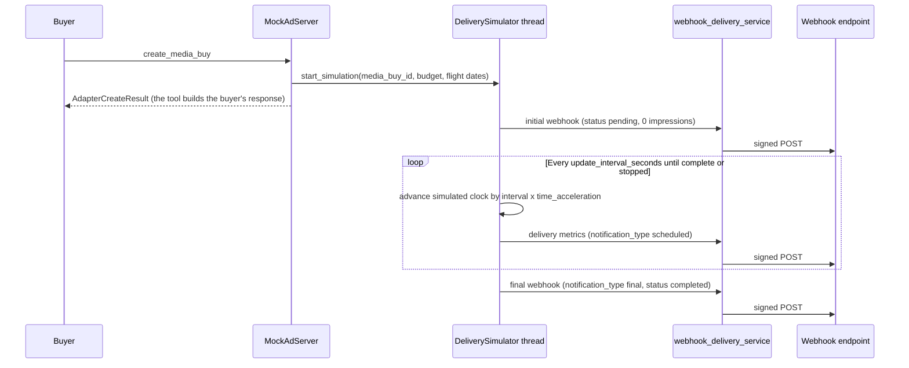

# Mock adapter delivery simulation

The mock adapter can simulate a campaign delivering over time, compressed so
that seconds of real time stand for hours or days of campaign time. A
background thread fires delivery webhooks at a configurable interval until the
simulated campaign completes, which lets you test an AI agent's reaction to a
full campaign lifecycle in minutes.

## Contents

- [How it works](#how-it-works) — the components involved and the order they act in
- [Configuration](#configuration) — the `delivery_simulation` block, its defaults, and where it lives
- [Webhook payload](#webhook-payload) — the exact JSON each webhook carries
- [Webhook endpoints](#webhook-endpoints) — registering receivers per principal
- [Simulated metrics](#simulated-metrics) — how the simulator computes spend, impressions, and clicks
- [Seeded delivery responses for tests](#seeded-delivery-responses-for-tests) — the polling-side seeding mechanism, distinct from webhooks
- [Lifecycle and threading](#lifecycle-and-threading)
- [Troubleshooting](#troubleshooting)
- [Related documentation](#related-documentation)

## How it works

When `MockAdServer` creates a media buy (not in dry-run mode), it calls
`DeliverySimulator.start_simulation()` in
[`src/services/delivery_simulator.py`](../../../src/services/delivery_simulator.py).
The simulator runs one background thread per media buy. On every update
interval, the thread computes how far the accelerated campaign has progressed
and hands the metrics to `webhook_delivery_service`
([`src/services/webhook_delivery_service.py`](../../../src/services/webhook_delivery_service.py)),
which signs and delivers the payload to every active webhook endpoint
registered for the principal.

The following diagram shows the sequence from media buy creation to the final
webhook.



Time acceleration maps real seconds to simulated campaign time. With the
default acceleration of 3600, each real second advances the campaign by one
hour, so a 7-day campaign completes in 168 seconds.

## Configuration

The `delivery_simulation` block holds three keys.

| Key | Default | Accepted range | Meaning |
|-----|---------|----------------|---------|
| `enabled` | `false` | `true` / `false` | Turns the simulation on for media buys created against this configuration |
| `time_acceleration` | `3600` | 1–86400 | Simulated seconds that pass per real second (`3600` = 1 second is 1 hour) |
| `update_interval_seconds` | `1.0` | 0.1–60 | Real-time interval between webhooks |

The block lives in two places:

- **Adapter configuration.** `MockAdServer._start_delivery_simulation()` reads
  `delivery_simulation` from the adapter's own config dict when a media buy is
  created. Constructing the adapter with this block in its config — as the
  integration tests do — is what starts a simulation automatically.
- **Product `implementation_config`.** The mock product configuration page in
  the Admin UI (`/adapters/mock/config/<tenant_id>/<product_id>`) stores the
  same block on the product's `implementation_config`, and
  `DeliverySimulator.restart_active_simulations()` reads it from there when you
  restart simulations manually.

### Example timings

The three configurations that follow show how acceleration and interval
combine for a 7-day campaign.

**Fast (1 second = 1 hour):**

```text
time_acceleration: 3600
update_interval_seconds: 1.0

The campaign completes in 168 seconds (about 2.8 minutes),
with one webhook per second — 168 webhooks, each one hour apart
in campaign time.
```

**Ultra-fast (1 second = 1 day):**

```text
time_acceleration: 86400
update_interval_seconds: 1.0

The campaign completes in 7 seconds, with one webhook per
simulated day — 7 webhooks.
```

**Slow motion (1 second = 1 minute):**

```text
time_acceleration: 60
update_interval_seconds: 1.0

The campaign completes in 10,080 seconds (about 2.8 hours).
Useful for watching delivery progress at a readable pace.
```

To reduce webhook volume without changing campaign speed, raise
`update_interval_seconds` instead of lowering `time_acceleration`.

## Webhook payload

`webhook_delivery_service.send_delivery_webhook()` builds each webhook body as
a delivery notification:

```json
{
  "adcp_version": "3.1.1",
  "notification_type": "scheduled",
  "is_adjusted": false,
  "sequence_number": 3,
  "next_expected_at": "2026-01-15T12:34:57.789Z",
  "reporting_period": {
    "start": "2026-01-10T00:00:00Z",
    "end": "2026-01-12T03:00:00Z"
  },
  "currency": "USD",
  "media_buy_deliveries": [
    {
      "media_buy_id": "buy_abc123",
      "status": "delivering",
      "totals": {
        "impressions": 45000,
        "spend": 450.0,
        "clicks": 450,
        "ctr": 0.01
      },
      "by_package": []
    }
  ]
}
```

The fields behave as follows:

- **`adcp_version`** — the AdCP spec version the server pins. See
  [AdCP spec version](../../adcp-spec-version.md).
- **`notification_type`** — `scheduled` for a periodic update, `final` for the
  last webhook of a completed campaign, and `adjusted` for a restatement of
  previously reported data.
- **`sequence_number`** — starts at 1 for each media buy and increments with
  every webhook.
- **`next_expected_at`** — ISO timestamp of the next expected webhook. Absent
  on the final webhook.
- **`status`** — `pending` on the initial webhook, `delivering` while the
  simulated campaign runs, and `completed` at the end.
- **`reporting_period`** — spans from the campaign start to the simulated time
  the webhook reports.

Delivery itself goes through the webhook egress module: each `POST` carries an
HMAC-SHA256 signature (`X-ADCP-Signature` and `X-ADCP-Timestamp` headers) when
the endpoint's configuration requires one, a per-endpoint circuit breaker
protects against failing receivers, and each endpoint has a bounded queue of
1,000 pending webhooks.

## Webhook endpoints

The service delivers each webhook to every **active push-notification
configuration registered for the principal** that owns the media buy. Register
an endpoint in either of two ways:

- In the Admin UI, open the principal (advertiser) and use its webhooks page
  to register a URL with optional authentication.
- Pass a `push_notification_config` when calling `create_media_buy`.

If the principal has no active endpoint, the simulation still runs but
delivers nothing; the server logs `No webhooks configured for
<tenant>/<principal>`.

## Simulated metrics

The simulator paces spend evenly across the flight with a ±5% random variance,
capped at the total budget. The other metrics derive from spend:

- Impressions assume a fixed $10 CPM (`impressions = spend / 0.01`).
- Clicks are 1% of impressions, and the simulator reports `ctr` as `0.01`.

## Seeded delivery responses for tests

Separately from webhook simulation, the mock adapter's
`get_media_buy_delivery()` can return an exact, pre-seeded payload. When the
`ADCP_TESTING` environment variable is `true`, the adapter checks the
`delivery_simulation_configs` table for a row keyed by tenant and media buy. If
such a row exists, the adapter returns its stored payload verbatim. The e2e
harness writes these rows so that in-process and containerized runs see
identical delivery numbers. Without the environment variable or a matching row,
the adapter computes delivery from campaign progress as usual.

This mechanism affects polling (`get_media_buy_delivery`) only — it neither
starts nor alters webhook simulations. See
[Test architecture](../../../tests/CLAUDE.md) for how tests use it.

## Lifecycle and threading

- Each media buy gets its own daemon thread; threads never block server
  shutdown, and a stop signal (`DeliverySimulator.stop_simulation()`) ends one
  gracefully.
- When a simulation completes, the thread exits and the webhook sequence
  counter for that media buy resets.
- Simulation threads do not survive a server restart, and the server does not
  restart them on boot. `DeliverySimulator.restart_active_simulations()`
  restarts simulations for active media buys on demand.
- A simulation starts only for a real creation — a dry-run `create_media_buy`
  stores nothing and starts nothing.

## Troubleshooting

**Webhooks are not firing.** Check these four things, in order:

1. Confirm that the `delivery_simulation` block has `enabled: true` in the
   configuration the adapter reads (see [Configuration](#configuration)).
2. Confirm that the principal has an active webhook endpoint registered
   (see [Webhook endpoints](#webhook-endpoints)).
3. Confirm that the endpoint URL is reachable from the server container.
4. Read the server logs. A healthy start logs these lines:

```text
🚀 Starting delivery simulation (acceleration: 3600x, interval: 1.0s)
✅ Started delivery simulation for buy_abc123 (acceleration: 3600x, interval: 1.0s)
📊 Simulation parameters for buy_abc123: ...
📤 Delivery webhook #1 for buy_abc123: 0 imps, $0.00 [scheduled]
```

If the start lines are missing, the adapter did not read the configuration at
creation time, or the media buy was a dry run. If the start lines appear but no
`📤` lines follow, the webhook side is failing — look for
`No webhooks configured`, circuit breaker warnings, or delivery errors in the
same log.

**Too many or too few webhooks.** Raise `update_interval_seconds` for fewer
webhooks, or lower it for more frequent updates. Adjust `time_acceleration` to
change how fast the campaign itself completes.

## Related documentation

- [Mock adapter](README.md) — the full mock adapter guide
- [End-to-end testing](../../development/e2e-testing.md) — the containerized stack these simulations run in
- [Test architecture](../../../tests/CLAUDE.md) — writing tests against the mock adapter
- [Troubleshooting](../../development/troubleshooting.md) — general debugging
