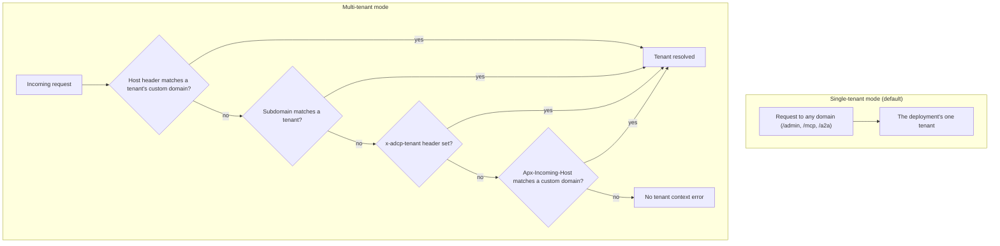

# Multi-tenant setup

This guide covers setting up the Prebid Sales Agent in multi-tenant mode, where a single deployment hosts multiple publishers with subdomain-based routing.

> **Prerequisites**: This guide assumes that you have a working single-tenant deployment. See [Single-tenant deployment](single-tenant.md) for Docker images, environment variables, and basic setup. The [architecture guide](../development/architecture.md#multi-tenancy) explains how tenant isolation works inside the application.

## When to use multi-tenant mode

**Single-tenant (default):** One publisher per deployment. Simple path-based routing (`/admin`, `/mcp`, `/a2a`). Most publishers should use this.

**Multi-tenant:** Multiple publishers on one deployment. Subdomain-based routing (`publisher1.yourdomain.com`, `publisher2.yourdomain.com`). For platforms hosting multiple publishers.

The following diagram shows the difference: in single-tenant mode every request lands on the one deployment tenant, while in multi-tenant mode the request's headers select the tenant.



## Step 1: Enable multi-tenant mode

Set the `ADCP_MULTI_TENANT` environment variable:

```bash
# Fly.io
fly secrets set ADCP_MULTI_TENANT=true --app your-app-name

# Docker
ADCP_MULTI_TENANT=true docker compose up -d

# Cloud Run
gcloud run services update salesagent \
  --update-env-vars "ADCP_MULTI_TENANT=true"
```

## Step 2: Configure domain environment variables

Set your domain configuration:

```bash
# Where the sales agent is hosted - tenant subdomains hang off this domain
SALES_AGENT_DOMAIN=sales-agent.yourdomain.com

# Where the admin UI is accessible
ADMIN_DOMAIN=admin.sales-agent.yourdomain.com

# Domain for super admin emails (users from this domain get super admin access)
SUPER_ADMIN_DOMAIN=yourdomain.com
```

> **Session cookies in multi-tenant mode**: When `ADCP_MULTI_TENANT=true`, session cookies are automatically scoped to `.SALES_AGENT_DOMAIN` so they work across all tenant subdomains. This lets users authenticate at `admin.sales-agent.yourdomain.com` and access tenant dashboards at `tenant.sales-agent.yourdomain.com`. In single-tenant mode (default), cookies use the actual request domain instead.

## Step 3: DNS configuration

### Wildcard DNS (for subdomain routing)

Point a wildcard DNS record to your deployment:

```
*.sales-agent.yourdomain.com → your-deployment-ip
```

For Fly.io:

```bash
fly ips list --app your-app-name
# Add A/AAAA records for the IPs shown
```

### SSL certificates

- **Fly.io**: Automatic wildcard SSL
- **Cloud Run**: Use Cloud Load Balancer with managed certificates
- **Docker**: Use Caddy, nginx with certbot, or a reverse proxy with a wildcard certificate

## Step 4: Optional: custom domains with Approximated

Approximated is a proxy service that lets tenants use their own custom domains (for example, `sales.publisher.com`) instead of subdomains.

### Environment variables

```bash
# Approximated API credentials
APPROXIMATED_API_KEY=your-approximated-api-key

# The backend address Approximated proxies to
APPROXIMATED_BACKEND_URL=sales-agent.yourdomain.com
```

### How it works

1. The tenant sets their custom domain in the Admin UI (**Settings > Account**, the **Custom Domain** field).
2. The system registers the domain with the Approximated proxy.
3. The tenant adds a CNAME record: `sales.publisher.com → proxy.approximated.app`.
4. Requests to `sales.publisher.com` are proxied to your deployment.
5. The `Apx-Incoming-Host` header identifies which tenant.

### Admin UI configuration

1. Go to **Settings > Account**.
2. Set the **Custom Domain** field to the tenant's domain (for example, `sales.publisher.com`).
3. The DNS configuration widget shows the records the tenant must create and the current verification status.
4. Click **Register Domain** to register the domain with the Approximated proxy (**Check Status** re-checks it).

## Step 5: Create tenants

### Via the Admin UI

1. Log in as a super admin at `https://admin.sales-agent.yourdomain.com`.
2. Click **Create New Account**.
3. Enter:
   - **Name**: Publisher display name
   - **Subdomain**: for example, `acme` → `acme.sales-agent.yourdomain.com`
   - **Custom Domain** (optional): a domain like `sales.acmepublisher.com`
4. Configure the ad server adapter (Mock or GAM).

### Via script

```bash
# Docker
docker compose exec adcp-server python -m scripts.setup.setup_tenant \
  "Acme Publisher" \
  --subdomain acme \
  --adapter mock

# Fly.io
fly ssh console -C "python -m scripts.setup.setup_tenant 'Acme Publisher' \
  --subdomain acme \
  --adapter mock"
```

## Step 6: Per-tenant GAM setup

Each tenant using Google Ad Manager needs their own service account.

### Option A: Automatic provisioning (recommended)

If you've configured GCP service account provisioning:

1. Go to tenant **Settings > Ad Server**.
2. Select the **Google Ad Manager** adapter.
3. Click **Provision Service Account**.
4. The system creates a GCP service account and shows the email.
5. Have the publisher add this email as a **Trafficker** in their GAM.

See [GAM service account setup](../adapters/gam/service-account-setup.md) for details.

### Option B: Manual configuration

1. The publisher creates their own GCP service account.
2. The publisher exports the JSON key file.
3. In the Admin UI, paste the service account JSON in **Settings > Ad Server**.

## Step 7: Tenant requirements

Before a tenant can create media buys, they need:

1. **Currency limits**: At least USD configured (Settings > Currencies)
2. **Property tags**: At least the `all_inventory` tag (Settings > Property Tags)
3. **Products**: At least one product configured (Products page)
4. **Advertisers**: At least one advertiser/principal (Advertisers page)

**Note:** In multi-tenant mode, SSO is **optional** per-tenant. The platform manages authentication centrally, so individual tenants can skip SSO configuration. In single-tenant mode, SSO is required before accepting orders.

The Admin UI shows a setup checklist for each tenant.

## Subdomain routing

In multi-tenant mode, the system resolves the tenant from request headers, in this order:

1. **Host header**: The tenant's custom domain is checked first, then the subdomain - `acme.sales-agent.yourdomain.com` → tenant `acme`.
2. **x-adcp-tenant header**: Explicit tenant override, matched as a subdomain first and then as a tenant ID (advanced).
3. **Apx-Incoming-Host header**: For Approximated proxy requests, matched against the tenant's custom domain.

Example MCP client configuration:

```python
# Subdomain-based routing
transport = StreamableHttpTransport(
    url="https://acme.sales-agent.yourdomain.com/mcp/",
    headers={"Authorization": "Bearer advertiser-token"}
)

# Or with custom domain
transport = StreamableHttpTransport(
    url="https://sales.acmepublisher.com/mcp/",
    headers={"Authorization": "Bearer advertiser-token"}
)
```

The [request lifecycle](../development/request-lifecycle.md) explains what else happens between the wire and business logic, including where these headers are read.

## Troubleshooting

### "No tenant context" error

- Verify the subdomain or domain is configured for a tenant.
- Check that the Host header is being passed correctly.
- For Approximated: verify the `Apx-Incoming-Host` header is present.

### Custom domain not working

1. Check DNS: `dig sales.publisher.com` should show Approximated IPs.
2. Verify `APPROXIMATED_API_KEY` is set.
3. Check the tenant's **Custom Domain** field is set correctly (stored as `virtual_host`).
4. Verify the Approximated proxy registration (the Admin UI shows the status).

### Tenant can't create media buys

Check the setup checklist in the Admin UI:

- Currency limits configured?
- Property tags exist?
- Products configured?
- Adapter connected?

## Related documentation

- [Single-tenant deployment](single-tenant.md) - standard deployment guide
- [Environment variables reference](environment-variables.md) - all domain and multi-tenant variables
- [Architecture guide](../development/architecture.md#multi-tenancy) - how tenant isolation works
- [Security and authentication](../security.md) - sessions, authentication, and tenant isolation
- [GAM service account setup](../adapters/gam/service-account-setup.md) - per-tenant GAM configuration
- [GCP service account provisioning](../adapters/gam/gcp-provisioning.md) - automatic service account creation
