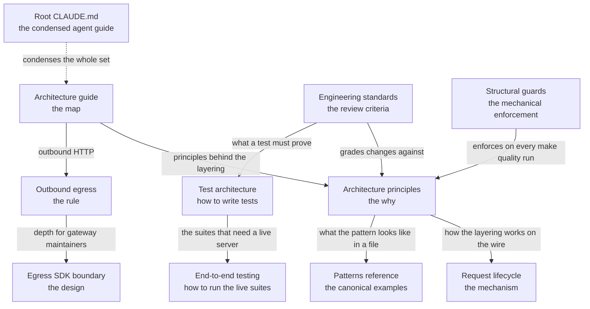

# Development guide

Documentation for contributors to the Prebid Sales Agent codebase, maintained under Prebid.org.

## Get started

```bash
git clone https://github.com/prebid/salesagent.git
cd salesagent
make setup
```

See [Getting started](GETTING_STARTED.md) for prerequisites, manual setup, testing, and common operations.

## Find the document that answers your question

The following table maps the questions contributors arrive with to the document that answers each one.

| Your question | Read | What it contains |
|---|---|---|
| What is this system, and what are its parts? | [Architecture guide](architecture.md) | The top-level map: topology, component locations, configuration, data model, adapters, and extension points, each section linking to the document with the details |
| Why does code belong in this layer and not that one? | [Architecture principles](architecture-principles.md) | Six principles — logic only in `_impl`, models everywhere, construction and serialization at the boundary, one code table behind every error — each short enough to apply on sight |
| How do I add or change a tool? | [Building a tool](building-tools.md) | One registry row, the three identity types and what each guarantees, the boundary's steps, server-initiated work, errors, and how to substitute an implementation in a test |
| What happens to my request before `_impl` runs? | [Request lifecycle](request-lifecycle.md) | The middleware stack in execution order, identity resolution, the per-transport path, and a placement table for changes to the request path |
| Which file do I copy from — and which files must I not imitate? | [Patterns reference](patterns-reference.md) | The canonical implementation file per pattern, the test harness, and the legacy files whose surrounding code is tracked debt |
| What standards must my change meet? | [Engineering standards](engineering-standards.md) | The standards every pull request is reviewed against — layering, duplication, test integrity, spec grounding — ending in a verification list |
| Why did `make quality` fail on a test I never touched? | [Structural guards](structural-guards.md) | The AST-scanning tests that enforce the architecture, the framework for deciding whether a guard should exist, and how to add one |
| How do I write a test, and what must it assert? | [Test architecture](../../tests/CLAUDE.md) | The harness environments, the factories, and the wire-envelope assertion policy — the authoritative test-writing recipe |
| How do I run the tests that use the live server? | [End-to-end testing](e2e-testing.md) | The Docker stack, the two suites that share the name "e2e", computed worker counts, and a failure-modes table for debugging runs |
| Why can I not call `httpx` directly? | [Outbound egress](../security/outbound-egress.md) | The one egress gateway, the five policy decisions it makes on your behalf, and the three layers that stop a raw HTTP call |
| Which lane does an error take to the buyer, and what derives its text? | [Error architecture](../design/error-architecture.md) | The one code table, the raised and advisory lanes and how to choose between them, the `issues[]` channel, and the guards that hold each part |
| How do I test a webhook, a retry, or a delivery to another agent? | [Webhook testing architecture](../design/webhook-testing-architecture.md) | The programmable loopback origin, the shared TLS material, the MCP origin, the delivery envs, and how to assert signatures, backoff, and breaker state |
| Who owns which decision inside the egress gateway itself? | [Egress gateway and the SDK boundary](../design/egress-sdk-boundary.md) | The gateway's module map, what the `adcp` SDK owns, the two-verdict validation split, and which local workarounds are temporary |
| What are the condensed rules an AI agent works from? | [Root CLAUDE.md](../../CLAUDE.md) | The critical patterns, common commands, and test-integrity policy, stated compactly — the same rules the preceding documents explain in full |

## Where to start

The starting point differs by what brought you here. Each path is three or
four documents, in reading order.

**You are new to the codebase.** Build the mental model before you touch code:

1. [Architecture guide](architecture.md) — what the system is and where its parts live.
2. [Architecture principles](architecture-principles.md) — why code lives where it lives.
3. [Request lifecycle](request-lifecycle.md) — how a request reaches business logic.
4. [Patterns reference](patterns-reference.md) — which files to imitate, and which not to.

**You are about to make a change.** Know the target before you write:

1. [Engineering standards](engineering-standards.md) — the criteria the change is held to.
2. The [placement table](request-lifecycle.md#where-does-my-change-go) — which layer owns your change.
3. [Patterns reference](patterns-reference.md) — the canonical file for the pattern you are writing.
4. [Test architecture](../../tests/CLAUDE.md) — how to prove the change with tests that can fail.

**You are debugging a failing run.** Start from the symptom:

1. [Failure modes and what they mean](e2e-testing.md#failure-modes-and-what-they-mean) — for live-stack runs, symptoms mapped to causes.
2. [Structural guards](structural-guards.md) — when `make quality` fails on an architecture test you never wrote.
3. [Troubleshooting](troubleshooting.md) — environment, database, and operations issues.

## How the documents relate

The set has a shape: one map, a principle layer with its mechanisms, the
standards a change is graded against, the testing pair, and the egress pair.
The following diagram shows which document leads to which.



Two pairings deserve a sentence each. [Outbound
egress](../security/outbound-egress.md) states the rule for anyone who makes a
request, and [Egress gateway and the SDK
boundary](../design/egress-sdk-boundary.md) is its depth companion for anyone
who changes the gateway. Read the first unless you are editing
`src/core/security/`. [Architecture principles](architecture-principles.md) is
the why and [Request lifecycle](request-lifecycle.md) is the how: the
principles justify the layering, and the lifecycle traces a request through
it.

## Guides outside the core set

This directory holds these further guides:

- [Getting started](GETTING_STARTED.md) — prerequisites, one-command setup, and common operations.
- [Creating an ad server adapter](../adapters/creating-an-adapter.md) — the adapter base-class contract, registration, and targeting translation.
- [Troubleshooting](troubleshooting.md) — symptom-to-fix reference for environment, database, and operations issues.
- [CI pipeline](ci-pipeline.md) — the GitHub Actions workflow, required checks, and test shards.
- [A2A and MCP agent flows](a2a-mcp-agent-flows.md) — why MCP, A2A, and REST run one flow, the measured MCP/A2A parity, the framing that differs per protocol, and which other agents this one talks to.
- [Admin UI BDD pattern](admin-bdd-pattern.md) — how to write BDD tests for Flask admin features.
- [BDD harness architecture](../design/bdd-harness-architecture.md) — how one scenario runs on every transport: what a scenario names, what the harness derives, and which layer owns each decision.
- [Webhook testing architecture](../design/webhook-testing-architecture.md) — the local HTTP and MCP origins, the shared TLS material, the delivery envs, and the e2e capture service.

## Design documents and retirement notes

[`docs/design/`](../design/) holds the depth companions the documents above link
to — the error architecture, the BDD harness architecture, the webhook testing
architecture, the egress SDK boundary, and the adapter schema system. Several files
there are short **retirement notes**: the design shipped, the note says what
replaced it and where the live description lives, and it keeps its path only
because source comments, tests, or review records cite that path. A title that
says "retired" means the file describes a plan, not the tree — follow its
pointer, and read the facts it kept as facts about the tree.

## Records of past work, not guidance

Completed review rounds, remediation plans, one-time reports, and epic planning
artifacts live in [`archive/`](../../archive/) at the repository root. Each was
accurate about a moment that has passed; none describes the system as it
stands. Release notes stay under `docs/releases/`, where they belong as a record
of what shipped.

## Key resources

- [Root CLAUDE.md](../../CLAUDE.md) — development patterns and conventions, condensed for AI agents.
- [Test architecture](../../tests/CLAUDE.md) — the authoritative guide to writing tests.
- [Tests](../../tests/) — the test suites and examples.
- [Source](../../src/) — the application source code.

## Quick reference

### Run tests

```bash
./run_all_tests.sh        # Full suite: in-network Docker stack, all suites (DEFAULT)
./run_all_tests.sh quick  # No Docker: unit + integration
# Both modes produce JSON reports in test-results/

# Manual pytest
uv run pytest tests/unit/ -x
uv run pytest tests/integration/ -x
```

For everything beyond this — targeted runs, the live-server suites, iteration
on one failing test — use the command table in
[End-to-end testing](e2e-testing.md#choose-a-command).

### Code quality

```bash
# Pre-commit hooks
pre-commit run --all-files

# Type checking
uv run mypy src/core/your_file.py --config-file=mypy.ini
```

### Database migrations

Migrations run automatically on startup. To run them manually:

```bash
# Inside Docker
docker compose exec adcp-server python scripts/ops/migrate.py

# Or locally with uv
uv run python scripts/ops/migrate.py

# Create a migration
uv run alembic revision -m "description"
```
