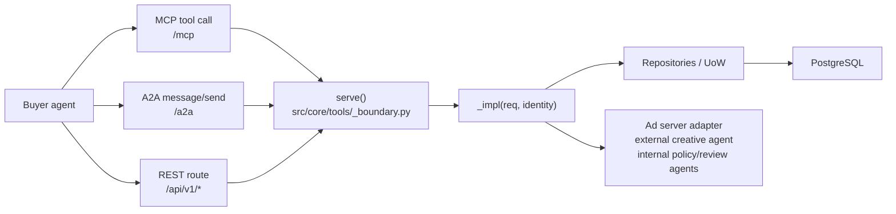
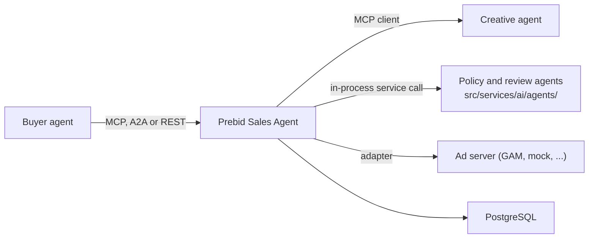
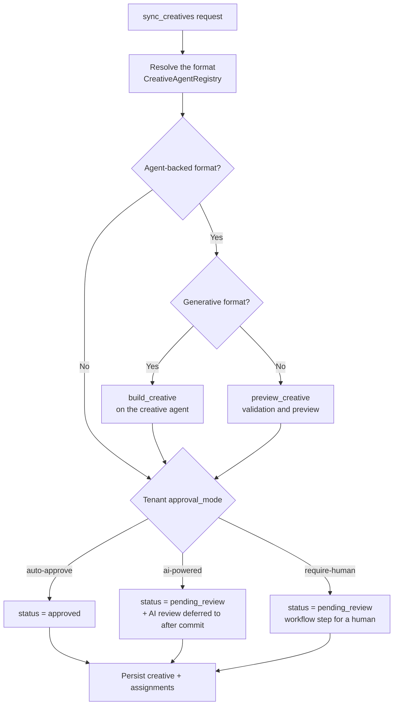

# A2A and MCP agent flows

MCP, A2A, and REST run one flow. Each parses its own wire and then hands the raw
payload plus the request headers to the same function — `serve`
(`src/core/tools/_boundary.py:224`). Validation, identity resolution, account
resolution, idempotency, the buyer's `context` echo, and the response body all
happen there, once, identically for every protocol. Framing is what remains per
protocol: how the call arrives, which container the body travels in, and how
each transport marks a failure.

Read [Request lifecycle](request-lifecycle.md) for the shared path in full — it
traces the boundary step by step and has a section per transport. This page
covers three things the lifecycle page does not: the measurement showing that
MCP and A2A behave the same, the framing details that genuinely differ, and
which other agents this one talks to.



## Evidence that MCP and A2A grade identically

The AdCP conformance storyboards run once per protocol against the same
deployment. On run `test-results/innet_150926_0801` (AdCP 3.1.1, runner
`@adcp/sdk` 14.0.0-rc.35) the two summaries — `storyboard/summary_mcp.json` and
`storyboard/summary_a2a.json` — carry the same verdict:

| Field | mcp | a2a |
| --- | --- | --- |
| `passed` | 30 | 30 |
| `failed` | 21 | 21 |
| `skipped` | 249 | 249 |
| `not_selected_count` | 0 | 0 |

The agreement is stronger than the counts. A key-by-key comparison of the two
files finds exactly three differing fields: `agent_url`, `tested_at`, and
`total_duration_ms`. Every graded field matches, including `failures` entry for
entry in the same order and `skipped_by_reason` bucket for bucket. Reproduce the
comparison with:

```bash
uv run python -c "
import json
a = json.load(open('test-results/innet_150926_0801/storyboard/summary_a2a.json'))
m = json.load(open('test-results/innet_150926_0801/storyboard/summary_mcp.json'))
print(sorted(k for k in a if a[k] != m.get(k)))"
```

The remaining failures are seller gaps, not protocol gaps: the runner grades
each one on both protocols, and each fails on both. A difference between MCP and
A2A in that file means something reached an implementation by two different
routes, the state `serve` exists to make unreachable.

## What differs by protocol

| | MCP | A2A | REST |
| --- | --- | --- | --- |
| Entry | `RegistryTool.run` (`src/core/main.py:365`) | `AdCPRequestHandler.on_message_send` → `_dispatch_skill` (`src/a2a_server/adcp_a2a_server.py:198`, `:452`) | generated route handler (`src/routes/api_v1.py:52`) |
| How the tool is named | the MCP tool name | `skill` in a DataPart | the route's path and verb |
| Where the payload comes from | the tool's argument object | `input` (or `parameters`) in that DataPart, decoded from a protobuf `Struct` | the JSON body, with templated path values merged over it — the path wins |
| Where the headers come from | `get_http_headers` | `context.state["headers"]` (`:187`) | `request.headers` |
| Advertised shape | the DTO's `model_json_schema()` on the registered tool (`src/core/main.py:261`) | the agent card's skills (`:477`) | the DTO's schema published through `openapi_extra`, with shared `$defs` in `REST_COMPONENT_SCHEMAS` (`src/routes/api_v1.py:114`) |
| Success container | `ToolResult.structured_content` | an artifact DataPart on a Task | the HTTP body |
| Failure marker | a raised `AdCPToolError`, which FastMCP marks `isError` | the Task state, read off the response's own `status` (`:135`) | the HTTP status, from `AdcpErrorResponse.http_status` |

The body inside those containers is the same bytes on all three: `to_wire`
(`src/core/tools/_wire.py:10`) is the one serializer, and it runs on success and
failure alike. A transport adds its marker and nothing else: no transport writes
a key into the body, and `_served` (`src/core/tools/_boundary.py:329`) stamps
`context` and `adcp_version` on the model instead.

### One renderer for every `401`

The credential decision happens inside `serve`, which holds the registry row
for the named tool, so `/mcp` has no auth gate in front of it and no transport
has a `401` of its own. A middleware in front of the mount cannot know which tool
the call names — the name sits inside the JSON-RPC body. `AuthChallengeResponder`
(`src/core/auth_middleware.py:149`) renders the challenge app-wide instead.
`src/app.py:629` registers it as the outermost middleware, and it reads the AdCP
error code off the finished body — one reader per container, so one piece of
code answers every transport's refusal. The readers and the buffering rule are
in
[Request lifecycle § The ASGI middleware stack](request-lifecycle.md#the-asgi-middleware-stack).

### A2A message framing

An invocation is one DataPart carrying `{"skill": <name>, "input": {...}}`.
`on_message_send` (`src/a2a_server/adcp_a2a_server.py:198`) enforces two rules:

- **One skill per message.** The handler refuses a second skill DataPart whole
  as `InvalidRequestError` before anything runs, rather than treating it as a
  batch. The reason recorded there: the pinned 3.1.1 text describes an A2A
  invocation as one DataPart naming one skill and says nothing about batching,
  so a message naming two is malformed.
- **A text-only message names no skill, so the handler refuses it.** The
  handler records text parts on the Task's metadata, and they route nothing.
  Guessing a tool from text is a translation concern that belongs in front of
  this seam, with its own response and its own auth handling, so the handler
  does not do it.

An unknown or non-A2A skill is `MethodNotFoundError`. Dispatch admits a skill
only when it is a registry row with `a2a=True`, and the card derives from the
same rows, so the card cannot advertise a skill that dispatch refuses (`:452`).

### A2A integers

`Part.data` is a protobuf `Struct`, which has no integer variant: every number
placed in it becomes a double, and comes back out of any `MessageToDict` as a
float (`86400` → `86400.0`). `A2A_WIRE_INTEGER_FIELDS` names the fields the
pinned schema types `integer`, and `restore_a2a_integer_types` coerces those
back on the JSON produced from the `Struct`
(`src/a2a_server/adcp_a2a_server.py:102`, `:148`). The composition root wraps
every `/a2a` route endpoint with it (`src/app.py:292`, applied at `:365`).

This is the one place adding a field needs A2A-specific work: an integer-typed
field you add to an A2A response reaches the buyer as a float until you add its
name to that set. Coercion fires only for a listed name holding a
whole-numbered float, so it never touches an unlisted or genuinely fractional
value.

### The agent card

`_derived_skills()` generates the card's skills from `TOOLS`
(`src/a2a_server/adcp_a2a_server.py:477`): `id` and `name` are the tool name,
`description` comes from the pinned SDK definitions — the same source MCP
registration reads — and `tags` come off `DTO.TAGS`. All 14 registry rows carry
`a2a=True`, so the card advertises 14 skills whose names are exactly the tool
names. There is no hand-written skill list, and no skill on the card that
dispatch refuses.

`create_agent_card()` (`:504`) adds the AdCP extension declaring
`adcp_version` and `protocols_supported: ["media_buy"]`, and one supported
interface with `protocol_binding="JSONRPC"`. That binding is required in
practice, not decorative. The comment at that line records an A2A 1.x client
(`@a2a-js/sdk`) selecting its interface by the value and reporting the agent
unreachable when the card omits it. The measurement used runner 14.0.0-rc.35,
which graded zero checks for that reason.

A dynamic route serves the card at `/.well-known/agent-card.json` and
advertises the tenant's **stored** host, resolved from the request `Host` header
(`src/app.py:416`, `:435`). It deliberately does not build the URL from
`Host` / `Apx-Incoming-Host` / `X-Forwarded-Proto`: the signed-request check
compares the URL a counterparty invoked against the published URL, and two
derivations mean two chances to disagree about a scheme, a port, or a trailing
slash.

## The tools a buyer can call

One registry row per tool decides all three transports, so each of the 14 tools
is an MCP tool, an A2A skill, and a REST route
(`src/core/tools/registry.py:205`, `:288`):

- **Discovery** — `get_adcp_capabilities`, `get_products`,
  `list_creative_formats`, `list_accounts`, `sync_accounts`
- **Media buy lifecycle** — `create_media_buy`, `update_media_buy`,
  `get_media_buys`, `get_media_buy_delivery`
- **Creative library** — `sync_creatives`, `list_creatives`
- **Task management** — `list_tasks`, `get_task_status`, `complete_task`

Nothing is MCP-only or A2A-only. `ToolSpec.requires_credential`
(`src/core/tools/registry.py:163`) derives a tool's credential policy from its
implementation's identity annotation instead of reading a declaration on the
row: `get_adcp_capabilities`, `get_products`, and `list_creative_formats` are
public, the other eleven require a credential, and naming an `account` requires
one on any tool.

The registry is the authority on this list. Print the live one with:

```bash
uv run python -c "
from src.core.tools.registry import TOOLS
for name, spec in TOOLS.items():
    print(name, spec.rest.verb, spec.rest.path, 'a2a' if spec.a2a else '', spec.requires_credential())"
```

## Which agents this one talks to



The buyer talks to one public agent. The outbound calls make this a multi-agent
system, and only one of them is a protocol call:

- **The creative agent, over MCP.** `CreativeAgentRegistry` calls
  `list_creative_formats` on a tenant's configured creative agents
  (`src/core/creative_agent_registry.py:565`) and the two non-AdCP tools
  `preview_creative` (`:838`) and `build_creative` (`:889`). All three go out
  through the one outbound MCP seam, `call_mcp_tool` — see
  [Outbound egress](../security/outbound-egress.md).
- **The policy and review agents** under `src/services/ai/agents/` are
  in-process service components, not tools. No registry row reaches them
  directly and no buyer can call them.

### Governance

There is no buyer-facing governance tool. `get_adcp_capabilities` reports
`supported_protocols: ["media_buy"]` (`src/core/tools/capabilities.py:100`), and
the storyboard run above records the same absence from the buyer's side: its
governance storyboards skip with `missing_tool: sync_governance` and
`missing_tool: sync_plans`, identically on both protocols.

Governance-adjacent data and internal review exist instead.
`governance_agents` is a persisted account field that `sync_accounts` carries
through with an omission-preserving resolver, so a buyer that omits it does not
clear it (`src/core/tools/accounts.py:279`, `:559`). Creative approval runs
through the internal review path below.

### Creative approval inside `sync_creatives`



`sync_creatives` consults the registry only for an agent-backed format; the
generative branch calls `build_creative` and skips `preview_creative`, because
the built output is already the answer
(`src/core/tools/creatives/_processing.py:337`). Both the update and create
paths read the three approval modes off the tenant (`tenant.approval_mode`) and
apply them the same way (`:299`, `:1035`); `ai-powered` sets
`pending_review` and submits the review as an after-commit effect
(`_defer_ai_review`, `:175`), so a rolled-back sync submits nothing.
