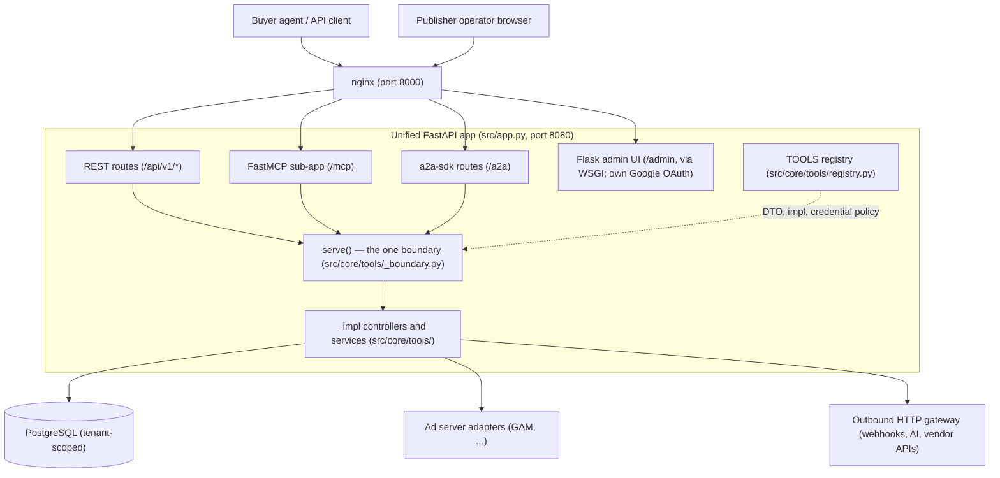
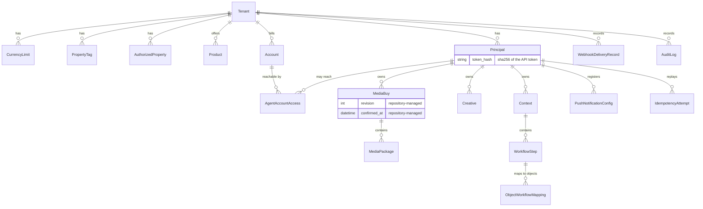
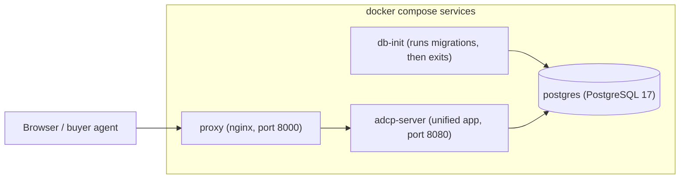

# Architecture guide

This guide is the top-level map of the Prebid Sales Agent: what the system
is, what its parts are, and where to read more. Each section stays at
overview level and links to the document that covers the details.

## System overview

The Prebid Sales Agent is a multi-tenant sales agent that implements the
[Ad Context Protocol](../adcp-spec-version.md) (AdCP): buyers' AI agents
discover products, create media buys, and submit creatives over MCP, A2A, or
REST; the agent executes those buys on the publisher's ad server through a
per-tenant adapter. Publishers operate it through a web admin UI.

## System topology

One process runs behind nginx. A single FastAPI application (`src/app.py`)
serves every protocol; there is no per-protocol server. Every buyer-facing
request converges on one function, `serve` in `src/core/tools/_boundary.py`,
which is where identity resolution, account resolution, idempotency, and the
response envelope happen — once, for all three transports. The following
diagram shows that path and what the process depends on:

The ASGI middleware stack carries no auth. It is three entries — an A2A
`messageId` compatibility shim innermost, `CORSMiddleware`, and
`AuthChallengeResponder` outermost, which renders every transport's 401
challenge by reading the AdCP error code off the response body (`src/app.py`,
`src/core/auth_middleware.py`). Only one place reads a credential: the resolver
behind the boundary. For the stack in execution order, see
[Request lifecycle § The ASGI middleware stack](request-lifecycle.md#the-asgi-middleware-stack).

### Component map

The following table maps each component to its location in the source tree:

| Component | Location | Description |
|-----------|----------|-------------|
| App assembly | `src/app.py` | Builds the FastAPI app, mounts every entry point, registers the three middlewares |
| Tool registry | `src/core/tools/registry.py` | `TOOLS`: one frozen `ToolSpec` row per AdCP tool. MCP registration, the A2A card, and the REST routes all derive from it |
| Transport boundary | `src/core/tools/_boundary.py` | `serve` / `invoke_tool`: validation, version negotiation, identity, idempotency, envelope |
| Identity | `src/core/resolved_identity.py` | The three identity types and `_resolve_identity`, private to the boundary |
| MCP server | `src/core/main.py` | `RegistryTool` registration from `TOOLS`; mounted at `/mcp` |
| A2A server | `src/a2a_server/` | Agent card skills derived from `TOOLS`; routes added at `/a2a` |
| REST API | `src/routes/` | `/api/v1/*` routes generated per registry row, health endpoints |
| Admin UI | `src/admin/` | Flask app (Google OAuth), mounted into FastAPI via WSGI |
| Business logic | `src/core/tools/` | `_impl` controllers and the services they delegate to — the only place behavior lives |
| Schemas | `src/core/schemas/` | Pydantic models extending the `adcp` library types |
| Errors | `src/core/errors/`, `src/core/exceptions.py` | `CODE_TABLE`, the typed exception hierarchy, declared detail classes, `issues[]` |
| Data access | `src/core/database/` | ORM models, repositories, unit of work, transaction effects, migrations |
| Adapters | `src/adapters/` | Ad-server integrations behind one abstract interface and typed carrier types |
| Services | `src/services/` | Cross-cutting domain services: targeting, policy, webhooks, AI |
| Settings | `src/core/config.py` | The one reader of the process environment, loaded once into typed settings |
| Egress gateway | `src/core/security/outbound_http.py` | The single gateway for all outbound HTTP |

## Request path

Every request enters through one of the four entry points. A buyer-facing
request then runs one sequence, in this order: validate the payload into the
registry row's DTO, negotiate the version pin the request declares, resolve the
identity, honour the idempotency key, call the implementation, stamp the
envelope. Version negotiation runs before identity resolution on purpose — a
rejected pin must not resolve a credential, touch the database, or be answered
from the replay cache.

The resolver hands the implementation one of three frozen identity types:
`PublicIdentity` (principal and tenant may be `None`), `ResolvedIdentity`
(both present), or `AccountIdentity` (an account present as well). The type
carries the boundary's decision, so nothing downstream re-checks it.

The full trace — the middleware stack, `_resolve_identity`, the per-transport
path, and a "where does my change go?" table — is in
[Request lifecycle](request-lifecycle.md). How to add a tool to the registry is
in [Building tools](building-tools.md).

## Layering and the transport-parity invariant

All business behavior is identical across MCP, A2A, and REST, because all three
transports make the same call: `serve(tool_name, payload, headers, protocol)`.
There are no per-tool transport wrappers. A transport parses a request, catches
`AdcpFailure`, serializes the response the boundary built with `to_wire`, and
adds only its own failure marker — an HTTP status for REST, a raised
`AdCPToolError` for MCP, a Task state for A2A.

Each tool is one `ToolSpec` row: the request DTO, the implementation, and the
REST binding. Everything else about a tool derives from that row rather than
being declared a second time:

- the credential policy comes from the implementation's `identity` annotation
  (`ToolSpec.requires_credential`), so there is no `auth=` literal to
  disagree with the body;
- whether an account is resolved comes from whether the DTO requires it, and
  the registry refuses a row at load whose annotation and DTO disagree;
- the MCP tool's advertised parameters are the DTO's own JSON Schema, the A2A
  card's skills are the registry's keys, and the REST routes come from each
  row's binding.

The layering rules — what `_impl` may accept, raise, and return, and why — are
in [Architecture principles](architecture-principles.md), with worked examples
in [Patterns reference](patterns-reference.md).
[Structural guards](structural-guards.md) enforce them mechanically: five
TID251 ruff configs over `src/` and `scripts/`, the `.ast-grep/rules/`
structural rules, mypy, and the `tests/unit/test_architecture_*.py` suite all
run in `make quality`, so a violation fails the build rather than waiting for
review.

## Multi-tenancy

Isolation is database-backed and row-level. Most domain tables carry a
`tenant_id` foreign key; the rest — media packages, workflow steps, and object
mappings — are scoped through the parent row that does. The repository layer
tenant-scopes every query. The resolver identifies a request's tenant from its
credential before `_impl` runs, so business logic never sees data outside its
tenant.

- **Tenant** — a publisher. Configuration lives in individual columns on the
  row (ad server, policy settings, authorized emails/domains, webhooks), not
  in a single JSON column.
- **Principal** — an advertiser within a tenant, identified by its API token
  (stored as `token_hash`; the token itself is shown once); `platform_mappings`
  ties it to accounts on the ad server.
- **Account** — the billing relationship a request names. One credential may
  reach several accounts, so an account is resolved per request rather than
  remembered on the principal: the resolver loads it inside the single identity
  construction, and `agent_account_access` says which accounts a principal may
  reach. Naming an account is itself a claim that needs a credential, so a
  request carrying `account` requires a valid token even on a public tool.
- Admin users, products, media buys, creatives, and audit logs all belong to
  the tenant.

## Data model

The following diagram shows the main entities and which entity owns which;
`src/core/database/models.py` holds the authoritative definitions:

Principal-owned rows also carry `tenant_id` directly; rows without their own
`tenant_id` (media packages, workflow steps, object mappings) are
tenant-scoped through their parent. `Context`, `WorkflowStep`, and
`ObjectWorkflowMapping` implement human-in-the-loop workflows;
`PushNotificationConfig` and `WebhookDeliveryRecord` implement outbound
notification; `IdempotencyAttempt` stores the response a keyed request may
replay, scoped to `(tenant, principal, account, key)`. Secondary tables belong
to these entities — products have pricing options and inventory mappings,
creatives have reviews and package assignments.

Setup order matters: a tenant needs its `CurrencyLimit` row (USD, required
before budgets validate) and its `PropertyTag` row (`all_inventory`, required
before products) before you can create products, and products before media
buys.

All access goes through repositories (`src/core/database/repositories/`);
some models additionally defend their own invariants — `MediaBuy` refuses
construction with repository-managed fields preset. A unit of work owns the
session and the transaction, and `dry_run` makes the whole unit a preview: the
identical write path runs, and the unit of work rolls it back instead of
committing, so there is no second simulated write path to keep in step. The
same boundary (`repositories/effects.py`) routes effects a rollback cannot
reach — register a deferrable one with `repo.after_commit(fn)`, wrap one whose
result you need with `repo.outbound(call)`. The rules for what may touch the
database, and why reads are trusted rather than re-validated, are in
[Architecture principles](architecture-principles.md), and
[Patterns reference](patterns-reference.md) works through both patterns.

## Adapter pattern

An adapter translates AdCP operations into one ad server's API. All adapters
implement `AdServerAdapter` (`src/adapters/base.py`); the registry in
`src/adapters/__init__.py` selects one per tenant.

The seam declares types in both directions, so main-app models do not reach
adapters and adapter internals do not reach back:

- `create_media_buy` takes `AdapterCreateRequest` — the buy to place, not the
  buyer's request DTO — and returns `AdapterCreateResult`;
- `update_media_buy` takes primitives and returns `AdapterUpdateResult`;
- both carriers are `extra="forbid"`, and neither is ever serialized to a
  buyer, so a carrier can hold a seller-internal value (the per-package
  ad-server line-item ids) without a wire model having to strip it;
- an adapter raises failures as `AdCPSalesAgentError` subclasses and never
  returns them.

An adapter owns the following responsibilities:

- **Platform authentication** — its own credentials and session handling
- **API translation** — AdCP requests → platform orders/line items, platform
  state → AdCP status and delivery reporting
- **Creative handling** — uploading assets and associating them with line items
- **Capability refusal** — declaring what it cannot fulfil, so the tool raises
  rather than silently degrading

A preview run is a unit of work with `dry_run` set, which rolls the
transaction back and suppresses the outbound effects registered inside it — so
an adapter has no preview mode of its own and reads no `dry_run` flag.

The registry contains the following adapters:

| Registry key | Adapter | Notes |
|--------------|---------|-------|
| `gam`, `google_ad_manager` | Google Ad Manager | Most complete; see the [adapter documentation](../adapters/README.md) |
| `broadstreet` | Broadstreet | |
| `kevel` | Kevel | |
| `triton`, `triton_digital` | Triton Digital | Audio |
| `mock` | Mock ad server | Testing and development |

(`creative_engine` in the registry is a creative-processing base class, not
an ad-server adapter.)

## Targeting

Targeting dimensions have a two-tier access model, defined in
`src/services/targeting_capabilities.py`. **Overlay** dimensions (geo,
device, content, audience segments, frequency caps) are buyer-settable
through the AdCP `targeting_overlay`. The agent sets **managed-only**
dimensions (AEE signals and scores) internally and never accepts them from a
buyer. Adapters translate accepted dimensions into their platform's targeting
structures.

## AI integration

AI is provider-pluggable through Pydantic AI (`src/services/ai/`): the
platform default provider and model come from the typed settings loaded at
startup, and each tenant can override them in its own `ai_config`. Agents
built on this factory handle policy checks, creative review, naming, and
ranking (`src/services/ai/agents/`). Generative creative processing requires
the configured provider's API key and fails explicitly when it is missing.

## Configuration

The settings loader in `src/core/config.py` reads the process environment once,
into typed groups composed into one `Settings` object at startup. Everything
else reads a named fact off that object. `ruff-environment.toml`, run in
`make quality`, bans `os.environ` and `os.getenv` under `src/` and `scripts/`
outside the loader and two writes of variables another library reads. One
derived setting decides schema strictness:
`RuntimeSettings.pydantic_extra_mode` is `forbid` outside production and
`ignore` in it, and `is_production` is the one predicate over the three
spellings a deployment sets. Every variable is documented in
[environment variables](../deployment/environment-variables.md).

## Outbound HTTP

Every outbound request — webhooks, adapter vendor calls, AI providers —
leaves through one gateway, `src/core/security/outbound_http.py`, entered as
`send` or `asend`. The application deliberately implements no SSRF protection
anywhere else; the `adcp` SDK owns address validation, cloud-metadata blocking,
and resolve-once-then-pin, and the one address verdict this repo keeps is
`EgressPolicy.resolve_for_dial`. Retry schedule and the retry/success/terminal
decision live in `src/core/security/egress/attempts.py`. `ruff-egress.toml`
runs with `--ignore-noqa`, so a raw HTTP client or a hand-written address check
cannot exempt itself with a comment. See
[Outbound egress](../security/outbound-egress.md) for the rule and the
[egress SDK boundary](../design/egress-sdk-boundary.md) for the design.

## Security

- **Identity layers**: super-admin allowlist (`SUPER_ADMIN_EMAILS`) →
  Google OAuth for admin users → tenant-scoped roles → per-principal API
  tokens. The resolver reads the credential from `Authorization: Bearer` only,
  and it is also the only place that mints the two auth refusals
  (`AUTH_MISSING`, `AUTH_INVALID`). [Request lifecycle](request-lifecycle.md)
  traces the path.
- **Audit**: the audit logger (`src/core/audit_logger.py`) writes
  security-relevant operations to `audit_logs` with tenant and principal
  context. A failure additionally writes one server-side record through
  `record_boundary_error`, which is where the caught exception and its
  traceback go — the buyer's error body carries no exception text.
- **Isolation**: tenant scoping at the repository layer, enforced by
  structural guards.

See the [security guide](../security.md) for more.

## Deployment topology

Local development runs four compose services (`docker-compose.yml`):
`postgres` (17-alpine), `db-init` (runs migrations, then exits),
`adcp-server` (the unified app on 8080), and `proxy` (nginx on 8000).
The following diagram shows the services and their startup order —
`adcp-server` waits for a healthy database and completed migrations, and
`proxy` waits for `adcp-server`:

Production uses the same topology — nginx in front of the single app process
and a managed PostgreSQL — on any Docker-compatible platform. See
[single-tenant deployment](../deployment/single-tenant.md) and
[multi-tenant deployment](../deployment/multi-tenant.md).

## Testing

[End-to-end testing](e2e-testing.md) and
[tests/CLAUDE.md](../../tests/CLAUDE.md) cover the test stack, its suites,
and how to run them; outbound delivery has its own guide,
[webhook testing architecture](../design/webhook-testing-architecture.md),
because those tests stand up a real local origin rather than patching an HTTP
client. The architectural point: because behavior lives in `_impl`
and the transports add only their own framing, you write a behavioral scenario
once and run it on every transport. BDD scenario text never names a transport —
the transport is a parametrized fixture value, the test environment owns what
differs per transport, and assertions go through wire helpers that read the
bytes the transport actually produced.
[BDD harness architecture](../design/bdd-harness-architecture.md) describes how
the harness builds that. Structural guards enforce the layering on every
`make quality` run.

## Extension points

The following table shows where each kind of extension goes:

| To add | Do | Documented in |
|--------|----|---------------|
| An AdCP tool | Extend the library schema → write the `_impl` controller in `src/core/tools/` → add a `ToolSpec` row to `src/core/tools/registry.py` → tests. MCP, A2A, and REST all derive from the row | [Building tools](building-tools.md), root `CLAUDE.md` |
| An ad-server adapter | Implement `AdServerAdapter`, return the carrier types, register it in `ADAPTER_REGISTRY` (`src/adapters/__init__.py`) | [Adapter documentation](../adapters/README.md) |
| An error condition | An `AdCPSalesAgentError` subclass naming a code `CODE_TABLE` classifies, with a declared details class | [Error architecture](../design/error-architecture.md), [Patterns reference](patterns-reference.md) |
| An admin page / REST route | Flask blueprint in `src/admin/`; check for route conflicts. A buyer-facing route is a registry row, not a hand-written handler | [Request lifecycle](request-lifecycle.md) |
| A table or column | ORM model + repository + Alembic migration (`uv run alembic revision`) | root `CLAUDE.md` |
| An outbound call | Call the egress gateway — never a raw HTTP client | [Outbound egress](../security/outbound-egress.md) |
