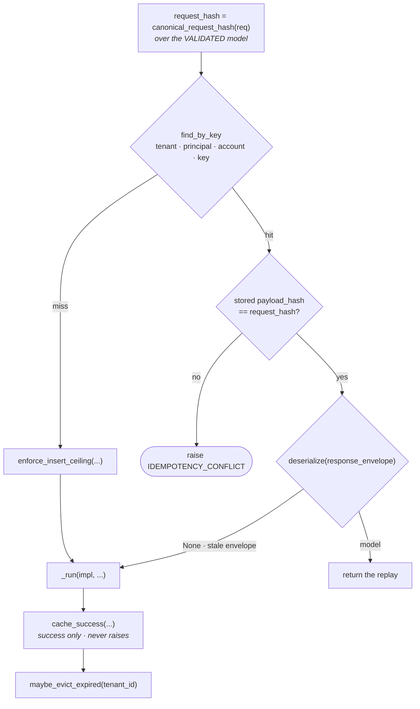

# Building a tool

This page is the how-to for adding or changing an Ad Context Protocol (AdCP) tool in this
codebase. It describes the tree as it is, and it carries the decisions the tree rests on with
the reason beside each one. Read it top to bottom when you add a tool, and jump to a section
when you change one.

The system rests on a small number of seams, and each seam is the single place that decides
its concern. A tool is one registry row. One resolver identifies the caller. The boundary runs
the tool once, for every transport. A response becomes a body in one function. An error names a
code and supplies facts. Because there is one of each, a rule holds everywhere by
construction, and most of the checks that used to police agreement between copies are gone.

The codebase targets AdCP 3.1.1 through the `adcp` SDK. The companion pages are
[Architecture guide](architecture.md), [Request lifecycle](request-lifecycle.md),
[Patterns reference](patterns-reference.md), [Structural guards](structural-guards.md), and
[Error architecture](../design/error-architecture.md).

## The four steps

Adding a tool is four steps, and none of them is writing a transport.

1. **Extend the SDK's request model** into a data transfer object (DTO), and declare the
   response so it carries the envelope. See
   [What a tool declares: the DTO](#what-a-tool-declares-the-dto).
2. **Write the `_impl` controller**, declaring `(req, identity)` and delegating the work to a
   service. See [What a tool declares: the identity type](#what-a-tool-declares-the-identity-type)
   and [Controller and service](#controller-and-service).
3. **Add the `ToolSpec` row** to `src/core/tools/registry.py`. MCP registration, the A2A agent
   card and its dispatch, and the REST route all follow from it. See
   [A tool is one registry row](#a-tool-is-one-registry-row).
4. **Grade it with BDD scenarios** that run on every transport. See
   [Test a tool](#test-a-tool).

There is no step where you write a wrapper, a request builder, a body model, an `AgentSkill`
literal, or a route decorator. The worked version of these four steps, with the code, is
[Add a tool](#add-a-tool).

## A tool is one registry row

You declare a tool once, in `src/core/tools/registry.py`, as a `ToolSpec` row keyed by its
AdCP tool name:

```python
    "get_products": ToolSpec(
        dto=GetProductsRequest,
        impl=_get_products_impl,
        rest=RestBinding("POST", "/products"),
    ),
```

A row carries four things:

- `dto`: the request model the transports validate into. The DTO says what the tool accepts,
  which is why the row holds a model rather than a description of one.
- `impl`: the function that runs. Its signature is the subject of a later section.
- `rest`: the REST binding, or `None` for a tool with no REST route.
- `a2a`: whether the A2A agent card advertises the tool. The default is `True`.

There are fourteen rows. Every one of them carries a REST binding and every one takes the
`a2a=True` default, so all fourteen tools are reachable on all three transports.

Each transport derives everything else from the row, so nothing can disagree with it. Each
item below names what a transport derives and, after the dash, the part of the row it comes
from:

- The MCP tool and its advertised JSON Schema — `spec.dto.model_json_schema()`.
- The A2A skill, agent-card entry, and dispatch — iteration over `TOOLS`.
- The REST route and its documented request body — `spec.rest` and `spec.dto`.
- Whether a caller needs a credential — the `identity` annotation on `spec.impl`.
- Whether the boundary resolves an account — the `account` field on `spec.dto`.

There is no field for the credential policy and no field for the account policy. The row
used to carry an `auth` literal beside the implementation. A literal is a second statement of
a fact the implementation already states, and the two disagreed. The annotation and the DTO
are the policy, as [Policy is derived](#policy-is-derived-and-the-registry-checks-it)
describes.

`TOOLS` is a `MappingProxyType` over a module-private dict, and `ToolSpec` is frozen, so the
whole declaration is immutable: nothing adds, drops, or repoints a row at runtime. Every
transport reads the row per call rather than closing over it, which is what makes a row
substitutable in a test — see [Substitute an implementation in a test](#substitute-an-implementation-in-a-test).

`RestBinding.verb` is `Literal["POST", "PUT"]`, deliberately narrow. An AdCP tool call carries
a request body, so a verb that cannot is not a shape this registry can express. `GET
/capabilities` was the one route that needed it, and the answer was deleting that route rather
than widening the type: it was a second shape for a tool that already had one, taking no body,
so a buyer could not send the `protocols`, `context`, or `ext` the same tool accepted
everywhere else. `path` is written without the router's `/api/v1` prefix, which the router
declares once.

### Registration refuses an incoherent row

`_register_tool` in `src/core/main.py` raises `RuntimeError` at import instead of registering a
row it cannot derive from. It refuses three kinds of row:

- A request DTO that does not descend from the SDK's `AdcpVersionEnvelope`. A DTO without that
  base is not a request in this protocol, and in practice it means the model came from a
  parallel hierarchy rather than from the SDK.
- A response model that does not descend from `AdcpResponse`. The boundary stamps envelope
  fields on every response and revives every replay; a model without the base has nowhere to
  put them, and the loss is silent, because the base serializes `exclude_none=True`.
- A DTO that does not inherit the SDK's request model, for a tool the pinned spec defines.
  A DTO written from a wrapper's own signature makes the announced shape tautological.

The `ToolSpec` constructor adds a fourth refusal, described under
[Policy is derived](#policy-is-derived-and-the-registry-checks-it). Each refusal replaces a
guard that reported the violation afterwards.

## What a tool declares: the DTO

A request DTO subclasses the SDK's pinned request model and adds nothing the spec does not
declare. The DTO carries the spec's whole vocabulary, and a field this seller does not
implement is unused rather than removed.

```python
class CreateMediaBuyRequest(BuyerRequest, LibraryCreateMediaBuyRequest):
```

`sdk_grounding()` in `src/core/tools/_announced_shape.py` proves a DTO carries the spec's
fields by walking the live method resolution order. That proof is why the DTO extends the SDK
model rather than being rebuilt from it, and it is why bumping the SDK moves every advertised
type with it.

**No registry DTO declares an internal field.** Not one of the fourteen has a
`Field(exclude=True)`. An internal value that a request needs lives on a model used
internally, and you delete it when nothing reads it — `GetProductsRequest.product_selectors`
and `UpdateMediaBuyRequest.today` were both deleted on that ground, each having been an
excluded field no transport could set and no caller read. `Field(exclude=True)` belongs on a
domain or response model such as `Product`, where a field must exist on the model and not on
the wire.

**There is deliberately no test comparing a DTO's field set to the pinned schema.** Such a
suite exists when the model and the schema are two artifacts that can disagree. Here the DTO
*is* the pinned model plus the mixin, so what it declares is inherited, and the comparison
asserts only that Python inheritance works. The alignment suite that compared them was deleted
rather than renegotiated; `tests/unit/test_architecture_schema_inheritance.py` grades
REDECLARATIONS against the library parent instead, which is the only place a local class can
weaken a pinned type.

Divergence from the spec has two directions, and Python can state only one of them. You
declare an added field on the subclass, typed and greppable in the file you are already
reading; that declaration is the whole statement, and a second list recording it is a place to
drift. An omission has no syntax at all, which is the other reason a DTO does not narrow the
SDK model.

> Narrowing is fragile, and this note records why so nobody reattempts it. Popping from
> `model_fields` plus `model_rebuild(force=True)` narrows the class but does not survive
> subclassing. The popped fields return as required fields, because the pop destroyed their
> defaults. Narrowing also changes nothing a buyer can observe: production runs
> `extra="ignore"`, so an unimplemented field is ignored whether popped or unused.

### The accepted shape is the declared shape

`SalesAgentBaseModel` in `src/core/schemas/_base.py` sets `extra` from the settings object:
`forbid` outside production and `ignore` in production. `BuyerRequest` adds a before-validator,
`_accept_only_declared_fields`, that calls `deep_strip_to_schema` in
`src/core/schemas/_accepted_shape.py`. That function is a recursive JSON Schema walk that
keeps only the fields the DTO declares, at every nesting depth. What happens to a field the
models do not declare depends on the environment:

- **Development and CI:** the strip rejects it, so an unimplemented spec field is loud.
- **Production:** the strip drops it, so a buyer sending a field from a later release is
  served.

The rejection names what it rejected, in the two channels the pin defines for it: one
`issues[]` entry per removed key, each with an RFC 6901 `pointer` and the keyword
`additionalProperties`, plus the `field` the exception derives from `issues[0].pointer`.

Three properties of that validator are the design, not an accident of where it ended up.

- **It is a validator on the mixin, not a seam.** Every transport constructs the DTO, so
  every transport gets the policy and there is no call to forget. It used to be a
  `ToolSpec.validate` method that only A2A ever reached, so the same bytes had three meanings.
- **It runs `mode="before"`, which is what reaches the nesting.** Field validation has not run
  yet, so the strip pre-empts the SDK's own nested `extra="forbid"` — which in production was
  rejecting a buyer who sent an unknown field inside `account`, the exact forward
  incompatibility `extra="ignore"` exists to prevent.
- **It walks the JSON Schema, not the model tree.** Two other mechanisms were built and thrown
  away, and `src/core/schemas/_accepted_shape.py` records both: walking the data against the
  model tree meant reimplementing union resolution, `RootModel` unwrapping, and `dict[K, V]`
  detection, and it deleted every `account.account_id` and every creative asset on its first
  run; setting `extra` on the 255 reachable SDK classes made pydantic's `__eq__`
  time-dependent, so tests failed by import order.

The strip ignores `additionalProperties` on purpose. A pinned schema saying
`additionalProperties: true` is the spec permitting a sender to add fields. It is not an
instruction to this seller to carry them inward, because the DTO is what keeps the internal
models predictable. If the tool should accept a field, declare it on the DTO. That is the only
mechanism.

A free-form container such as `ext` or `context` keeps its contents. An object that declares
no properties is the schema's way of saying arbitrary data lives there, so there is nothing
undeclared to remove and only contents to lose.

There is no compatibility layer, on any transport. The one that existed was deleted whole,
because it had become a rewrite running in three places: a legacy shorthand accepted on A2A
raised a `ValidationError` on MCP and REST, from the same bytes. If compatibility returns it is
one layer ahead of validation, for every transport, and nowhere else. It does not belong on a
DTO either: a before-validator accepting a shape AdCP does not define is the same mistake as
declaring a non-spec field, spelled as behaviour instead of a field. Behaviour that depends on
the spec version the buyer speaks belongs in the implementation, which already holds
`req.adcp_version` and `req.adcp_major_version` as envelope fields.

### The account is a reference, never an id

No request DTO declares a top-level `account_id`. The pinned schemas declare `account`, whose
type is the SDK's `AccountReference`: a `oneOf` of a reference by id and a reference by
natural key. The boundary resolves that reference for the caller, and the tool reads the
result off the identity.

Ten of the fourteen DTOs declare `account`, and three of those declare it required
(`create_media_buy`, `update_media_buy`, `sync_creatives`). Four declare an
`idempotency_key`: those three plus `sync_accounts`. Read the answer off the registry rather
than a list on this page:

```bash
uv run python -c "
from src.core.tools.registry import TOOLS
for n, s in TOOLS.items():
    f = s.dto.model_fields
    print(n, 'account' in f and f['account'].is_required(), 'idempotency_key' in f, s.requires_credential())
"
```

### Envelope fields and request fields

Envelope fields are properties of the call and the seller. The SDK's `AdcpVersionEnvelope`
and `ProtocolEnvelope` declare them, every model inherits them, and an implementation neither
knows them nor should have to.

| Field | Request | Response |
|---|---|---|
| `adcp_version` | The release the buyer pins, negotiated by the boundary | The release this seller served, set by `_served` |
| `adcp_major_version` | The major version the buyer pins, negotiated with it | Not on a response |
| `idempotency_key` | The at-most-once key, read by the boundary | Not on a response |
| `replayed` | Not on a request | Set by the boundary on a cache hit |
| `status`, `message` | Not on a request | Declared fields the implementation fills |
| `context`, `ext` | Echoed, free-form | Echoed, free-form |

Request fields are the tool's own vocabulary — `brief`, `packages`, `media_buy_id` — and they
are what the implementation reads. You never add an envelope field to a model. `BuyerRequest`
lets the boundary ask any request for its account, its key, and its version pins, even when the
request's schema declares none of them. Those are methods, because pydantic does not let a
field shadow a property of the same name: the value is stored and `model_dump` shows it, but
attribute access returns the property, so a property resolves `None` for every tool that
declares an account, silently.

## What a tool declares: the identity type

Every implementation declares exactly two parameters: the request DTO and an identity. The
identity parameter takes one of three types, and each type is a guarantee the boundary has
already enforced before the implementation runs.

| Annotation | What the resolver guarantees | Which tools |
|---|---|---|
| `PublicIdentity` | Whoever arrived: `principal` and `tenant` may be `None`. The tool branches on `identity.principal is None` itself. | `get_products`, `list_creative_formats`, `get_adcp_capabilities` |
| `ResolvedIdentity` | An authenticated caller: `principal` and `tenant` are present. `account` is the account the request named, or `None` when it named none. | Every protected tool whose DTO declares `account` as optional, or not at all |
| `AccountIdentity` | Everything `ResolvedIdentity` guarantees, and `account` is present. | `create_media_buy`, `update_media_buy`, `sync_creatives` |

The three classes live in `src/core/resolved_identity.py`. Their fields are the resolved
types, never dicts:

```python
class PublicIdentity(BaseModel):
    principal: InstanceOf[Principal] | None = None
    tenant: InstanceOf[TenantContext] | None = None

class ResolvedIdentity(PublicIdentity):
    principal: InstanceOf[Principal]
    tenant: InstanceOf[TenantContext]
    account: InstanceOf[Account] | None = None

class AccountIdentity(ResolvedIdentity):
    account: InstanceOf[Account]
```

`InstanceOf` is the reason a dict fails at construction. Without it, pydantic coerces
`{"tenant_id": "d"}` into a `TenantContext`. That coercion is how test code kept building
identities from dicts after the tenant became one type. The model is frozen and declares
`extra="forbid"`, so a caller passing `principal_id=` or `tenant_id=` fails instead of building
an anonymous identity — both are derived properties. Only that module and the test factory
construct an identity, which
`.ast-grep/rules/resolved-identity-constructed-only-by-its-owners.yml` enforces; the rule
matches the call, including the `model_validate` and `model_construct` spellings, because an
import ban also fires on the `TYPE_CHECKING` imports some forty modules legitimately need.

Each identity type appears in one real signature:

```python
async def _get_products_impl(req: GetProductsRequest, identity: PublicIdentity) -> GetProductsResponse:
```

```python
def _get_media_buys_impl(
    req: GetMediaBuysRequest,
    identity: ResolvedIdentity,
) -> GetMediaBuysResponse:
```

```python
async def _create_media_buy_impl(
    req: CreateMediaBuyRequest,
    identity: AccountIdentity,
) -> CreateMediaBuyResult:
```

A plain `def` and an `async def` are both registrable. The boundary awaits the result only
when the implementation returns an awaitable.

The `ToolImpl` protocol types `ToolSpec.impl`, so mypy checks each row. An implementation
fails to type-check at the row in the following cases:

- Its `req` is not the row's DTO.
- Its `identity` is none of the three types.
- It declares a third parameter without a default.

`.ast-grep/rules/impl-signature-is-request-and-identity.yml` refuses two shapes a protocol
cannot: an `identity` declared optional or defaulted, and an extra parameter with a default.

A tool reads `identity.principal`, `identity.tenant`, and `identity.account`, and nothing
else. There is no helper that re-checks whether a principal is present, because on a
`ResolvedIdentity` the check has no branch to take. Two such helpers used to exist, and each
was a second place that minted the same refusal the boundary had already decided. The name a
media buy records for its advertiser is `identity.principal.name`; the account a media buy is
filed under is `identity.account.account_id`.

### Controller and service

An `_impl` is a controller. It establishes who is calling, and then delegates to a service
function that takes an already-resolved caller and asks nothing about transports, auth, or
idempotency:

```python
def _sync_creatives_impl(req, identity: AccountIdentity):          # controller
    return sync_creatives(req, identity=identity, principal_id=identity.principal.principal_id, tenant=identity.tenant)

def sync_creatives(req, *, identity, principal_id, tenant):        # service
    ...
```

**A controller never calls another controller.** When `create_media_buy` and
`update_media_buy` upload a package's inline creatives, they call the service. Calling the
other `_impl` re-runs an auth check that already passed and drags the outer request's
`idempotency_key` into a function with no business seeing it. `sync_creatives` is the one
service extracted so far; extract the next when a second tool needs it, not before.

Reaching an implementation directly is a lint failure. `ruff-boundary.toml` bans importing
every `_impl` name across `src/` and `scripts/`, with `src/core/tools/registry.py` as the only
exemption, and it runs without `--ignore-noqa`. When you need to reach a tool's work, the
legitimate spellings are `serve(name, payload, headers, protocol)` from a transport,
`invoke_tool(name, req, headers, protocol)` with a request you already validated,
`TOOLS[name].impl` when you need the function object, and the extracted service when you have
no buyer and no request envelope at all.

## Policy is derived, and the registry checks it

**The credential policy is the annotation.** `ToolSpec.requires_credential()` answers `True`
when the implementation annotates `ResolvedIdentity` or `AccountIdentity`, and `False` for
`PublicIdentity`. The resolver refuses a missing credential with `AUTH_MISSING` before a
protected implementation runs, and refuses a rejected credential with `AUTH_INVALID` before
any implementation runs, public or protected: the pinned enum's MUST for that code keys on "an
`Authorization` header was present but verification failed" and names no task, so the policy
decides the absent case only.

A seller's policy can add a requirement. When the DTO declares `brand` and the tenant's
`brand_manifest_policy` is `require_auth`, `requires_credential(tenant)` answers `True`. The
resolver loads the tenant first, asks that question, and refuses the anonymous caller the same
way. The tool never sees the difference: `get_products` keeps `identity: PublicIdentity` and
receives a `ResolvedIdentity` when the policy applies.

**The account policy is the DTO.** The boundary resolves an account when, and only when, the
DTO declares `account` and the request carries one. A DTO that requires `account` guarantees
the implementation an `AccountIdentity`.

The registry refuses a disagreement between the annotation and the DTO at load, in both
directions. An implementation that annotates `AccountIdentity` on a DTO whose `account` is
optional raises:

```
TypeError: <function _get_media_buys_impl ...> declares identity: AccountIdentity but GetMediaBuysRequest does not require account; annotate ResolvedIdentity
```

An implementation that annotates `ResolvedIdentity` on a DTO that requires `account` raises:

```
TypeError: <function _create_media_buy_impl ...> declares identity: ResolvedIdentity but CreateMediaBuyRequest requires account; annotate AccountIdentity
```

The second refusal matters as much as the first. A tool guaranteed an account must not narrow
an optional, because that narrowing is the re-check this design removes.

## Resolution: one resolver, private to the boundary

`_resolve_identity` in `src/core/resolved_identity.py` is the one identity resolution in the
tree, and `invoke_tool` is its only caller. The leading underscore is the design: a transport
that wants to resolve its own identity has no public name to reach for. Four transports used
to resolve their own, and they disagreed twice. A2A refused a credential on a public task that
MCP and REST served. REST's discovery route hardcoded the credential as optional, so a
rejected credential answered `200` there and `401` everywhere else. `ruff-boundary.toml`
enforces the privacy at lint time: it bans importing the resolver outside the boundary,
re-exporting it from the boundary, and the two primitives it is made of.

The resolver reads the headers once and resolves the credential, then the tenant, then the
seller's own brand policy, then the principal inside that tenant, then the account the request
names — five steps, each traced with its citations and its refusal in
[Request lifecycle § Identity](request-lifecycle.md#identity-_resolve_identity). Four
consequences are worth knowing before you write a tool:

- The resolver reads a credential from `Authorization: Bearer` and nowhere else. It does not
  recognize the `x-adcp-auth` alias, so a caller sending only the alias has presented nothing.
- A principal is a row in exactly one tenant, looked up by the hash of the presented token
  inside the detected tenant, so a token minted for one tenant never acts on another.
- A presented token that resolves to no principal is `AUTH_INVALID` on every row, public tools
  included. A missing one is `AUTH_MISSING`, and only where the policy requires a credential.
- Naming an account is itself a claim that needs a credential, so a request that carries
  `account` requires a valid token even on a public tool.

The resolver builds the identity once, from the resolved rows, with the account inside. It
returns a `PublicIdentity` for a public tool, a `ResolvedIdentity` for a protected one, and an
`AccountIdentity` when the request names an account. The overloads make that static, so the
boundary consumes the matching type with no `isinstance`. Nothing copies or amends an identity
afterwards. The resolver used to resolve the account after the identity existed, by copying
the identity. That order is how a tool could hold an identity with no account where the schema
promised one.

The two authentication refusals belong to the resolver alone: `ruff-boundary.toml` bans
importing `AdCPAuthRequiredError` and `AdCPAuthenticationError` anywhere else, so each has one
minting site.

### Server-initiated work

Two jobs run with no request at all: executing a media buy after a human approves it, and the
delivery scheduler reporting on stored buys. They act as the buy's owner, on the buy's
account, and they get an identity from `identity_of` in `src/core/resolved_identity.py`:

```python
def identity_of(tenant_id: str, principal_id: str, account_id: str | None = None) -> ResolvedIdentity:
```

`identity_of` loads the tenant and then the principal inside it, by id. When the row names an
account, it loads that account through the same access-checked lookup a request goes through.
It returns an `AccountIdentity` when the caller passes `account_id` and a `ResolvedIdentity`
otherwise, and the overloads make the return type static. The approval executor in
`src/core/tools/media_buy_create.py` and the delivery job in
`src/core/tools/media_buy_delivery.py` pass `media_buy.account_id` off the persisted row.

Two rules follow. Server-initiated work never resolves an account by reference, because the
row already carries the resolved id. And it never fabricates one: a media buy row with no
`account_id` raises `AdCPPersistedStateError`. That row is a seller-side store defect,
and a placeholder id hides it. The approval executor reports that refusal as a
persisted-row defect and leaves the buy pending approval, so an operator who repairs the row
can retry.

There is no ambient tenant. A `ContextVar` used to carry the tenant to readers that held no
identity, and it was a second channel that could disagree with the first. `get_adapter` in
`src/core/helpers/adapter_helpers.py` takes the identity and reads the tenant and the principal
off it, so nothing can pass the two as a mismatched pair.

### Import bans enforce ownership

Two ruff configs ban the modules that can load a principal row or an account row everywhere
under `src/` and `scripts/`. A tool that needs a principal or an account has one way to get
it: the identity. Ruff exempts a whole rule per path, so each ban lives in the config whose
exemption set fits it.

`ruff-ownership.toml` carries the bans whose exemptions are wide. Its exemptions are the
resolver, the repositories, and the components that manage principals and accounts as data,
which means the admin tree and the setup scripts. It bans the following five names:

- `src.core.database.repositories.principal`
- `src.core.database.repositories.principal_lookup`
- `src.core.auth_utils`
- `src.core.database.repositories.account`
- `src.core.database.repositories.uow.AccountUoW`

`ruff-boundary.toml` carries the two bans whose exemptions are narrow. The ORM `Principal`
model is importable only by the four repository modules that query it, and
`repositories.account_lookup` only by the resolver. Under the ownership config's admin and
scripts exemptions, both were importable from an admin blueprint and a setup script.

`make quality-ci` runs both configs beside `ruff-egress.toml`, `ruff-serialization.toml`, and
`ruff-environment.toml`, then `ast-grep scan --config sgconfig.yml`, then mypy.
`tests/unit/test_ruff_boundary_bans.py` proves every banned name fires.

## What the boundary does once per request

A transport hands its bytes to `serve` in `src/core/tools/_boundary.py`:

```python
async def serve(
    tool_name: str,
    raw: Any,
    headers: Mapping[str, str],
    protocol: TransportProtocol,
) -> AdcpResponse:
```

`serve` validates the payload into the row's DTO through `validated_request` and calls
`invoke_tool`. `invoke_tool` is the entry for a caller that already holds a validated request.
Both steps leave a failure the same way, as an `AdcpFailure`, so a transport wraps one call in
one `try`.

`validated_request` is the one validation for all three transports. When it fails it reads the
buyer's `context` off the RAW payload — by subscript, caught, because a payload that is not a
JSON object has no context to echo — so MCP, A2A, and REST answer a malformed payload
identically and still carry the caller's context back.

`invoke_tool` takes headers, never an identity. From there the boundary does the following, in
this order, for every transport:

1. **Captures the buyer's `context`** off the request, to stamp it back unchanged.
2. **Negotiates the version the buyer pins**, through `negotiate_adcp_version` in
   `src/core/version_negotiation.py`, reading the two pins the request already declares. This
   runs FIRST, before anything reads the database: a release this build does not speak ends the
   exchange, so a rejected pin must not resolve a credential, a tenant, or an account, must not
   hash the request, and must not be answered from the replay cache. The check used to sit
   beside the outbound stamp, which reads well and orders wrong — the stamp can only run last —
   and a request that named an account was then answered on auth before its unsupported pin was
   read at all.
3. **Resolves the identity** through `_resolve_identity`, in a worker thread because the
   resolver is synchronous and hits the database. The boundary computes the credential flag
   from the row — `spec.requires_credential() or account_ref is not None` — and hands the row's
   tenant-dependent policy down for the resolver to ask once it holds the tenant.
4. **Computes the idempotency scope** from the identity's own `replay_scope()`. That method
   returns the tenant, principal, and account ids, or `None` for a caller with no tenant or
   principal. A request with a key and a scope takes the replay path described under
   [Idempotency](#idempotency).
5. **Calls `impl(req=..., identity=...)`**, with the request and the caller and nothing else.
   There is no per-transport channel here, so no transport can hand an implementation a value
   the others cannot.
6. **Stamps `adcp_version` and the captured `context`** onto the response through `_served`. It
   stamps a replayed response the same way, so it carries the release serving it and the
   context of the caller being served rather than the context of whichever request filled the
   cache.
7. **Turns any exception, from any step, into an `AdcpFailure`** carrying the
   `AdcpErrorResponse` that answers it, after recording the failure with the identity it had
   resolved.

`_served` is the one writer of both fields, on every outcome:

```python
def _served[Served: AdcpResponse](echo: ContextObject | None, response: Served) -> Served:
    response.adcp_version = SERVED_ADCP_VERSION
    object.__setattr__(response, "context", echo)
    return response
```

`AdcpResponse` refuses `context` on construction and on assignment, and `_served` writes it
through `object.__setattr__`, which bypasses both. That bypass is what makes the boundary the
only writer instead of the conventional one, and it is why the refusal can be unconditional
everywhere else: `.ast-grep/rules/context-is-written-by-the-boundary-alone.yml` bans a
`context=` keyword under `src/` outside the boundary, and `ruff-boundary.toml` bans importing
`adcp.types.ContextObject` outside the boundary and the schemas. Business logic used to thread
the context through sixteen signatures and over a hundred call sites to reach the raise sites.
One missed site was a response with no echo.

### What a transport does

A transport does three things and nothing more: it calls `serve`, it catches `AdcpFailure`,
and it adds its own failure marker. The REST route is the whole pattern:

```python
        try:
            response = await serve(tool_name, body, request.headers, TransportProtocol.REST)
        except AdcpFailure as failure:
            # REST's wire failure marker is the HTTP STATUS, and that is all this transport
            # adds. The BODY is the response the boundary built, serialized by the same
            # function the success path uses.
            return JSONResponse(status_code=failure.response.http_status, content=to_wire(failure.response))
```

MCP's marker is a raised `AdCPToolError` whose `str()` is the JSON body, and A2A's marker is
the Task state, taken from the response's own `status`. The body inside each container is the
same bytes, produced by `to_wire` in `src/core/tools/_wire.py`. A transport that stamps a key
of its own into the body turns one response object into a different document per transport.
That divergence is what the boundary exists to prevent.

There is no auth gate in front of `/mcp` and no per-transport `401`. `serve` decides auth,
where the tool name is known, and `AuthChallengeResponder` in `src/core/auth_middleware.py`
renders the challenge app-wide. It is registered as the outermost middleware, and it reads the
AdCP error code off the response body.

`protocol` labels the observability record a failure writes. `TransportProtocol` is a `StrEnum`
of `mcp`/`a2a`/`rest`, nothing under `src/` branches on it, and the identity does not carry it.
Requests carry no testing headers either: the identity has no testing context, and no adapter
carries a dry-run flag. The only `dry_run` is the request field on `sync_accounts` and
`sync_creatives`, implemented as a unit-of-work rollback.

### How each transport follows from the row

You never edit a transport to add a tool. Each of the three generators is a loop over `TOOLS`,
and each one's shape follows from a property of that transport.

**MCP** registers a `RegistryTool` per row (`src/core/main.py`). It is a `fastmcp.Tool`
subclass rather than a function tool, because FastMCP validates a FUNCTION tool against a
`TypeAdapter` built from its annotations. With the DTO's fields as parameters, that adapter
reached the SDK's nested models first and refused or coerced the payload before any code in
this tree ran — so the strip was a no-op on MCP, dev rejection came from pydantic, and
production tolerance came from a retry in a compat middleware: two programs for one policy.
`parameters` is the DTO's own `model_json_schema()`, so the advertised shape is the model
rather than a signature reconstructed from it. `run` reads the request headers with
`get_http_headers` and calls `serve`; outside an HTTP request that returns `{}`, a request
presenting nothing, which the resolver answers `AUTH_MISSING` on a protected tool.

**A2A** derives the agent card's skills with `_derived_skills()` and dispatches with
`_dispatch_skill` (`src/a2a_server/adcp_a2a_server.py`). A skill's `id` and `name` are the tool
name, the description comes from the pinned SDK definitions — the same source MCP reads — and
the tags come off `DTO.TAGS`, because they describe the tool's shape rather than its wiring.
Dispatch admits a skill only when it is a registry row with `a2a=True` and answers
`MethodNotFoundError` otherwise, so the card and what is dispatchable cannot disagree. A
`hasattr`-built handler dict used to override the card silently. `_dispatch_skill` calls `serve`
and returns `to_wire(...)`, so A2A adds nothing to the body.

**REST** adds one route per row with a `rest` binding (`src/routes/api_v1.py`). The handler
takes `Request`, not the DTO: a typed body parameter is exactly what makes FastAPI validate
before the handler runs, and a rejected request owes the buyer its `context` back, which only
`validated_request` returns. A row whose path is templated names those fields in
`path_fields`, and the URL is the resource identity, so a path value wins over a body that
disagrees. The published contract does not change, because the route advertises the DTO's JSON
Schema through `openapi_extra`, derived from the same model that validates.

`_rest_body_schemas()` makes ONE `models_json_schema` call over every REST DTO, so pydantic
assigns each nested model a name unique across the whole set, and `src/app`'s OpenAPI hook
publishes the shared `$defs` as `REST_COMPONENT_SCHEMAS`. Generating per DTO and
merging by name let two models that happened to share a name — `Status`, `Disclosure`,
seventeen of them — overwrite each other in `components/schemas`, so a `$ref` from one tool
resolved to another tool's definition; and a verbatim `model_json_schema()` puts its `$defs` at
the root of the SCHEMA, while a schema nested under a request body is not the root of the
DOCUMENT, which left 1466 dangling references.

## Errors

An implementation raises an `AdCPSalesAgentError` subclass from `src/core/exceptions.py` and
returns only on success. There is no status field to inspect on the way out: a return is a
success, and an error is an exception.

```python
    def __init__(
        self,
        *,
        error_code: ErrorCodeT | None = None,
        details: DetailsT | None = None,
        issues: list[ErrorIssue] | None = None,
        field: str | None = None,
        retry_after: int | None = None,
        internal_detail: BaseException | None = None,
    ) -> None:
```

The constructor has no `message` parameter. A raise site supplies facts through `details`,
`field`, and `issues`; it cannot author a sentence. `CODE_TABLE` in `src/core/errors/codes.py`
owns the four things a buyer needs with a code — the message, the recovery, the suggestion, and
the HTTP status — and `message`, `recovery`, `suggestion`, and `status_code` are read-only
properties resolving from it at every read, so no instance can carry a value that disagrees
with the table by any route. The table holds 100 entries: the 92 published codes loaded from
the pinned bundle's `enums/error-code.json` through `importlib.resources`, plus the 8 platform
codes `AppErrorCode` declares. An error names its code by its class or explicitly, never both
and never neither: `__init_subclass__` refuses a subclass whose code the table does not
classify, and `__new__` refuses both a bare base construction and an `error_code` passed to a
class that already declares one.

That is the raise-site contract. The mechanism behind it — how `CODE_TABLE` resolves a
message, why `recovery` is the one closed vocabulary while the code vocabulary is open, the two
lanes a failure can travel in, and the pydantic-to-JSON-Schema keyword map behind `issues[]` —
is [Error architecture](../design/error-architecture.md). Read that one when you add a code or
change how an error reaches the wire; the code itself lives in `src/core/errors/codes.py`,
`details.py`, and `issues.py`.

`internal_detail` is typed `BaseException | None`, so it takes the caught exception and
nothing else. It goes to the server-side record and never to the wire. Forty-seven raise sites
used to put an authored sentence there. None of those sentences said anything the code,
the class, and the typed details did not already say. When you catch an exception and raise
a typed one, pass the caught exception and raise `from` it. `record_boundary_error` in
`src/core/tool_error_logging.py`, which the boundary calls on every failure, writes one
server-side record per failure and attaches the traceback when the
error has a cause of either kind, a `__cause__` or an `internal_detail`; nothing logs
`internal_detail` separately. `.ast-grep/rules/internal-detail-is-an-exception.yml` refuses
an authored string there in every spelling (literal, f-string, `+`, `%`, `.format`, `str()`,
a conditional with a string branch) under `src/`, `scripts/`, and `tests/`, where mypy does
not look.

`ToolError` is MCP's wire type. `ruff-boundary.toml` bans importing it anywhere under `src/`
except the module that mints one on the way out to MCP and the app module that renders it.
A `ToolError` travelling inwards is a transport error inside transport-agnostic code.

`AdCPSalesAgentError` is unrelated to `adcp.exceptions.ADCPError`, which is the SDK's client
hierarchy for calls this seller makes to other agents. Adapters raise into the seller
hierarchy; no module under `src/adapters/` defines an exception class.

### A failure is a response

`AdcpErrorResponse.of` in `src/core/schemas/_base.py` is the only place that builds a failure
response. AdCP models a failure as a response, not as a separate document: the protocol
envelope declares `adcp_error`, `context`, and a required `status` on every response, so a
failure has a field for the echo and for the status like any other outcome. At a raise site,
you return nothing and raise instead — the boundary builds the response, stamps it, and hands
a transport one exception to catch.

The step-by-step of that path is
[Request lifecycle § Failure](request-lifecycle.md#failure); the shape of the body and the
status it carries are [Error architecture](../design/error-architecture.md).

### Which code

The following table gives the two codes that are most often confused.

| Code | The pin's words | So |
|---|---|---|
| `INVALID_REQUEST` | "malformed, missing required fields, or violates **schema constraints**" | Any pydantic `ValidationError`, and an undeclared property |
| `VALIDATION_ERROR` | "invalid field values or violates business rules **beyond schema validation**" | This seller's own logic refusing |

`adcp_error_for` in `src/core/exceptions.py` is the one normalizer from an untyped exception to
a typed one, and every branch is a type mapping with no text: a pydantic `ValidationError`
becomes `AdCPInvalidRequestError` with a derived `field` and `issues[]` (checked before
`ValueError`, because it is a subclass), a plain `ValueError` becomes `AdCPValidationError`, a
`PermissionError` becomes `AdCPAuthorizationError`, and anything else names `INTERNAL_ERROR`.
Nothing rewrites a code between the raise site and the envelope.

### Facts, not sentences

A structured rejection carries `ErrorProblem` entries: `code`, `subject_type`, `subject_id`,
`field`, `rejected_value`, and `accepted_values`. There is no free-text field on purpose. A
declared class stops field-name drift but not text inside a declared field, so there is no
`reason` slot for an f-string to move into.

An error's `details` is a declared `ErrorDetails` instance, never a dict. Each exception class
names its exact detail type in its own type parameter
(`AdCPSalesAgentError[DetailsT: ErrorDetails]`), so mypy rejects both a dict and a foreign
detail class at every raise site.

### Batch tools have two levels of failure

A tool that takes a list, such as `sync_accounts` or `sync_creatives`, answers for each entry
separately. What kind of wrong an entry is decides the level, not how many entries failed.

| The entry is | Level | What the buyer gets |
|---|---|---|
| Structurally invalid: it violates the request schema itself | Operation-level | The call is refused with a `raise`, and the details carry the entry's `index` |
| Schema-legal but refused by a business rule | Per-entry | The call succeeds; that entry carries `action: "failed"`, `status: "rejected"`, and its own `errors` array |

A partial failure is a successful response, and the operation-level `errors` field stays
absent. A per-entry refusal is a declared `GateFailure` value naming why a gate refused —
`failure_class`, `field`, `details`, and deliberately no message or suggestion. One converter,
`_gate_failures_to_errors`, turns those into wire `Error` entries, and `_FAILURE_CLASS_TO_CODE`
maps the class to a code that supplies the sentence. An entry-relative pointer roots at the
entry, `"brand.domain"`, never at the entry's position in the batch.

## How a response is produced

### The response model conforms by inheritance

An implementation returns a model that extends the SDK's success model and `AdcpResponse`.
`AdcpResponse` inherits the SDK's `AdcpVersionEnvelope` and `ProtocolEnvelope` and declares
no fields of its own. Every response schema opens with that pair under a root `allOf`, and a
root `allOf` applies to every branch of a root `oneOf`. The SDK's generator applies the bases
to some branches and not others, so inheriting `AdcpResponse` restores the composition
without widening anything.

```
REQUEST: every tool, no exceptions

    adcp.types.<Tool>Request              BuyerRequest
    (SDK: the spec's fields)              (ours: account, key and version accessors)
                        \                /
                         <Tool>Request
                         (ours: what the tool accepts)


RESPONSE: single-shape tools

    AdcpVersionEnvelope        ProtocolEnvelope        (SDK: the schema's allOf pair)
                        \     /
                      AdcpResponse                     (ours: declares no fields itself)
                            |
    adcp.types.<Tool>Response                          (SDK: the tool's own fields)
                        \     /
                     <Tool>Response                    (ours: what the impl returns)


RESPONSE: oneOf tools

                      AdcpResponse
                            |
                       <Tool>Result                    (ours: the union, named as a type)
                    /       |       \
      <Tool>Success   <Tool>Error   <Tool>Submitted    (one class per branch, flattened)
```

The same shapes appear as real declarations:

```python
# request: the SDK's model plus the boundary's accessors
class CreateMediaBuyRequest(BuyerRequest, LibraryCreateMediaBuyRequest): ...

# response, single shape: the SDK's response, carrying the envelope
class GetProductsResponse(NestedModelSerializerMixin, LibraryGetProductsResponse, AdcpResponse): ...

# response, oneOf: the union as a type, then one class per branch
class CreateMediaBuyResult(AdcpResponse): ...
class CreateMediaBuySuccess(AlwaysIncludeFieldsMixin, AdCPCreateMediaBuySuccess, CreateMediaBuyResult): ...
class CreateMediaBuyError(AdCPCreateMediaBuyError, CreateMediaBuyResult): ...
class CreateMediaBuySubmitted(AdCPCreateMediaBuySubmitted, CreateMediaBuyResult): ...

# a local tool with no SDK counterpart: the envelope, directly
class CompleteTaskResponse(AdcpResponse): ...
```

The shape encodes five rules:

- `allOf` is multiple inheritance. Every response schema opens with the version and protocol
  envelopes, so `AdcpResponse` inherits both and declares nothing of its own.
- A `oneOf` member is a branch, and each branch is its own class, carrying the envelope fields
  plus that branch's fields, flat. The class is the document the buyer receives.
- The union is named as a type, never a bare SDK union alias. `_response_model_for` reads the
  implementation's return annotation and requires a class.
- Method resolution order matters: the SDK parent precedes `AdcpResponse`, so the parent's
  narrower `Literal` wins and `status="failed"` on a success branch stays a type error.
- A local tool with no SDK counterpart inherits the envelope directly. It is the only
  variation, and it is visible in the declaration.

Because every response is an `AdcpResponse`, the boundary never needs to know which tool it
holds. It can stamp `adcp_version`, set `replayed`, serialize with `to_wire`, and revive a
cached body.

### Who fills which envelope field

The implementation fills `status` and `message`, because both are declared fields on the model
it returns. A create awaiting human approval returns the `submitted` branch with its own
status. A response with no status is not a task envelope, and it succeeded by having returned.
The boundary writes exactly three fields onto a response: `adcp_version` and `context` in
`_served`, and `replayed` in the replay deserializer. No transport adds anything of its own.

### Serialization happens at the wire only

`to_wire()` in `src/core/tools/_wire.py` produces every body, and `AdcpResponse.revive` parses
every cached one. An implementation never serializes and never parses. A model is the value;
a dict built from it mid-flow is a second representation that drifts. `to_wire` takes a
`ProtocolEnvelope`, not a `BaseModel`, because that inheritance is the guarantee: a plain
model routed through it produces a body with no envelope at all.

Serialization happens at named edges, each with one owner: the wire; outbound bodies to
another agent or a webhook target; the idempotency payload hash; the persistence edge (the
engine's JSON serializer behind `JSONType`, the ORM `@validates` hooks, and the documents the
repositories and the context manager compose); the admin UI's JSON responses; the two error
helpers that project `issues` and `details` to their wire shape; and the one schema module
that re-dumps a nested child inside `WireSerializerMixin`. **Read the list from
`ruff-serialization.toml` and `.ast-grep/rules/serialize-only-at-the-edges.yml`, which carry it
in two syntaxes and are the enforcement.** Exemption is by path, never by a suppression
comment: the first bans the importable names `pydantic_core.to_json` and
`pydantic_core.to_jsonable_python`, the second the method spellings `.model_dump()`,
`.model_dump_json()`, and pydantic v1's `.dict()`.

A wire model does not shape its own output. `WireSerializerMixin` in
`src/core/schemas/_base.py` is the one serializer, because pydantic runs only the first
model serializer in the method resolution order and silently drops the rest. It carries
exactly two concerns:

- `NestedModelSerializerMixin` re-serializes children by their instance rather than the
  declared library type, which is what keeps a local subclass's extra fields on the wire.
- `AlwaysIncludeFieldsMixin` keeps a required field whose value is `None` on the wire under
  `exclude_none`. It reads that set off the model's own `model_fields` — required and nullable
  are both already on the model — never off a schema path. A class used to opt in by naming a
  pinned schema ref, and a hand-written ref can name the wrong schema and derive nothing,
  silently; a rule read off the model cannot.

Re-insertion honours the caller's selection: the serializer reads `info.exclude` and
`info.include`, skips a field the caller excluded, and puts back only `None`, so no raw Python
value can land in a `mode="json"` dump.

A field that must exist on the model and not on the wire is `Field(exclude=True)` at its
declaration, nowhere else. The per-class hook and the per-class strip set that used to live on
`WireSerializerMixin` are deleted. Every use did one of two things. It patched back the output of a
redeclaration that had weakened the library type, in which case the fix is to not redeclare.
Or it stripped a field that belongs on the wire, such as `Product.expires_at`. Never override
`model_dump`: an override runs on one of the three serialization paths and a
`@model_serializer` runs on all three. No model under `src/` overrides it — the two
`def model_dump` lines are `TYPE_CHECKING` protocol declarations.

### Adapters take and return a carrier, not a wire model

An ad-server adapter never sees the buyer's DTO and never returns the buyer's response model.
`src/adapters/base.py` declares the carriers on both sides, and both set `extra="forbid"`:

```python
class AdapterCreateResult(BaseModel):
    model_config = ConfigDict(extra="forbid")

    media_buy_id: str
    packages: list[ResponsePackage]
    creative_deadline: AwareDatetime | None = None
    #: package_id -> ad-server line-item id, persisted as package_config["platform_line_item_id"].
    platform_line_item_ids: dict[str, str] = Field(default_factory=dict)
```

`create_media_buy` takes an `AdapterCreateRequest` and returns an `AdapterCreateResult`;
`update_media_buy` takes primitives and returns an `AdapterUpdateResult` carrying
`media_buy_id` and `affected_packages`. An adapter raises a failure as an
`AdCPSalesAgentError` subclass and never returns one.

Inbound, `AdapterCreateRequest` carries exactly what adapters read and nothing a buyer must
send: `brand`, `po_number`, `total_budget` as one already-summed value, `already_approved`, and
`push_notification_config`. It has two constructors, `from_buyer_request` and
`from_persisted_request`, and neither names the buyer-supplied fields: both read a set derived
from the declared fields minus the seller-supplied ones. Handing adapters the DTO forced the
approval replay to rebuild one off the row and fabricate an `idempotency_key` no buyer had
sent, in a field whose whole meaning is what the buyer sent, and to mark a replay with a
private `setattr`.

Outbound, nothing serializes a carrier to a buyer, so each can hold a seller-internal
value without a wire model having to strip it. `extra="forbid"` is what makes "exactly what
the tool reads" a check rather than a claim: a kwarg no tool reads raises at construction
instead of being dropped, which is how one adapter kept passing a field that had left the
carrier. The tool writes the row and then builds the buyer's `CreateMediaBuySuccess` from the
persisted row, so the buyer sees what was stored.

## Idempotency

An `idempotency_key` on a request makes the call at-most-once. The boundary takes the scope
from `identity.replay_scope()`, which is the tenant, principal, and account ids, and hashes
the canonical request. A repeat of the same key with the same payload replays the first
response. The same key with a different payload is a conflict, not a second execution.



A miss rate-limits before running, because a fresh key inserts a row and the per-scope insert
rate has a ceiling. The cache stores the result's own protocol status, so a replay of a
`submitted` answer reconstructs the `submitted` branch: `revive` resolves a stored body of a
`oneOf` tool back to the BRANCH the buyer received rather than to the union root, which drops
the branch's own fields. What each of the four outcomes does, with the code that does it,
is [Request lifecycle § Idempotency](request-lifecycle.md#idempotency).

`canonical_request_hash` in `src/core/idempotency_canonical.py` hashes the validated model,
after the undeclared-field strip. Two requests carrying the same key that differ only in
fields this seller does not declare hash the same and replay. That is the accurate answer,
because those fields never reach an implementation. Changing the `idempotency_key` is what
asks for another execution, and it is the only thing that does. This is a deliberate
divergence from a strict reading of the spec, which describes the hash over the request as
sent.

Replay is a property of the boundary, not of a tool. A nested call carries its own key,
because a controller delegates to a service rather than re-entering the boundary. Reads take
no key: a read is idempotent by construction, and no read schema declares one.

This tree does not implement concurrent same-key requests. The intended design writes the
attempt row before the work, so a second concurrent request observes a row whose response slot
is empty and answers `IDEMPOTENCY_IN_FLIGHT`. It is filed as prebid/salesagent#2217, which
carries the scenario shape: the observable state is a row, so a Given seeds an incomplete
attempt and the When dispatches a second request with the same key — the harness needs no
concurrency.

## Persistence

**Hand the model to the column.** A `JSONType` column in `src/core/database/json_type.py`
takes a pydantic model, a dict, or a list. The engine serializes a model through
`pydantic_core.to_json`, the same serializer the wire uses. A column declared
`JSONType(model=...)` validates the stored value back into that model on read. Never call
`json.dumps` or `model_dump` before the column. The column raises on a pre-serialized string,
because coercing one to an empty document turned that type error into silent data loss.

**Repositories compose stored documents.** A repository method such as
`MediaBuyRepository.create_from_request` in `src/core/database/repositories/media_buy.py`
takes the request model and serializes it at the database boundary. The account
normalizers in `src/core/database/repositories/account_serialization.py` live there for the
same reason. They are persistence normalization, and keeping them beside the tool put
`model_dump` inside the business-logic call graph. A tool, helper, or validator composes no
document.

**Fix a stored document that does not fit its model with a single migration.** `Targeting`
used to carry a validator that rewrote legacy flat geo keys into the structured fields on
every validation.
The validator is deleted, and no read-side normalizer replaced it. A validator that reshapes
input runs on every read forever and hides which rows are legacy; a data migration answers
the question once, in the rows. Write the migration only for rows that exist. No database
reachable from this repo holds a document with the flat geo keys, so the tree carries no
migration for them; if you ever find one, write the migration then, for the databases that
hold it.

**Never reshape input on a wire model.** A model never coerces a legacy or looser buyer
spelling on the way in. The before-validators that once did so on `Creative`,
`PackageRequest`, `UpdateMediaBuyRequest`, and `Targeting` are deleted, and so is the one that
wrapped a plain string as a `Provenance` tool. An undeclared buyer field follows
[the accepted shape rule](#the-accepted-shape-is-the-declared-shape): rejected in development,
dropped in production. Migrate a legacy stored shape once in the rows, and never reshape it on
read.

One before-validator remains that adopts a sibling generated class, and it is a
model-to-model step, never a dump. Pydantic validates a model-typed slot by instance, so a
generated instance of the wrong class is refused without one. `Creative._adopt_sibling_assets`
reads the sync input's `Assets` list into the listing's: the pinned asset-list shape is
generated twice, as two `RootModel` classes over one list, so there is no local class to delete
and the adoption is irreducible. Its two former siblings are gone rather than kept, and each
deletion names a better mechanism: the local `Provenance` subclass added nothing, so typing the
field with the pinned class itself made the rebuild unnecessary; and
`PushNotificationConfig` sets `from_attributes=True`, which lets a base-typed authentication
block fill the narrowed slot by attribute, so the hand-written rebuild went too. Prefer
either of those before writing an adoption validator.

`Creative.assets` is inherited as the library's typed asset map. `_coerce_blob_assets` in
`src/core/tools/creatives/listing.py` validates the stored blob into that map at the one place
a row becomes a model. It drops a stored value that does not validate, with a warning, rather
than crashing the whole listing on one bad row.

## Settings

`src/core/config.py` is the one reader of the process environment. Six `BaseSettings`
groups read it — `RuntimeSettings`, `TestingSettings`, `DatabaseSettings`, `AuthSettings`,
`IntegrationSettings`, and `LimitSettings` — and `Settings` is a plain frozen dataclass that
holds them, with named derived properties. The composite is deliberately not a
`BaseSettings`: as one, its six field names were environment variables, and a shell with
`TESTING=1` could not start the process. An empty value is an unset value
(`env_ignore_empty`), because CI and the compose files hand a process `ADCP_TESTING=""`.
A bad numeric knob or a malformed credential fails at startup instead of being logged and
ignored. Business logic reads a fact off that object, never the environment. The three
spellings of "production" — `PRODUCTION=true`, `ENVIRONMENT=production`, and a Fly app name —
collapse to one `is_production` property, so a security-sensitive check cannot drift on the
difference.

Each composition root calls `load_settings()` once: `src/app.py` at the top of the module,
and it hands the object to `create_app(settings=...)`; the standalone admin server and
`src/core/startup.py` do the same for their processes. Nothing builds `Settings` at import.
The one runtime fact a module needs while its classes are being defined, the request DTOs'
`extra` mode, comes from `get_pydantic_extra_mode()`, which constructs
`RuntimeSettings` alone, so importing a schema is never where a bad credential fails. The
audit logger reads its log directory the same way.

Business code never reads `ADCP_TESTING`. Each allowance it implies has its own name,
such as `debug_routes_enabled`, `reference_formats_only`, and `loopback_webhooks_allowed`.
Where an allowance selects a component, the selection happens at composition. The debug
router is mounted or absent, the creative registry is the reference-formats registry or the
live one, and the admin UI's test-credential login blueprint is registered or absent
(`src/admin/blueprints/test_auth.py`; a request-time reader asks the app whether it was
composed, through `test_login_composed()`). Where an allowance gates one predicate inside one
function, such as `loopback_webhooks_allowed` or `relaxed_brand_validation`, that function
reads it off the settings object per call: a swapped component carries only that bool.

`ruff-environment.toml` bans `os.environ` and `os.getenv` everywhere under `src/` and
`scripts/` except the loader and two writes of variables another library reads (Werkzeug's
flags in `src/admin/server.py`, `GOOGLE_APPLICATION_CREDENTIALS` in the GCP service). A
script is a composition root of its own and calls `load_settings()` where it starts; a
repo-tooling knob such as `ADCP_HOME` is a field on `ToolingSettings`, which is not part of
`Settings` because nothing the application serves depends on it.

## Credentials

A buyer credential is a `Principal` row and nothing else. `src/core/credentials.py` owns the
three facts about a token: how to mint one, how to hash one, and how much of one to show.

```python
def mint_token() -> str:
    """A fresh buyer token: ``tok_`` and 32 URL-safe random bytes."""
    return f"tok_{secrets.token_urlsafe(32)}"


def hash_token(token: str) -> str:
    """The stored form of *token*: hex SHA-256 of its UTF-8 bytes."""
    return hashlib.sha256(token.encode("utf-8")).hexdigest()
```

The row stores the SHA-256 of the token and a twelve-character display prefix. A random
256-bit token is not a password, so there is no slow hash and no salt. The equality lookup
stays an index hit, and the table cannot be inverted. The resolver hashes what a request
presents and compares hashes. `Principal.issue`, `Principal.with_token`, and
`Principal.rotate_token` in `src/core/database/models.py` are the only constructors of a
credential. The admin UI shows a token exactly once, when it mints or rotates one, and offers
rotation in place of display.

There is no tenant admin token. A tenant is not a caller, and the resolver fallback that
accepted one as a Bearer credential is deleted with the column. The resolver reads the
credential from the `Authorization: Bearer` header and nowhere else, and it accepts one
credential only: a token that hashes to a principal row in the addressed tenant.

## Add a tool

1. **Extend the SDK's request model.** If the pinned spec defines the tool, extend the SDK
   model; do not write one. Declare nothing the spec does not.

   ```python
   # the real line, and the SDK is the authority on the spelling — it is not always <Tool>Request
   from adcp.types import GetProductsWholesaleRequest as LibraryGetProductsRequest

   class GetProductsRequest(BuyerRequest, LibraryGetProductsRequest):
       TAGS: ClassVar[tuple[str, ...]] = ("products", "inventory", "catalog", "adcp")
   ```

   Import the library type under the `Library*` alias, per critical pattern #1.
   `BuyerRequest` supplies the boundary's accessors and the accepted-shape validator. `TAGS`
   is what the A2A card reads. An internal value belongs on a model used internally, not here.

   Declare the response in the same step, as an `AdcpResponse` or one branch class per `oneOf`
   member, so it carries the envelope. See
   [The response model conforms by inheritance](#the-response-model-conforms-by-inheritance).

2. **Write the implementation.** Declare `(req: <Tool>Request, identity: <type>)`, where the
   type is `PublicIdentity` for a public tool, `AccountIdentity` when the DTO requires
   `account`, and `ResolvedIdentity` otherwise. Return a model and raise
   `AdCPSalesAgentError` subclasses. No transport imports, no `ToolError`, no
   `.model_dump()`, no `get_db_session()`, no principal or account lookup, and no call to
   another implementation. A controller that needs another tool's work calls that tool's
   service function, as `create_media_buy` calls `sync_creatives`.

3. **In `src/core/tools/registry.py`, add the row.** The row registers the tool on every
   transport it declares. If registration raises, the message names which refusal you hit.

4. **Grade it with BDD scenarios** that run on every transport. See
   [Test a tool](#test-a-tool).

### Substitute an implementation in a test

`TOOLS` holds the function object, and every transport calls the object the row holds. Patching
the module attribute `src.core.tools.<mod>._<tool>_impl` renames something nothing consults.
Substitute the row instead, with the helpers in `tests/helpers/capture_wrapper_req.py`:

```python
with stub_impl("get_products") as mock_impl:
    ...
    mock_impl.assert_called_once_with(req=..., identity=...)
```

`stub_impl` replaces the row's `impl` with an `AsyncMock` and stubs the boundary's
database-backed steps for the duration: the replay cache and the resolver's account read.
`registry_impl(tool_name, impl)` substitutes a real function without the stubs, for a test
that grades replay or account resolution against a real database. Both patch the registry's
module-private dict, which is deliberate and greppable: the public mapping is read-only so
that production cannot repoint a row.

### Persistence and effects

Writes go through repositories and a Unit of Work. A preview is transaction disposal, not a
shadow path: `dry_run` rolls back instead of committing, so it runs the same code. Side
effects register on the unit of work through `repo.after_commit(fn)` and
`repo.outbound(call)`, and disposing it discards them. An implementation never dials out;
effects drain after commit.

## What this design replaced

The tree used to carry mechanisms this page no longer describes:

- A per-tool transport wrapper for each of three transports — fifteen `*_raw` functions. The
  wrappers disagreed about account resolution and idempotency: only three of the fifteen
  resolved the request's `account`, so seven tools accepted the field over REST and A2A and
  dropped it silently.
- An `auth` literal on the registry row. The literal could disagree with the implementation.
- Two helpers that re-checked inside every tool whether the admitted caller was present. The
  helpers minted the same refusal in a second place.
- A second identity resolver, kept alive by its own tests, per-transport identity middleware,
  and an ambient tenant `ContextVar` beside the identity.
- Per-transport request parsing: A2A skill handlers that each validated and coerced their own
  parameter bag, and a strip that only A2A reached.
- Hand-written `AgentSkill` literals and a `hasattr`-built handler dict, so the A2A card could
  advertise a skill that answered `MethodNotFoundError`.
- Hand-written REST decorators, one of which hardcoded the credential as optional, and a
  `GET /capabilities` route that could carry no body.
- The buyer's context threaded through signatures to raise sites, and a hand-assembled error
  dict with no `status`.
- Per-class serializer hooks, strip sets, `model_dump` overrides, and input-reshaping
  validators on wire models.
- Environment reads scattered across forty modules, and a plaintext token column with a
  tenant admin token beside it.

On this tree, each of those is one seam:

- The annotation is the credential policy, and the DTO is the account policy.
- The resolver builds one identity with the account inside.
- The boundary validates, runs, and stamps; the wire function serializes.
- The settings object reads the environment, and the credential module owns the token.

## Test a tool

BDD scenarios executed across transports grade behaviour. Integration tests cover what BDD
cannot observe. There is no third category, and there is no unit test of an implementation's
behaviour. An implementation is not a transport, so a test of it cannot grade wire
conformance. The authoritative recipe is [Test architecture](../../tests/CLAUDE.md), and
[BDD harness architecture](../design/bdd-harness-architecture.md) describes the harness that
makes one scenario run on every transport; this section gives the shape.

### The transports

A scenario never names a transport. The transport is a parametrized fixture value, so one
scenario runs on each of the following transports:

- `MCP`: the in-memory FastMCP client, through the registered tool, to the boundary.
- `A2A`: the A2A handler to the boundary.
- `REST`: a `TestClient` through the route to the boundary.
- `E2E_REST`: real HTTP through nginx to the server.
- `E2E_MCP` and `E2E_A2A`: real HTTP through nginx to the server, dispatchers registered,
  enabled per run with `BDD_E2E_TRANSPORTS=all`.

The three in-process transports run always, and the in-network job adds `E2E_REST`. The
other two end-to-end dispatchers exist and are registered; they stay opt-in for capacity
rather than correctness reasons — [BDD harness architecture § One scenario, several
transports](../design/bdd-harness-architecture.md#one-scenario-several-transports) carries the
measured cost and the intended rollout.

A scenario written once and run on every transport is what makes a transport divergence
impossible to hide inside the test meant to catch it. A scenario whose text genuinely names a
transport carries `@mcp`, `@a2a`, or `@rest` and drops out of parametrization; those tags
are the declared exception.

### Scenarios

The steps that make up a scenario follow four rules.

- Given steps go through the shared cross-transport harness, the domain env, and the
  factories. A Given that writes transport-specific setup by hand means the transports are
  not running the same scenario.
- Steps dispatch the raw payload. A step that builds the DTO in the test process catches the
  `ValidationError` there and never crosses the wire.
- Then steps read the wire through the harness readers on the exact response from the run.
  Use `result.assert_wire_error(code, recovery=...)` for an error and `wire_field(ctx, ...)`
  for a success. An assertion on a reconstructed exception can pass vacuously, which is why
  the harness no longer rebuilds one: `result.error` carries what the transport raised, and
  `wire_error_envelope` holds the bytes the buyer received or nothing at all.
- You cannot assert a sentence. `assert_wire_error` has no message parameter, because the
  message is a function of the code and asserting it checks the table against itself. Grade
  codes, fields, and recovery, which are the things a buyer parses.

The compliance check reads the real wire — REST's HTTP body, MCP's `structured_content`, and
A2A's artifact `DataPart` — and raises when a transport stashed nothing, rather than
re-serializing the typed payload. A re-serialized payload carries `status` whether or not the
envelope ever reached the wire, which reports success precisely where it could not observe
what it was asked to grade.

### Fixtures

Test data comes from factories, never from inline `session.add()`. Requests come from a
factory per registered tool, bound to the registry DTO:

```python
payload = CreateMediaBuyRequestFactory.payload()                        # conformant baseline
payload = CreateMediaBuyRequestFactory.payload(start_time="not-a-time") # ONE field perturbed
payload = CreateMediaBuyRequestFactory.payload(idempotency_key=OMIT)    # required field removed
req     = CreateMediaBuyRequestFactory.build(po_number="PO-1")          # typed, DTO validation runs
```

A factory can only build a valid request, because constructing the model validates it. A
negative path is therefore build, dump, then modify. `payload()` applies overrides after the
dump, when the payload is a plain dict that can carry a value the DTO rejects. `OMIT` deletes a
key from that dict, which is the only way to express a missing required field once the model
has refused to build one.

Identities in tests come from `PrincipalFactory` in `tests/factories/principal.py`.
`make_identity` builds a `ResolvedIdentity` and `make_public_identity` builds the anonymous
form. `make_account_identity` builds an `AccountIdentity` from an identity and a resolved
account. None of them accepts a dict, and an unknown keyword is a `TypeError` rather than a
dropped key.

### Conformance storyboards

`tests/storyboard/` grades a measured run of the real `@adcp/sdk` storyboard runner as
parametrized pytest, one test per protocol, track, storyboard, and step. It runs once per
protocol, because grading only MCP lets A2A drift while CI stays green.
`known_failures.txt` is empty by decision: nothing routes a conformance check to xfail, so the
job's failure count IS the gap count, and comparing runs isolates a regression. A listed entry
that resolves to no collected check fails CI too, so the file cannot go stale either way.

### Guards are the last resort

A guard enumerates the wrong shapes someone thought of, and the space of wrong shapes is
unbounded. Prefer these three mechanisms, in order:

1. **Make the wrong thing unconstructible.** `AdCPSalesAgentError.__init__` has no `message`
   parameter, so a raise site cannot author a sentence. `ToolSpec` refuses an identity
   annotation that disagrees with its DTO. An identity refuses a dict. `AdcpResponse` refuses
   a `context`.
2. **Ban the import or the call spelling with ruff.** `ruff-boundary.toml`,
   `ruff-ownership.toml`, `ruff-serialization.toml`, `ruff-environment.toml`, and
   `ruff-egress.toml` each run as their own quality line.
   `tests/unit/test_ruff_boundary_bans.py` proves every banned name fires.
3. **Write a structural rule only for what neither can express.** `.ast-grep/rules/` holds
   them, because an exact signature, a construction site, and a string in any spelling are
   what ruff cannot see. Write it against the call graph rather than a file list, and prove it
   non-vacuous by breaking the code on purpose.

Delete a guard as soon as a structural change makes its violation unrepresentable, and say
which change made it dead. Several guards went that way: the ones that read this area's facts
off `inspect.signature` or an AST walk of a hand-written file list are gone, replaced by the
protocol on `ToolSpec.impl`, the import bans, and the structural rules.

## Outbound: webhooks and egress

Webhook registration is in-protocol: a buyer attaches a `push_notification_config` to a
request. One builder produces every webhook body, so the envelope shape does not depend on the
transport the buyer registered over.

Every outbound request goes through one send path in `src/core/security/outbound_http.py` and
`src/core/security/egress/`. The SDK owns address validation, cloud-metadata blocking, and
resolve-once-then-pin, and this repo does not reimplement them. Registration-time
checks are deterministic and make no DNS call; dial-time resolution pins the address it
resolved. See [Outbound egress](../security/outbound-egress.md).

## Where things live

Iterating `TOOLS` at import generates the MCP registration, the A2A agent card and its
dispatch, and the REST routes. You add a row, and they follow. The following table names the
generator for each, not a list to edit.

| What | Where |
|---|---|
| The registry | `src/core/tools/registry.py` |
| The boundary | `src/core/tools/_boundary.py`: `serve`, `validated_request`, `invoke_tool`, `_served` |
| The identity types and the resolver | `src/core/resolved_identity.py` |
| The account lookup | `src/core/database/repositories/account_lookup.py` |
| Version negotiation | `src/core/version_negotiation.py` |
| The response body | `src/core/tools/_wire.py`: `to_wire` |
| MCP registration | `src/core/main.py`: `RegistryTool`, `_register_tool` |
| A2A dispatch and agent card | `src/a2a_server/adcp_a2a_server.py`: `_dispatch_skill`, `_derived_skills` |
| REST routes and their OpenAPI bodies | `src/routes/api_v1.py` |
| Request base, response base, and strip | `src/core/schemas/_base.py`, `src/core/schemas/_accepted_shape.py` |
| Errors, the code table, details and issues | `src/core/exceptions.py`, `src/core/errors/` |
| Import bans | `ruff-boundary.toml`, `ruff-ownership.toml`, `ruff-serialization.toml`, `ruff-environment.toml`, `ruff-egress.toml` |
| Structural rules | `.ast-grep/rules/` |
| Adapter carrier types | `src/adapters/base.py` |
| The JSON column type | `src/core/database/json_type.py` |
| Settings | `src/core/config.py` |
| Credentials | `src/core/credentials.py` |
| Egress | `src/core/security/outbound_http.py`, `src/core/security/egress/` |
| Effects and the Unit of Work | `src/core/database/repositories/effects.py` |
| Harness | `tests/harness/` |
| Request and identity factories | `tests/factories/request.py`, `tests/factories/principal.py` |
| Storyboards | `tests/storyboard/` |
