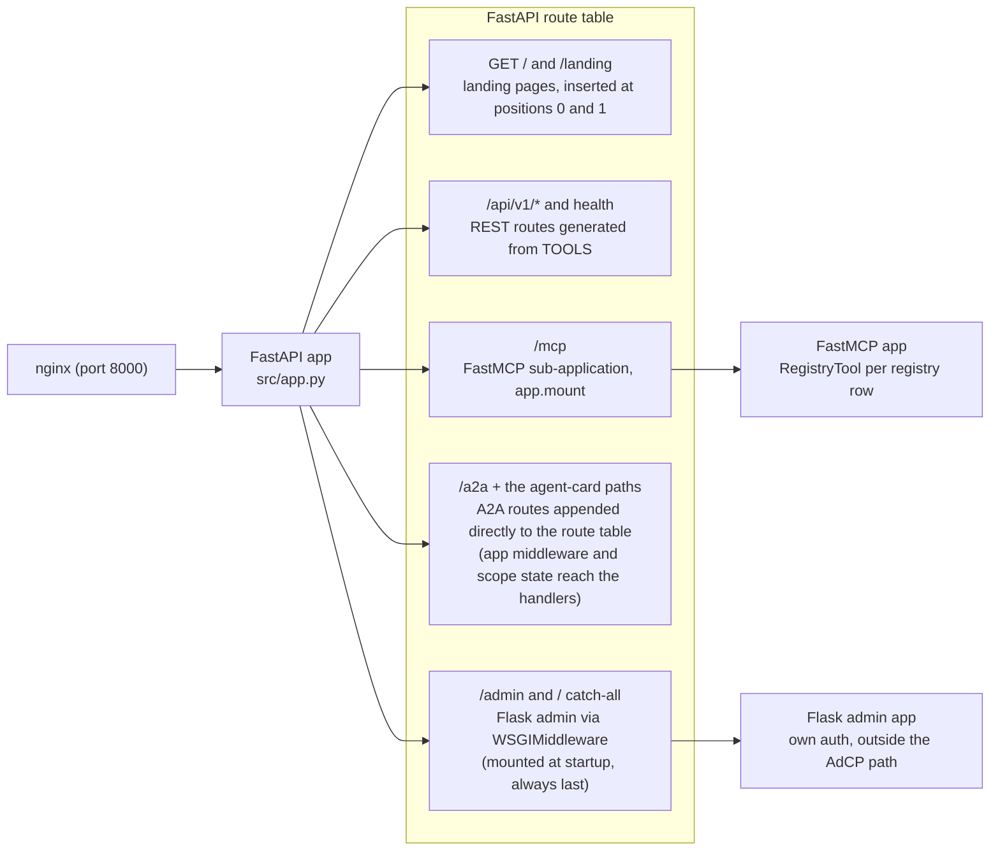
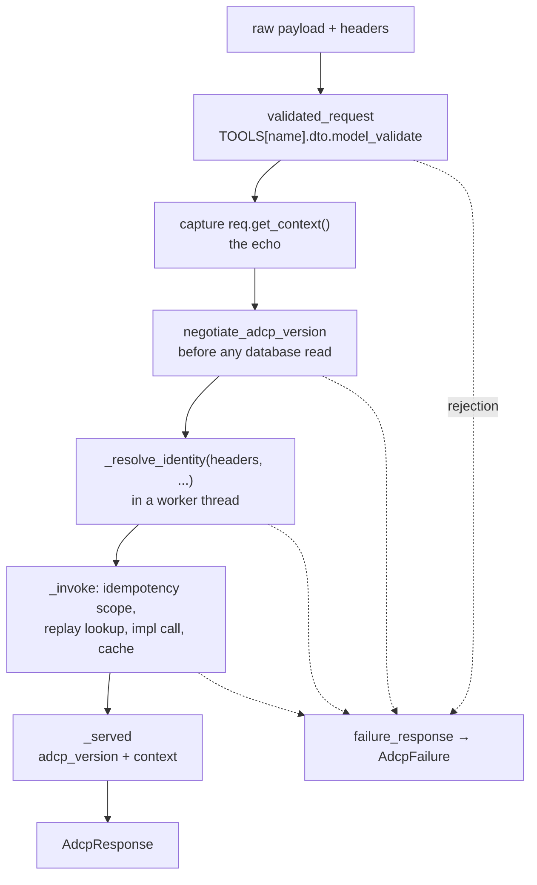
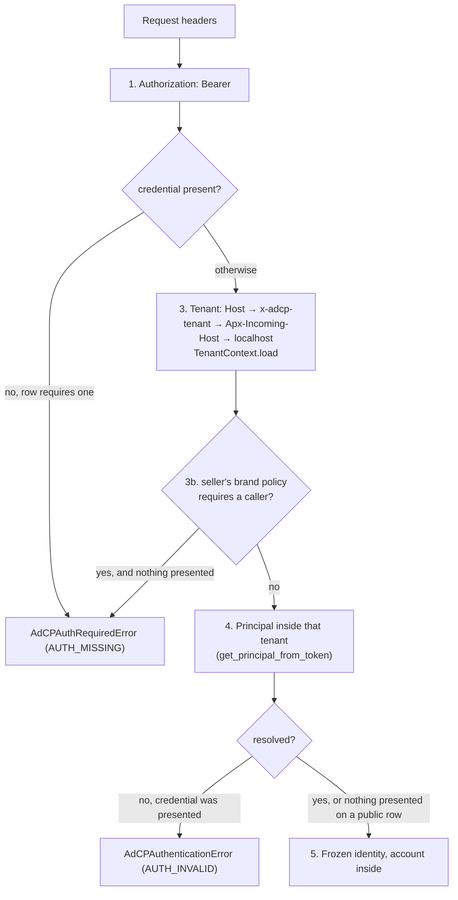
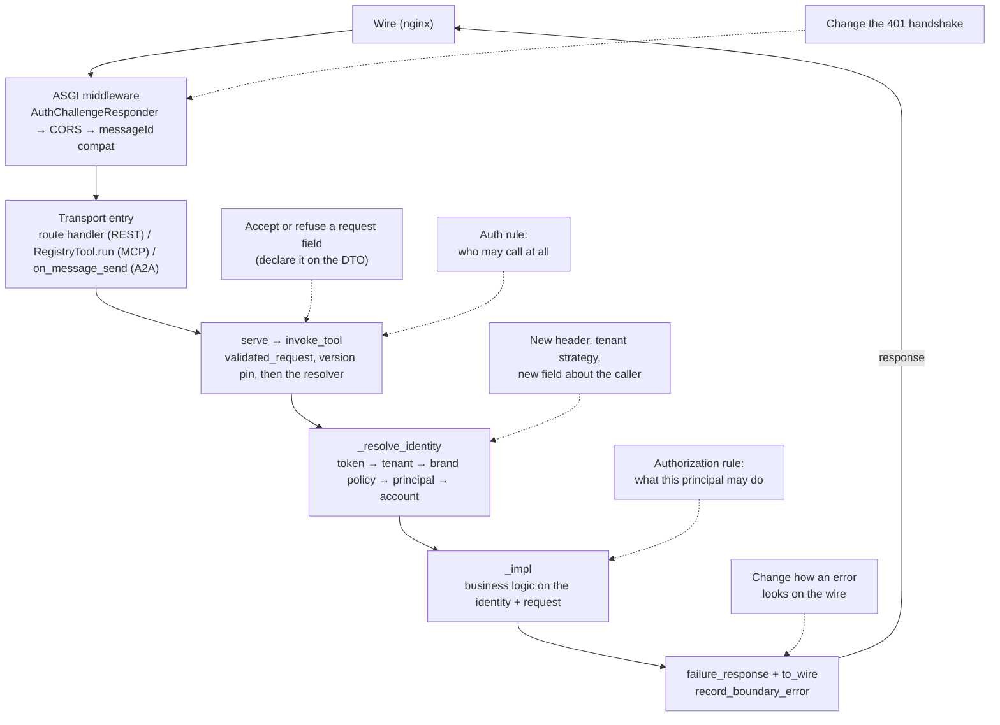

# Request lifecycle

How a request travels from the wire to business logic, and what has already
happened to it by the time your `_impl` function runs.

Read this before adding anything to the request path: a header to read, an auth
rule, a tenant-scoped check, an idempotency decision. Each of those has exactly
one layer that owns it (see [Where does my change go?](#where-does-my-change-go)
at the end). The principles this layering serves are in
[Architecture principles](architecture-principles.md); how to add a tool to
the registry is [Building a tool](building-tools.md).

## One process, four entry points

A single FastAPI application, built in `src/app.py`, serves everything.
nginx sits in front (port 8000 locally) and proxies to it; there is no
per-protocol process. The app exposes four kinds of entry point:

| Path | Protocol | How it is registered |
|------|----------|----------------------|
| `/api/v1/*` | REST | FastAPI routes generated from the tool registry (`src/routes/api_v1.py:139-164`), included with `app.include_router` (`src/app.py:583`) |
| `/mcp` | MCP | FastMCP sub-application (`mcp.http_app(path="/", json_response=True, stateless_http=True)`), mounted with `app.mount("/mcp", mcp_app)` (`src/app.py:126`, `:151`) |
| `/a2a` + three agent-card paths | A2A (JSON-RPC) | a2a-sdk route factories, appended **directly** to the FastAPI app's route table (`src/app.py:375-376`), not mounted as a sub-app, so the app's middleware and `scope["state"]` are visible to A2A handlers |
| `/admin` and `/` (catch-all) | Admin UI | The Flask admin app (`src.admin.app.create_app`), wrapped in `WSGIMiddleware` and mounted into FastAPI (`src/app.py:62-88`) |

The following diagram shows how each entry point reaches the shared
application, and which entry points are sub-applications rather than plain
routes on the app itself.



Three details deserve attention:

- **The admin UI is a Flask app living inside the FastAPI app.** The lifespan
  hook mounts it at startup (via `_install_admin_mounts()`, `src/app.py:62-88`)
  rather than at import time, which guarantees that the root catch-all mount is
  the *last* route: every FastAPI route, including routes added later, gets a
  chance to match before the Flask catch-all receives the request. Admin
  authentication (Google OAuth sessions) is Flask's own and is not part of the
  AdCP request path this document traces.
- **Landing pages**: the app inserts the handlers for `GET /` and `GET /landing`
  at positions 0 and 1 of the route table (`src/app.py:677-678`), so they take
  precedence over the root Flask mount. They resolve the tenant from the `Host`
  header and render a tenant landing page.
- **One handler serves the agent card on three paths** —
  `/.well-known/agent-card.json`, `/.well-known/agent.json`, and `/agent.json`.
  It replaces the SDK's single static route and creates the other two
  (`src/app.py:490-533`). When the `Host` routes to a tenant, the handler
  advertises that tenant's **stored** host as the A2A URL
  (`_canonical_a2a_url`, `src/app.py:416-432`), so the card publishes the same
  string the tenant's `brand.json` carries. For a `Host` that routes to no
  tenant it falls back to the `Apx-Incoming-Host` / `Host` /
  `X-Forwarded-Proto` sequence below that lookup (`src/app.py:434-482`).

The app includes the health routes (`src/routes/health.py`) alongside the REST
router (`src/app.py:604`), and the debug and reset routes only where the
deployment enables them (`settings.debug_routes_enabled`, `src/app.py:604-608`).
The app assembles the OpenAPI document last, after every router, and merges the
REST request bodies' nested models into `components/schemas` from the same DTOs
that validate (`_openapi_with_rest_components`, `src/app.py:586-688`;
`_rest_body_schemas`, `src/routes/api_v1.py:114-136`).

## What the proxy in front does

nginx terminates the client connection and proxies every path to the one
application, forwarding `Host` verbatim because tenant routing is an exact
`Host` match:

- **Compose and local development** (`config/nginx/nginx-development.conf:38-83`):
  one server on `:8000`, `proxy_pass` to `adcp-server:8080` with
  `$request_uri`, forwarding `Host`, `X-Real-IP`, `X-Forwarded-For`,
  `X-Forwarded-Proto`, and `Authorization`. It sets no tenant header, so the
  resolver identifies the tenant from `Host` (or from an `x-adcp-tenant` the
  caller sent itself).
- **Multi-tenant deployments** (`config/nginx/nginx-multi-tenant.conf`): a
  `map $host $tenant` extracts the subdomain, and the tenant server block adds
  `x-adcp-tenant: $tenant` and `Apx-Incoming-Host: $tenant.<domain>` to the
  proxied request (`:167`, `:184-185`). Those two headers, plus `Host`, are
  exactly the three the resolver reads for tenant detection.

### The in-network test stack

The e2e compose stack runs the same two-layer arrangement, with no host ports:
the `proxy` service mounts `nginx-development.conf`, and the stack reaches it by
service name at `http://proxy:8000`, the value of `E2E_BASE_URL`
(`docker-compose.e2e.yml:290-303`, `:476`).

Beside it, `tls-proxy` adds a second listener on `:8443` for the origins the
stack dials over HTTPS. It routes by the TLS ClientHello's SNI name through a
`map $ssl_server_name` — `proxy.adcp.test` to `adcp-server:8080`,
`creative-agent.adcp.test` to `creative-agent:8080`, `webhooks.adcp.test` to
`webhook-capture:8080`, `storyboard.adcp.test` to
`adcp-server-storyboard:8080` — and falls back to its own `${TLS_UPSTREAM}` for
a name the map does not carry, which is how one template also serves the
per-worker sidecars whose dotted container name matches nothing
(`config/nginx/nginx-tls-test.conf.template:28-96`). Those dotted names are
compose network aliases on that one service
(`docker-compose.e2e.yml:332-367`), and `scripts/dev/gen_test_tls.py` generates
the `*.adcp.test` wildcard certificate it serves. `tls-proxy` forwards `Host`
with its port intact here too, for the same tenant-routing reason
(`nginx-tls-test.conf.template:81-96`).

## The ASGI middleware stack

`src/app.py` registers three HTTP middlewares, and none of them reads a
credential or resolves an identity. Outermost first:

1. **`AuthChallengeResponder`** (`src/core/auth_middleware.py`), registered last
   and therefore outermost (`src/app.py:629`). It sees the *finished* response
   of every transport, including the MCP mount and the A2A routes. When the JSON
   body carries an AdCP `AUTH_MISSING` or `AUTH_INVALID` code it lifts the
   status to `401` and attaches the `WWW-Authenticate` challenge — `Bearer`, or
   `Bearer error="invalid_token"` for a presented credential that was rejected
   (RFC 6750 §3, `auth_middleware.py:35-38`).
2. **`CORSMiddleware`** (`src/app.py:619-625`): adds CORS headers to all
   responses (origins from `settings.runtime.allowed_origin_list`).
3. **`a2a_messageid_compatibility_middleware`** (`src/app.py:540-576`),
   innermost. On `POST /a2a` only, it rewrites a numeric `message.messageId` or
   JSON-RPC `id` to a string and leaves every other request untouched.

> **Warning:** Starlette's `add_middleware` makes the last-registered
> middleware the outermost one. `src/app.py` registers
> `AuthChallengeResponder` last so that it runs outermost on the wire.

`AuthChallengeResponder` finds the code by reading a *finished* body, so it
needs no knowledge of tools. `adcp_error_code_in`
(`src/core/auth_middleware.py:53-135`) tries one reader per container: the
envelope as the whole body (REST), an envelope nested under a JSON-RPC
`error.data`, an envelope re-encoded inside an MCP tool result's
`content[].text`, and an envelope in a failed A2A Task's artifact DataPart. It
buffers `application/json` responses only (`_is_json_response`), which is why
the app builds the MCP sub-application with `json_response=True` — under SSE the
status reaches the wire before FastMCP dispatches the tool. On flush it strips
any inbound `WWW-Authenticate` and re-derives it from the body
(`auth_middleware.py:181-226`), so a second renderer anywhere further in has no
effect.

No middleware decides auth. Each transport hands the request headers to the
boundary, where the tool name is known, and the resolver behind it is the one
reader of a credential (`src/app.py:138-152`).

## How a tool becomes reachable

`src/core/tools/registry.py` holds one frozen `ToolSpec` per tool, keyed by
AdCP tool name, exposed as a read-only `MappingProxyType` over a module-private
dict (`registry.py:205-288`). Fourteen rows, each naming a `dto`, an `impl`, a
`rest` binding, and `a2a` (default `True`). MCP registration, the A2A card and
its dispatch, and the REST route are each a loop over those rows, so a
registration cannot disagree with the row it derives from.

Two properties the request path depends on are **derived** from a row rather
than declared on it:

- **Whether a credential must verify** comes from the implementation's
  `identity` annotation. `ToolSpec.requires_credential()` returns `True` when
  that annotation is a `ResolvedIdentity` subclass, and additionally — when a
  tenant is supplied — for a DTO that declares `brand` on a tenant whose
  `brand_manifest_policy` is `require_auth` (`registry.py:163-195`). There is no
  `auth=` literal on a row.
- **Whether an account is resolved** comes from the DTO: `requires_account()`
  is true when the DTO declares `account` required (`registry.py:156-161`).
  `__post_init__` refuses at load a row whose identity annotation disagrees with
  its DTO — `AccountIdentity` on an optional `account`, or `ResolvedIdentity` on
  a required one (`registry.py:134-154`).

The implementation contract is exactly `(req: <DTO>, identity: <one of the three
identity types>)`. The `ToolImpl` protocol on `ToolSpec.impl` types that
contract, and `.ast-grep/rules/impl-signature-is-request-and-identity.yml` pins
it.

The row itself is the subject of [Building a tool](building-tools.md) — what
each field means, the three rows `_register_tool` refuses at import, and how
each of the three transports derives from a row. Read that page when you add or
change a tool; this page continues with what happens to a request once the tool
is reachable.

## The boundary: `serve` and `invoke_tool`

Every transport makes one call:

```python
response = await serve(tool_name, raw_payload, headers, protocol)
```

`serve` (`src/core/tools/_boundary.py:224-237`) validates the payload into the
registry row's DTO and hands the validated request to `invoke_tool`
(`:240-326`), which takes headers and never an identity. The order of steps is
the design:



1. **Validation** happens once, for all three transports
   (`validated_request`, `:199-221`). A rejection reads the buyer's `context`
   off the **raw** payload — by subscript, caught — because this is the one
   outcome with no validated request to read it from, and leaves through
   `_failed`.
2. **The echo**: the boundary captures `req.get_context()` at entry and stamps
   it on the way out. Nothing between those two points reads, passes, or writes
   it.
3. **Version negotiation** runs next, before anything touches the database
   (`negotiate_adcp_version`, `src/core/version_negotiation.py:58-92`). A
   release this build does not speak ends the exchange, so a rejected pin must
   not resolve a credential, a tenant, or an account, must not hash the request,
   and must not be answered from the replay cache. The two pins are declared
   fields on the request, read through the `BuyerRequest` accessors
   (`src/core/schemas/_base.py:689-695`).
4. **Identity** resolves once, in a worker thread because the resolver is
   synchronous and hits the database (`:289-310`). The boundary computes
   `require_valid_token=spec.requires_credential() or account_ref is not None`
   and passes the row's tenant-dependent policy down as
   `credential_required_for=spec.requires_credential`.
5. **The tool runs** inside `_invoke` (`:353-399`), which honours the request's
   idempotency key around the call.
6. **`_served`** (`:329-350`) stamps `adcp_version` and `context` onto the
   response envelope — on a fresh run, a replay, and a failure alike.

A failure at any step leaves as `AdcpFailure`, so a transport wraps one call in
one `try`.

### Validation: the DTO is the accepted shape

The accepted shape is the DTO's declared fields and nothing else (CLAUDE.md
critical pattern 7). The policy is a `mode="before"` model validator on the
`BuyerRequest` mixin (`src/core/schemas/_base.py:616-671`) calling
`deep_strip_to_schema` (`src/core/schemas/_accepted_shape.py:99-186`), so every
transport gets it by constructing the DTO and there is no call to forget. Why
the policy lives on the mixin, why it runs `mode="before"`, and why it ignores
`additionalProperties` are in
[Building a tool § The accepted shape is the declared shape](building-tools.md#the-accepted-shape-is-the-declared-shape).

What happens to a stripped key depends on the deployment, and one predicate
decides it. In development the validator raises `AdCPInvalidRequestError` with
one `issues[]` entry per removed key — RFC 6901 pointer, keyword
`additionalProperties` — so a spec field this seller has not implemented is
loud (`_base.py:661-671`). In production the validator drops the keys silently,
so the agent serves a newer buyer rather than refusing one.
Both branches ask `is_production()`, which is true for `PRODUCTION=true`,
`ENVIRONMENT=production`, or a Fly app name
(`src/core/config.py:73-79`, `:418-419`); the DTOs' own pydantic `extra` mode
comes from the same predicate through `RuntimeSettings.pydantic_extra_mode`,
`"ignore"` in production and `"forbid"` elsewhere (`:118-124`, `:422-430`).

A rejection here is `INVALID_REQUEST`, not `VALIDATION_ERROR`; the pin's split
between the two codes is in
[Building a tool § Which code](building-tools.md#which-code).

### Identity: `_resolve_identity`

All transports converge on one function before business logic runs
(`src/core/resolved_identity.py:267-412`):

```
_resolve_identity(
    headers, *, require_valid_token, account_ref=None, credential_required_for=None
) -> ResolvedIdentity | PublicIdentity
```

The leading underscore is the design: this is the one identity resolution in
the tree, `invoke_tool` is its only caller, and `ruff-boundary.toml` bans
importing it, re-exporting it from the boundary, and the two primitives it is
built from (`auth_utils.get_principal_from_token`, `_detect_tenant`).
`ruff-boundary.toml:183-184` bans the two auth refusals
(`AdCPAuthRequiredError`, `AdCPAuthenticationError`) outside it too, so one
place refuses a buyer's credential; the two exempt modules name
`AdCPAuthenticationError` for a different credential — an ad server rejecting
the seller's, and an inbound webhook's (`:61-66`). Overloads on
`require_valid_token` make the returned type static, so the boundary consumes it
with no `isinstance`.

It reads the headers once and does the following, in order:

**1. Token extraction** (`_extract_auth_token`, `:155-171`): the Bearer value of
`Authorization`, or nothing. This is the only header the resolver reads a
credential from. The resolver does not recognize the `x-adcp-auth` alias: pinned
3.1.1 `L2/authentication.mdx` says the credential MUST ride `Authorization` and
that sellers MUST NOT require non-canonical aliases. A caller sending only the
alias therefore presents nothing, and a protected tool answers `AUTH_MISSING`
rather than `AUTH_INVALID`.

**2. Missing credential**: if the row requires one and the caller presented
none, raise `AdCPAuthRequiredError` (`AUTH_MISSING`). This runs before tenant
detection, so an anonymous caller costs no database lookups.

**3. Tenant detection and load** (`_detect_tenant`, `:174-217`, then
`TenantContext.load`): four strategies identify the `tenant_id`, first match
wins, each reading one indexed column, and only then does the resolver load the
row once:

1. `Host` header: virtual-host lookup, then subdomain extraction
   (`<subdomain>.<domain>`; `localhost`, `www`, `admin`, and the service's own
   name are excluded).
2. `x-adcp-tenant` header (set by the multi-tenant nginx from the subdomain):
   subdomain lookup, then the literal tenant id, unverified.
3. `Apx-Incoming-Host` header (Approximated.app virtual hosts): virtual-host
   lookup.
4. Localhost fallback: the `default` tenant.

**3b. The seller's brand policy** (`:369-379`): a public row may still need a
caller. Once it has loaded the tenant row, the resolver asks the row's
`credential_required_for(tenant)` — `ToolSpec.requires_credential` — and a
seller whose `brand_manifest_policy` is `require_auth` makes `get_products`
require one. The refusal is the same `AUTH_MISSING`, minted here.

**4. Principal resolution** (`get_principal_from_token` in
`src/core/auth_utils.py`): the resolver looks the token up *inside the detected
tenant*, never globally. A principal is a row in exactly one tenant, so without
a tenant there is no lookup.

The lookup matches a HASH, not a plaintext token. The seller mints a credential
once (`mint_token` in `src/core/credentials.py`, `tok_` and 32 URL-safe random
bytes), shows it to the operator exactly once, and stores `sha256(token)` plus a
12-character display prefix. The resolver hashes what the request presents and
looks up that hash (`hash_token`, then
`PrincipalRepository.find_by_token_hash`), so the database never holds a
credential that authenticates and a test cannot read one back out of a row. A
256-bit random value is not a password, so there is no slow hash and no salt: an
attacker holding the table cannot invert SHA-256 over that much entropy, and the
lookup stays an index hit on `uq_principals_token_hash`. Operator API keys
(`sk_`) store the same way.

Migration `e4b7c2a91f05` converts an existing deployment in place: it adds the
two columns, fills them from the plaintext it is about to drop, makes the hash
NOT NULL and unique, then drops `principals.access_token` and
`tenants.admin_token`. Credentials already issued to advertisers keep working
across the upgrade.

Sandbox and demo credentials are not yet distinguished. The self-service signup
mints an ordinary `tok_` buyer token for its demo principal
(`src/admin/blueprints/public.py`), so nothing in the credential tells a demo
key from a production one. Giving demo keys their own prefix and their own
handling belongs to the sandbox feature and is future work.

If the caller presented a credential and it
resolves to no principal of that tenant, raise `AdCPAuthenticationError`
(`AUTH_INVALID`), whether or not the tool requires a credential: the pinned
enum's MUST keys on "an `Authorization` header was present but verification
failed" and names no task. A public tool differs only in the absent case, where
the request proceeds anonymously.

**5. Construction** (`:401-411`): the resolver builds the identity once, with
the account inside it when the request named one. Nothing copies or amends an
identity afterwards.



The result is one of three frozen types, and the type carries the boundary's
decision (`resolved_identity.py:44-149`):

| Type | `principal` / `tenant` | `account` | Who declares it |
|---|---|---|---|
| `PublicIdentity` | may be `None` | absent | `get_products`, `list_creative_formats`, `get_adcp_capabilities` |
| `ResolvedIdentity` | both present | optional | the other eight protected tools |
| `AccountIdentity` | both present | present | `create_media_buy`, `update_media_buy`, `sync_creatives` |

All three are `frozen=True` with `extra="forbid"`, and `principal` and `tenant`
are `InstanceOf` fields so nothing can coerce a dict into one. `principal_id`
and `tenant_id` are derived properties, and the type that knows what it carries
answers `replay_scope()`.
`.ast-grep/rules/resolved-identity-constructed-only-by-its-owners.yml` limits
construction to two owners: `src/core/resolved_identity.py` in production and
`tests/factories/principal.py` in tests.

`TransportProtocol` (`resolved_identity.py:24-42`) is a `StrEnum` of
`mcp`/`a2a`/`rest`. It is a label with one consumer — scoping the observability
record a failure writes. It is not a field on any identity, and nothing under
`src/` branches on it.

### Server-initiated work: `identity_of`

Some work runs with no request at all: executing a media buy after a human
approved it (`src/core/tools/media_buy_create.py:1180`, `:1498`), the delivery
reporting path (`src/core/tools/media_buy_delivery.py:163`), and an admin
operations view (`src/admin/blueprints/operations.py:133`). They act on behalf
of the stored row's owner, and the row carries the same facts the request path
derives: `tenant_id`, `principal_id`, and sometimes `account_id`.

`identity_of(tenant_id, principal_id, account_id=None)`
(`resolved_identity.py:415-451`) is the same resolution with those ids as its
input: load the tenant, load the principal inside it, and, when the row names an
account, load it through the same access-checked lookup a request goes through,
returning an `AccountIdentity`; otherwise a `ResolvedIdentity`. Overloads make
the return type static. A missing tenant or principal there is broken seller
data (`AdCPConfigurationError`), not an authentication outcome. No transport
calls it.

### The account the request names

The resolver resolves an account for an authenticated caller only, inside the
one identity construction. Naming an account is itself a claim that needs a
credential, so the boundary sets `require_valid_token` to true whenever the
request carries `account`, even on a public tool (`_boundary.py:289-310`); the
resolver refuses an anonymous caller before the access-scoped lookup can run.

`_load_account` (`resolved_identity.py:220-234`) opens an `AccountUoW` and calls
`find_account` (`src/core/database/repositories/account_lookup.py:36-54`), which
answers with the account or a typed refusal — not found, no access, ambiguous
natural key, or a status that blocks operations. The resolver loads the account
per request and never remembers it on the principal: one credential may access
many accounts. `ruff-boundary.toml:161` keeps `account_lookup` importable by the
resolver alone, so a tool reads `identity.account`; the account repository and
its unit of work carry the matching bans in `ruff-ownership.toml:64-70`.

### Idempotency

The boundary honours the request's `idempotency_key`, and only for a request
whose DTO declares one, which carries one, and whose identity resolved a tenant
and a principal (`_keyed_scope`, `_boundary.py:145-160`). The scope is
`(tenant_id, principal_id, account_id, key)`, read off `identity.replay_scope()`
— the spec's `(agent, account, key)`, with no tool dimension.

The digest is `canonical_request_hash` over the **validated** request's
`model_dump(mode="json")`, with the SDK's closed exclusion list stripped
(`idempotency_key`, `context`, `governance_context`, and the webhook credential)
so a key never hashes itself and a rotated credential does not turn a retry into
a conflict (`src/core/idempotency_canonical.py:77-84`).

`_invoke` (`:353-399`) then takes one of four paths:

- **A hit with the same payload replays** the stored envelope, reconstructed
  through `AdcpResponse.revive` on the model read off the implementation's
  return annotation (`_response_model_for`, `_deserializer_for`, `:74-133`). The
  boundary sets the `replayed` marker on the outgoing envelope rather than
  storing it, and `_served` re-stamps the context of the caller it is serving.
- **A hit with a different payload** is `IDEMPOTENCY_CONFLICT`, checked before
  any replay (`src/core/idempotency_replay.py:41-84`).
- **A cached envelope that no longer validates** counts as a miss, so the
  request executes fresh rather than failing.
- **A miss** runs the tool and caches the result with the result's own
  `status`, so a create awaiting approval replays as `submitted` rather than as
  a completed success.

Nothing caches an error, and that is a property of control flow rather than a
check: every implementation raises on failure, and a raise never reaches the
save.

What this means when you write a tool — that a read declares no key, that a
nested service call carries none, why the hash runs over the validated model,
and the one unimplemented case (two concurrent requests with the same key) — is
[Building a tool § Idempotency](building-tools.md#idempotency).

### The context echo

The buyer's `context` is opaque data this seller carries and returns. It is one
field on one class, with one writer.

`AdcpResponse` (`src/core/schemas/_base.py:754-795`) inherits the SDK's
`AdcpVersionEnvelope` and `ProtocolEnvelope` — the pair every pinned response
schema composes at its root — and `core/protocol-envelope.json` declares
`adcp_error`, `context`, and a required `status` there. So a failure is a
response carrying an error, not a separate document, and the echo has a field to
land on for every outcome.

`_served` (`_boundary.py:329-350`) is the one writer. It assigns the field
through `object.__setattr__`, the one bypass of the two refusals that make that
true rather than customary: an after-validator on `AdcpResponse` rejects a
non-`None` `context` on construction, and `__setattr__` rejects assignment
afterwards (`_base.py:782-795`). Both are needed, because pydantic's `__init__`
populates a model without routing through `__setattr__`.

`AdcpResponse.revive` (`_base.py:797-829`) is the one entry point for a stored
document that already carries a context — a replayed body, or a response the
test harness re-parses — and it re-attaches the value through the same bypass.

Two more refusals prevent the removed code paths from returning.
`ruff-boundary.toml:193` bans importing `adcp.types.ContextObject` outside the
schemas (which declare the field) and the boundary (which reads and writes it),
and `.ast-grep/rules/context-is-written-by-the-boundary-alone.yml` fails any
`context=` keyword argument under `src/` outside the boundary module.
`AdCPSalesAgentError` takes no `context` parameter, so an error cannot carry one
to a raise site; the boundary echoes onto the failure response it builds from
the error.

Three tests grade each refusal by breaking it:
`tests/unit/test_response_context_is_boundary_owned.py`,
`tests/unit/test_ruff_boundary_bans.py`, and
`tests/unit/test_ast_grep_identity_rules.py`.
`tests/bdd/test_local_context_echo.py` grades the behavior itself, and its
scenarios run on every transport.

### Failure

A failure is a response, built once. `failure_response`
(`_boundary.py:163-186`) records the original exception with
`record_boundary_error` and returns `_served(echo, AdcpErrorResponse.of(adcp_error_for(exc)))`;
`_failed` raises it as `AdcpFailure`, the one exception a transport catches
(`src/core/exceptions.py:1124-1149`).

- `adcp_error_for` (`exceptions.py:1180-1223`) types whatever escaped: an
  already-typed `AdCPSalesAgentError` passes through, a pydantic
  `ValidationError` becomes `AdCPInvalidRequestError` with `issues[]`, a plain
  `ValueError` becomes `AdCPValidationError`, a `PermissionError` becomes
  `AdCPAuthorizationError`, and anything else names `INTERNAL_ERROR`.
- `AdcpErrorResponse.of` (`_base.py:872-902`) carries the same error object at
  both layers the wire declares — `adcp_error` on the envelope and `errors[0]` —
  with `status=failed`. `http_status` reads the status from `CODE_TABLE` by the
  wire code string (`_base.py:857-869`).
- The body carries no exception text. `record_boundary_error`
  (`src/core/tool_error_logging.py:68-159`) writes the server-side record
  instead: a typed error at WARNING with the traceback attached when it carries
  a cause, an untyped one at ERROR with `exc_info=True`, then the activity feed
  and the audit log when the identity resolved a tenant, each sink wrapped so an
  observability failure cannot replace the buyer's error.

## The path per transport

Each transport adds exactly one thing: its own wire marker for a failure. The
body is the response the boundary built, serialized by `to_wire`
(`src/core/tools/_wire.py:10-35`) on success and failure alike. Envelope fields,
`adcp_version` and `context` included, serialize as declared fields, so no
transport adds anything there.

### REST

```
wire → AuthChallengeResponder → CORS → route handler → serve → _impl
```

The route factory `_rest_handler` (`src/routes/api_v1.py:52-111`) builds one
handler per registry row. The handler takes `Request` rather than the DTO, so
FastAPI validates nothing ahead of `validated_request` and a rejected request
still gets its `context` back. It reads the body (parsed JSON, or the raw bytes
when the body is not JSON), merges templated path values over it — the URL is
the resource identity, so a path value wins — and calls `serve` with
`request.headers`. A success is a `200` with the wire body; the handler answers
an `AdcpFailure` with `failure.response.http_status`. It publishes the DTO's
JSON Schema through `openapi_extra`, so the advertised shape and the accepted
shape come from one declaration.

### MCP

```
wire → AuthChallengeResponder → CORS → /mcp mount → FastMCP → RegistryTool.run → serve → _impl
```

`RegistryTool` (`src/core/main.py:347-390`) is one registry row served over MCP.
Its `run` reads the request headers with FastMCP's
`get_http_headers(include_all=True)` and calls `serve` with the buyer's argument
object. It is a `Tool` subclass rather than a function tool so that FastMCP does
not validate the arguments against a signature-derived adapter first; the DTO's
own JSON Schema is what the tool advertises, and `serve` is the one validation.
Outside an HTTP request `get_http_headers` returns `{}` — a request presenting
nothing, which the resolver answers `AUTH_MISSING` on a protected tool.
`RegistryTool.run` raises a failure as `AdCPToolError` whose `str()` is the JSON
body, which FastMCP renders as `isError: true`
(`src/core/tool_error_logging.py:26-41`). The success body goes in
`ToolResult.structured_content` as a plain dict from `to_wire`
(`src/core/tools/_mcp.py:11-32`).

### A2A

```
wire → AuthChallengeResponder → CORS → messageId compat → /a2a route → AdCPRequestHandler.on_message_send
     → _dispatch_skill → serve → _impl → to_wire
```

The A2A JSON-RPC routes are plain routes on the FastAPI app. The SDK's default
context builder places `dict(request.headers)` on the call context's
`state["headers"]`, which is all `on_message_send`
(`src/a2a_server/adcp_a2a_server.py:197-311`) reads before handing the skill
name, its parameters, and those headers to `_dispatch_skill`.

An invocation is one DataPart carrying `{"skill": ..., "input": {...}}`.
`_dispatch_skill` (`:452-475`) answers `MethodNotFoundError` for any skill that
is not a registry row with `a2a=True`, and otherwise calls `serve` and returns
`to_wire(...)`, so A2A adds nothing to the body. The message-framing rules that
sit in front of that call — one skill per message, a text-only message refused —
are in
[A2A and MCP agent flows § A2A message framing](a2a-mcp-agent-flows.md#a2a-message-framing).

A response becomes a Task: `status=submitted` returns the Task with no
artifacts, and anything else appends an artifact carrying an optional TextPart
read from the payload's `message` plus the DataPart, with the Task state mapped
from the response's own `status` through one total enum-to-enum table
(`_TASK_STATE_BY_ADCP_STATUS`, nine rows, `:135-145`). A failure travels the
same way — the failure response in the artifact, the state read off its
`status` — so `AuthChallengeResponder` finds a refused credential there and the
401 handshake needs no branch in the handler.

`_restore_a2a_wire_integers` (`src/app.py:292-335`) wraps every `/a2a` route
endpoint and repairs outgoing numbers once, because the a2a-sdk builds its body
through a protobuf `Struct` that has no integer variant. What that costs you
when you add an integer field is in
[A2A and MCP agent flows § A2A integers](a2a-mcp-agent-flows.md#a2a-integers).

## Where the path ends: the `_impl` handoff

Everything in the preceding sections exists to produce two things: a validated
request object and an identity. At that point the transport's job is done and
Critical Pattern #5 ([CLAUDE.md](../../CLAUDE.md), and
[Patterns reference](patterns-reference.md)) takes over:

- The boundary calls the `_impl` function as `impl(req=..., identity=...)`,
  never with a `Context` or raw headers. A protected tool declares
  `identity: ResolvedIdentity` (or `AccountIdentity`), whose `principal`,
  `tenant`, and — for the latter — `account` are not optional; a public tool
  declares `identity: PublicIdentity` and branches on
  `identity.principal is None` itself. The annotation IS the credential policy;
  the registry derives `requires_credential` from it.
- `_impl` is transport-agnostic: zero imports from
  fastmcp/a2a/starlette/fastapi, raises typed `AdCPSalesAgentError` subclasses,
  returns response models. It reads `identity.principal` and `identity.tenant`
  directly, because the type carries the boundary's decision and nothing
  downstream re-checks it.
- Reaching an `_impl` directly is a lint failure: `ruff-boundary.toml:77-92`
  bans importing each of the fourteen `_impl` names across `src/` and
  `scripts/` (sixteen rows: the config bans two tools at both spellings that
  resolve), with `registry.py` the single exemption (`:49`), and points a caller at
  `serve` / `invoke_tool` / `TOOLS[name].impl` or at the extracted service.
- The boundary translates the result and any error back into the transport's
  wire format, symmetrically, through `failure_response` and `to_wire`.

Enforcement for this path runs in `make quality-ci` (`Makefile:15-31`): five
ruff configs over `src/` and `scripts/`, then `ast-grep scan --config
sgconfig.yml`, then mypy. `tests/unit/test_ruff_boundary_bans.py`,
`tests/unit/test_ast_grep_identity_rules.py`, and
`tests/unit/test_transport_agnostic_impl.py` grade the same area from the test
suite; the design rationale is in
[Structural guards](structural-guards.md).

## Where does my change go?

The following diagram shows the end-to-end path with the common insertion points
(dashed) attached to the layer that owns each one, and the table after it maps
specific changes onto the same layers.



| Change you want to make | It belongs in | Not in |
|---|---|---|
| Read a new HTTP header for all transports | `_resolve_identity` / `_detect_tenant` in `src/core/resolved_identity.py`; headers reach the resolver from every transport | `_impl` (never sees headers), a transport entry |
| Accept a request field | Declare it on the DTO; the `BuyerRequest` validator accepts exactly the declared shape | Route handlers, a transport entry, `_impl` |
| Add an auth rule (who may call at all) | The implementation's identity annotation: `ResolvedIdentity` needs a caller, `PublicIdentity` serves anybody; `ToolSpec.requires_credential` derives it and the boundary reads it | A transport entry, an `auth=` literal on the row, or a check inside `_impl` |
| Add an authorization rule (what this principal may do) | `_impl`, reading `identity.principal`, `identity.tenant` and `identity.account` | Middleware (too early, no business context) |
| Add a tenant-resolution strategy | `_detect_tenant` in `src/core/resolved_identity.py`, which the resolver calls once | A transport entry. There is no per-transport tenant resolution: the variant that read `x-adcp-tenant` off a FastMCP `Context` is deleted (`src/core/auth.py`) |
| Add a field to what business logic knows about the caller | The identity types + populate them in `_resolve_identity` and `identity_of` | Passing extra transport args into `_impl` |
| Change what the buyer's `context` does | `_served` in `src/core/tools/_boundary.py`, the one writer | Anywhere else: the type, the keyword and the field are all banned outside it |
| Change how an error looks on the wire | `failure_response` and `AdcpErrorResponse` (`src/core/schemas/_base.py`); the 401 handshake in `AuthChallengeResponder` | `_impl` (raises typed errors, nothing else), a transport entry |
| Add a REST endpoint for a tool already in the registry | The row's `rest` binding in `src/core/tools/registry.py`; `src/routes/api_v1.py` derives the route | A hand-written route |
| Add a tool | A row in `src/core/tools/registry.py` — see [Building a tool](building-tools.md) | A per-transport registration |
| Log/audit a boundary event | `record_boundary_error` (errors) or the boundary itself | `_impl` |
| Touch request/response bodies globally | An ASGI middleware in `src/app.py`; remember that the last registered middleware is outermost | Route handlers |
