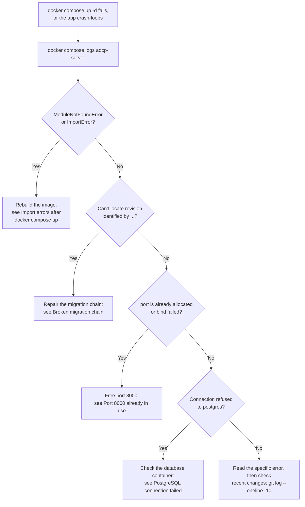
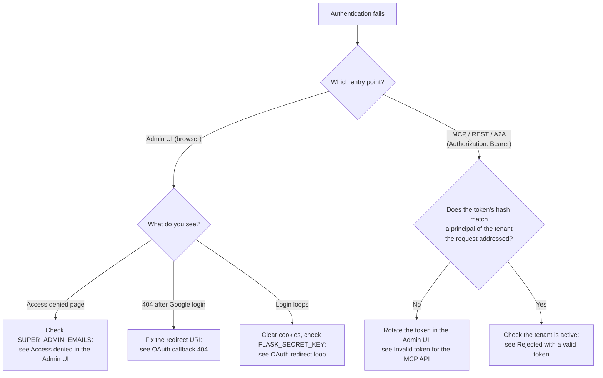
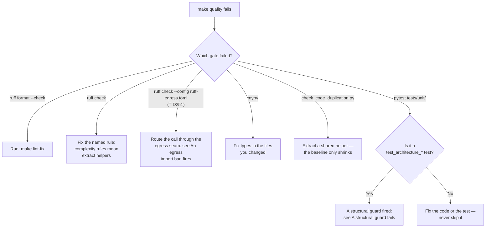

# Troubleshooting guide

This guide is a symptom lookup for the local Docker stack and its test
tooling. You reach every service through the nginx proxy at
`http://localhost:8000`. Each entry gives the symptom, the immediate fix, and
a link to the document that explains the mechanism. Find your symptom in the
contents, apply the fix, and follow the link if the fix isn't enough.

## Contents

Startup and Docker:

- [The stack won't come up, or the app crash-loops](#the-server-does-not-start) — decision tree
- [Container exits at startup](#container-does-not-start)
- [`ModuleNotFoundError` or `ImportError` after `docker compose up`](#import-errors-after-docker-compose-up)
- [Port 8000 is already allocated](#port-8000-already-in-use)
- [Permission denied inside a container](#permission-denied-inside-a-container)
- [Containers use too much memory](#high-memory-usage)

Database:

- [`column ... does not exist`](#column-does-not-exist)
- [`Can't locate revision identified by ...`](#broken-migration-chain)
- [`operator does not exist: text < timestamp with time zone`](#operator-does-not-exist-type-mismatch-in-queries)
- [App can't reach PostgreSQL](#postgresql-connection-failed)
- [Queries are slow](#slow-queries)

Authentication:

- [Which layer rejected the request](#authentication-issues) — decision tree
- ["Access denied" when logging in to the Admin UI](#access-denied-in-the-admin-ui)
- [404 after the Google OAuth redirect](#oauth-callback-404)
- [Login loops back to the OAuth screen](#oauth-redirect-loop)
- [Rejected with a valid token](#rejected-with-a-valid-token)
- [MCP requests rejected as unauthorized](#invalid-token-for-the-mcp-api)
- [A2A requests rejected as unauthenticated](#a2a-authentication-failed)

MCP and A2A:

- ["Tool not found" from the MCP server](#tool-not-found)
- [`get_products` returns an empty array](#mcp-returns-an-empty-products-array)
- [`Input validation error: '...' is a required property`](#contract-validation-errors)
- [A2A endpoint doesn't respond](#a2a-server-not-responding)
- [JSON-RPC rejects the `messageId`](#invalid-messageid-errors)

Admin UI:

- [Blank page or 500 error](#blank-page-or-500-error)
- [Activity feed doesn't update](#activity-feed-not-updating)
- [Slack notifications don't arrive](#slack-notifications-not-arriving)

GAM integration:

- ["Could not determine client ID from request"](#could-not-determine-client-id-from-request)
- [Choosing between OAuth and a service account](#oauth-compared-with-service-account)
- [GAM refresh token stopped working](#oauth-token-invalid)
- [Wrong GAM network code](#network-code-mismatch)
- [Inventory sync runs for 30+ minutes](#inventory-sync-timeout)

Outbound requests:

- [An outbound HTTP call is refused](#outbound-request-refused)

Testing and quality gates:

- [`make quality` fails — which gate](#a-make-quality-run-fails) — decision tree
- [A `test_architecture_*` guard test fails](#a-structural-guard-fails)
- [`TID251` import ban on `httpx`, `requests`, or `aiohttp`](#an-egress-import-ban-fires)
- [Integration tests are slow or flaky](#integration-tests-slow-or-flaky)
- [Async tests fail with coroutine warnings](#async-test-failures)
- [`AttributeError: '...' object has no attribute ...`](#attributeerror-on-model-fields)

Reference:

- [Recover a broken production deployment](#production-recovery)
- [API error quick reference](#api-error-quick-reference)
- [Check system health](#check-system-health)
- [Read the logs](#read-the-logs)
- [Get help](#get-help)

## The server does not start

The following decision tree routes a failed `docker compose up -d` — or an
app that starts and then crash-loops — to the right entry by what the logs
say.



## Server and Docker issues

### Container does not start

Read the logs first. Rebuild if the error is vague:

```bash
# Check logs
docker compose logs adcp-server
docker compose logs postgres

# Rebuild containers
docker compose down
docker compose build --no-cache
docker compose up -d
```

Migrations run automatically at startup: the `db-init` service runs
`python scripts/ops/migrate.py` and `adcp-server` waits for it to complete.
A migration error therefore appears in `docker compose logs db-init`.

### Import errors after `docker compose up`

**Symptoms**: `ModuleNotFoundError: No module named 'flask'` or
`ImportError: cannot import name ... from 'adcp...'` when running
`docker compose up` with source bind mounts.

The image installs the virtualenv at `/opt/venv` (outside `/app`), so the
`.:/app` bind mount never shadows installed packages. Import errors therefore
mean the image itself is stale — for example, after a dependency bump in
`uv.lock`. Rebuild without cache:

```bash
docker compose build --no-cache db-init adcp-server
docker compose up
```

If you add your own `docker-compose.override.yml`, mount source at `/app`
only — don't add a `/app/.venv` volume. The image provides packages on
`PATH` from `/opt/venv` and source on `PYTHONPATH=/app`.

### Port 8000 already in use

The proxy publishes one host port, `8000` by default. Set `CONDUCTOR_PORT`
to move it:

```bash
# Find the process holding the port
lsof -i :8000

# Or start the stack on a different host port
CONDUCTOR_PORT=8001 docker compose up -d
```

The `ADCP_SALES_PORT` variable (default `8080`) is the app's port inside the
Compose network, behind the proxy. Changing it doesn't resolve a host port
conflict.

### Permission denied inside a container

```bash
# Fix volume ownership
docker compose exec adcp-server chown -R $(id -u):$(id -g) /app

# Or run with your user ID
docker compose run --user $(id -u):$(id -g) adcp-server
```

### High memory usage

```bash
# Check container stats
docker stats
```

To cap a service, add limits in `docker-compose.override.yml`:

```yaml
services:
  adcp-server:
    mem_limit: 512m
    mem_reservation: 256m
```

## Database issues

### Column does not exist

The schema is behind the code. Run migrations:

```bash
# Locally
uv run python scripts/ops/migrate.py

# In Docker
docker compose exec adcp-server python scripts/ops/migrate.py

# Check migration status
docker compose exec adcp-server python scripts/ops/migrate.py status
```

If migrations fail, check for overlapping revisions:

```bash
grep -r "revision = " alembic/versions/
```

The `test_architecture_single_migration_head.py` guard fails `make quality`
when the migration graph has more than one head, so a chain conflict usually
surfaces there first.

### Broken migration chain

**Symptoms**: `Can't locate revision identified by '[revision_id]'` — the app
crashes at startup or a deployment fails.

1. Check the chain: `uv run alembic history`.
2. Identify the last known good revision: `uv run alembic current`.
3. Reset to it: `uv run alembic stamp [good_revision]`.
4. Create a new migration with the correct `down_revision`.
5. Test the fix locally.
6. Deploy the migration fix before any code change.

Never modify a committed migration file — create a new one.

### Operator does not exist: type mismatch in queries

**Symptoms**: `operator does not exist: text < timestamp with time zone`.

A query compares a column against a value of a different type, which means
the column's type in the database doesn't match what the ORM model declares.
Find the failing query in the logs, compare the column's type in the model
(`src/core/database/models.py`) against the live schema, and write a
migration that aligns them. The `test_architecture_query_type_safety.py`
guard catches queries you add whose filter types don't match the column
definitions — see [Structural guards](structural-guards.md).

### PostgreSQL connection failed

```bash
# Check PostgreSQL is running
docker ps | grep postgres

# Test the connection
docker compose exec postgres psql -U adcp_user adcp -c "SELECT 1;"

# Check the environment variable
echo $DATABASE_URL
```

### Slow queries

```bash
# Inspect the query plan
docker compose exec postgres psql -U adcp_user adcp -c \
  "EXPLAIN ANALYZE SELECT * FROM media_buys WHERE tenant_id='test';"
```

Add an index through a migration (`uv run alembic revision -m "add index"`),
not by hand — a hand-created index exists only in that one database.

## Authentication issues

Three entry points authenticate differently. The following decision tree
routes an authentication failure by where the request came in. The
[request lifecycle](request-lifecycle.md) document explains how
`_resolve_identity` — one function, private to the boundary — and the
middleware order make this work.



### Access denied in the Admin UI

```bash
# Check super admin configuration
echo $SUPER_ADMIN_EMAILS
echo $SUPER_ADMIN_DOMAINS

# Verify OAuth credentials
echo $GOOGLE_CLIENT_ID
echo $GOOGLE_CLIENT_SECRET
```

The Google account you log in with must match `SUPER_ADMIN_EMAILS` (or a
domain in `SUPER_ADMIN_DOMAINS`), or be a tenant user. The
[security guide](../security.md) documents OAuth setup, including the exact
redirect URIs per environment.

### OAuth callback 404

The redirect URI registered in the Google Cloud Console doesn't match your
deployment. Register the URI for your environment:

- Local Docker: `http://localhost:8000/auth/google/callback`
- Behind a production proxy: `https://your-domain.com/admin/auth/google/callback`

### OAuth redirect loop

```bash
# Clear session cookies in the browser, or use an incognito window.

# Verify the redirect URI in the Google Console matches exactly:
# http://localhost:8000/auth/google/callback

# Check the session secret is set and stable across restarts
echo $FLASK_SECRET_KEY
```

When `FLASK_SECRET_KEY` is unset, the app generates a random key at startup,
which invalidates every session cookie on each restart.

### Rejected with a valid token

**Symptoms**: the token is correct, but the server still rejects the request.

```bash
# Verify the tenant is active
docker compose exec postgres psql -U adcp_user adcp -c \
  "SELECT is_active FROM tenants WHERE tenant_id='your_tenant_id';"
```

The server reads the credential from `Authorization: Bearer` only. It does not
recognize `x-adcp-auth`, so a request that sends only the alias presents
nothing and gets `AUTH_MISSING`. The server identifies the tenant from the
host before it looks the token up, and it looks the token up only inside that
tenant. A token issued for one tenant is therefore `AUTH_INVALID` on another.
The [request lifecycle](request-lifecycle.md) document describes the exact
order.

### Invalid token for the MCP API

Get the token from the Admin UI: open the **Advertisers** tab and copy the API
token. The database holds only a hash of each token
(`principals.token_hash`), so you cannot read a lost token back. Rotate it
from the advertiser's row in the Admin UI and copy the token it shows.

### A2A authentication failed

Send the token as a Bearer token in the `Authorization` header:

```bash
curl -X POST http://localhost:8000/a2a \
  -H "Authorization: Bearer ${ADCP_AUTH_TOKEN}" \
  -H "Content-Type: application/json" \
  -d '{"jsonrpc": "2.0", "method": "message/send", ...}'
```

## MCP server issues

### Tool not found

List the tools the server actually registers:

```bash
uvx adcp http://localhost:8000/mcp/ --auth test-token list_tools
```

If a tool is missing, check its registration in `src/core/main.py` and its
implementation under `src/core/tools/`:

```bash
grep -rn "def get_products" src/core/tools/
```

The [request lifecycle](request-lifecycle.md) document explains the path from
the MCP wrapper to the `_impl` function.

### MCP returns an empty products array

Products are tenant-specific: create them for each tenant.

```bash
# Check whether products exist for the tenant
docker compose exec postgres psql -U adcp_user adcp -c \
  "SELECT COUNT(*) FROM products WHERE tenant_id='your_tenant_id';"
```

Create products through the Admin UI. A product requires the tenant to have a
USD `CurrencyLimit` and the `all_inventory` property tag — see the tenant
setup dependencies in the repository `CLAUDE.md`.

### Contract validation errors

**Symptoms**: `Input validation error: 'brief' is a required property` or a
similar parameter validation failure.

```bash
# Reproduce the failing request construction locally
uv run python -c "
from src.core.schemas import GetProductsRequest
req = GetProductsRequest(promoted_offering='test product')
print('Request creation successful')
"

# Run the contract validation tests (starts a database for you)
scripts/run-test.sh tests/integration/test_mcp_contract_validation.py

# Run the same check the pre-commit stage runs
pre-commit run adcp-contract-tests --all-files
```

Schemas extend the `adcp` library types by inheritance, and the schema
inheritance guard grades redeclarations against the library parent. Read
that guard's entry in [Structural guards](structural-guards.md) and the
repository `CLAUDE.md` before you change a request model.

## A2A protocol issues

### A2A server not responding

The A2A handler runs inside the unified server behind the proxy — there is no
separate container:

```bash
# Fetch the agent card
curl http://localhost:8000/.well-known/agent-card.json

# Check the logs
docker compose logs adcp-server | grep -i a2a
```

### Invalid `messageId` errors

The A2A specification requires string identifiers. Send `id` and `messageId`
as strings, not numbers:

```json
{"id": "123", "params": {"message": {"messageId": "456"}}}
```

## Admin UI issues

### Blank page or 500 error

```bash
# Check the Flask error in the logs
docker compose logs adcp-server | grep ERROR
```

To get interactive tracebacks, enable debug mode in
`docker-compose.override.yml`:

```yaml
services:
  adcp-server:
    environment:
      FLASK_DEBUG: "1"
```

### Activity feed not updating

The activity feed uses Server-Sent Events (SSE). Check the following three
things:

- The SSE endpoint responds at
  `http://localhost:8000/admin/tenant/{tenant_id}/events`.
- Rows arrive in the `audit_logs` table.
- No browser extension blocks the SSE connection.

### Slack notifications not arriving

1. Verify the webhook URL in the tenant settings (`slack_webhook_url`).
2. Check that the notification types are enabled.
3. Test the webhook directly:

   ```bash
   curl -X POST "your-webhook-url" \
     -H "Content-Type: application/json" \
     -d '{"text": "Test notification"}'
   ```

## GAM integration issues

These entries cover the Google Ad Manager (GAM) adapter.

### Could not determine client ID from request

**Symptoms**: error when saving or testing a GAM configuration with OAuth
authentication.

**Cause**: `GAM_OAUTH_CLIENT_ID` or `GAM_OAUTH_CLIENT_SECRET` isn't set.

1. Check whether the variables are set:

   ```bash
   docker compose exec adcp-server env | grep GAM_OAUTH
   ```

2. If missing, add them to your `.env.secrets` file:

   ```bash
   GAM_OAUTH_CLIENT_ID=your-client-id.apps.googleusercontent.com
   GAM_OAUTH_CLIENT_SECRET=your-client-secret
   ```

3. Create OAuth credentials in the
   [Google Cloud Console credentials page](https://console.cloud.google.com/apis/credentials):
   create an OAuth 2.0 client ID of type Web application and add the redirect
   URI `http://localhost:8000/admin/auth/gam/callback`.

4. Restart the services:

   ```bash
   docker compose restart
   ```

5. Verify the configuration:

   ```bash
   docker compose exec adcp-server python scripts/gam_prerequisites_check.py
   ```

**Alternative**: use service account authentication, which needs no OAuth
setup. In the Admin UI, configure it under Service Account Integration.

### OAuth compared with service account

The following table compares the two GAM authentication methods.

| Feature | OAuth (refresh token) | Service account |
|---------|----------------------|-----------------|
| Setup complexity | Higher — requires OAuth credentials | Lower — upload a JSON key |
| Token expiration | Tokens can expire | Never expires |
| Use case | Local testing | Production deployments |
| Security | Tied to a user account | Isolated service identity |

Use a service account for production, and OAuth for local testing only.

### OAuth token invalid

```bash
# Store a fresh refresh token for the tenant
uv run python -m scripts.setup.setup_tenant "Publisher" \
  --adapter google_ad_manager \
  --gam-network-code YOUR_CODE \
  --gam-refresh-token NEW_TOKEN

# Verify in the database
docker compose exec postgres psql -U adcp_user adcp -c \
  "SELECT gam_refresh_token FROM adapter_config;"
```

### Network code mismatch

```bash
docker compose exec postgres psql -U adcp_user adcp -c \
  "UPDATE adapter_config SET gam_network_code='123456' WHERE tenant_id='tenant_id';"
```

### Inventory sync timeout

**Symptoms**: a sync job shows "running" and never completes, or a large
account (hundreds of custom targeting keys with thousands of values each)
takes more than 30 minutes.

Inventory sync loads lazily by design: it fetches custom targeting **keys**
only, and the Admin UI fetches a key's **values** on demand when you browse
them, caching the result. A full sync of keys takes about two minutes.

```bash
# Trigger an inventory sync (authenticated with the SYNC_API_KEY value)
curl -X POST http://localhost:8000/admin/api/sync/trigger/{tenant_id} \
  -H "X-API-Key: ${SYNC_API_KEY}" \
  -H "Content-Type: application/json" \
  -d '{"sync_type": "full", "force": true}'

# Check recent sync jobs
curl "http://localhost:8000/admin/api/sync/history/{tenant_id}?limit=5" \
  -H "X-API-Key: ${SYNC_API_KEY}"
```

Check what the sync loaded:

```sql
SELECT
  COUNT(*) FILTER (WHERE inventory_type = 'custom_targeting_key') AS keys_count,
  COUNT(*) FILTER (WHERE inventory_type = 'custom_targeting_value') AS values_count
FROM gam_inventory
WHERE tenant_id = '{tenant_id}';
```

A sync that still runs long is stuck in GAM API calls — check
`docker compose logs adcp-server` for the request the sync is waiting on.

## Outbound request refused

**Symptoms**: an outbound HTTP call fails with an egress error, or the app
rejects a webhook or creative-agent URL at save time.

Every outbound request goes through the single gateway in
`src/core/security/outbound_http.py`, which refuses private, loopback, and
metadata addresses. This is intended behavior, not a network fault — don't
add a bypass or a hand-rolled IP check at the call site.
[Outbound egress](../security/outbound-egress.md) documents what the gateway
refuses, what it never refuses, how tests exercise egress through the TLS
terminator, and how to add an outbound call.

## Testing and quality-gate issues

### A `make quality` run fails

`make quality` runs formatting, linting, the egress import ban, type
checking, ratchet checks, and the unit suite in that order. The following
decision tree routes a failure by which gate reported it.



### A structural guard fails

A failing `tests/unit/test_architecture_*.py` test means your change violates
an enforced architecture invariant: a raw `select()` outside a repository, a
transport import in an `_impl` function, a weakened schema redeclaration. Fix
it by changing your code to satisfy the invariant, not by growing the guard's
allowlist — allowlists only shrink.
[Structural guards](structural-guards.md) documents every guard, what it
catches, and why it exists.
[Architecture principles](architecture-principles.md) and the
[patterns reference](patterns-reference.md) explain the layering rules the
guards enforce.

### An egress import ban fires

**Symptoms**: `TID251` on an import of `httpx`, `requests`, `urllib.request`,
or `aiohttp` under `src/` or `scripts/`.

Outbound HTTP goes through `send`/`asend` in
`src/core/security/outbound_http.py` — import that instead of a raw client.
[Outbound egress](../security/outbound-egress.md) explains the seam and the
narrow, reviewed exemption process.

### Integration tests slow or flaky

Create and clean up test data in factory-based fixtures
(`tests/factories/`), not by mocking database calls. Run one test against a
real database with:

```bash
scripts/run-test.sh tests/integration/test_foo.py -x
```

For the full containerized suite, its databases, and its failure modes, read
[End-to-end testing](e2e-testing.md). Read its "Failure modes and what they
mean" section before you re-run anything.

### Async test failures

Mark async tests with `@pytest.mark.asyncio` and mock async dependencies with
`AsyncMock`. Use `async with` for async context managers and `await` every
async call — a bare coroutine assertion passes vacuously.

### `AttributeError` on model fields

**Symptoms**: `AttributeError: 'Creative' object has no attribute
'format_id'` — often after a schema change, or passing locally but failing
in CI.

- A refactor must update all three layers together: the database schema (a
  migration), the ORM model, and the Pydantic schemas.
- In-place mutations of a `JSONType` column don't persist unless you call
  `attributes.flag_modified(obj, "field_name")` — see the uses in
  `src/core/database/repositories/` for the pattern.
- Test both model creation and updates; an update-path bug survives
  creation-only tests.

The schema-alignment pre-commit stage (`pre-commit run mcp-schema-alignment
--all-files`) and the guards in
[Structural guards](structural-guards.md) catch most drift before commit.

## Production recovery

This project deploys to whatever platform you host it on, so the commands
are your platform's — the sequence is what matters:

1. Read the platform logs and identify the specific error.
2. Check recent changes: `git log --oneline -10`.
3. Reproduce and fix locally with Docker.
4. Deploy the migration fix first, then the code change — a code deploy
   against an unmigrated schema crash-loops.
5. Deploy the minimal fix to restore service; ship broader changes
   incrementally.

For migration-chain failures, follow
[Broken migration chain](#broken-migration-chain) before deploying anything.

## API error quick reference

The following table maps HTTP errors to their usual cause.

| Error | Cause | Solution |
|-------|-------|----------|
| `401 Unauthorized` | Invalid token | Check the `Authorization: Bearer` header |
| `404 Not Found` | Wrong endpoint | Check the URL and method |
| `422 Validation Error` | Invalid request | Check the request schema |
| `400 Invalid ID format` | Malformed IDs | Ensure IDs match the expected pattern |
| `500 Internal Error` | Server error | Check the server logs |

## Check system health

```bash
# Service health through the nginx proxy
curl http://localhost:8000/health

# Database health
docker compose exec postgres pg_isready

# Container health
docker compose ps
```

## Read the logs

```bash
# All services, following
docker compose logs -f

# The app (MCP, A2A, REST, and Admin UI run in this one service)
docker compose logs -f adcp-server

# The migration runner
docker compose logs db-init
```

The app also writes every operation to the `audit_logs` table — operation
type, timestamp, principal and tenant IDs, success or failure, and security
violations. The Admin UI Operations dashboard reads from it.

Test runs persist JSON reports in `test-results/<ddmmyy_HHmm>/` — read those
instead of re-running a suite whose terminal output is gone.

## Get help

Check these sources in order:

1. The `/docs` directory — start with the
   [architecture principles](architecture-principles.md) and the
   [request lifecycle](request-lifecycle.md).
2. The GitHub issue tracker.
3. The tests — `tests/` is the largest set of working examples.

When reporting an issue, include the full stack trace, your environment
(Docker or standalone, OS, versions), minimal reproduction steps, the
relevant log entries, and a sanitized configuration.
