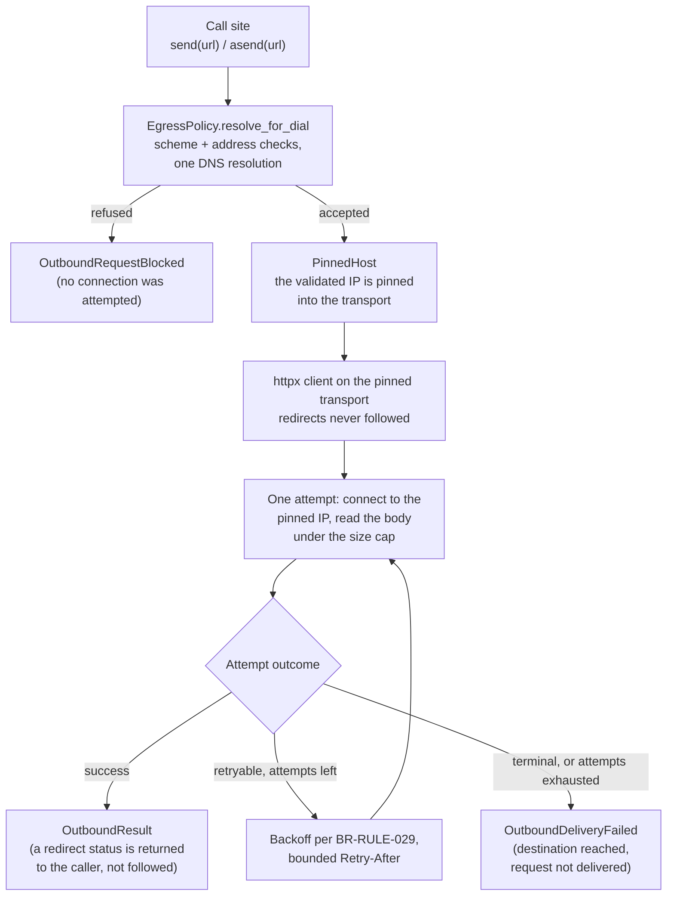
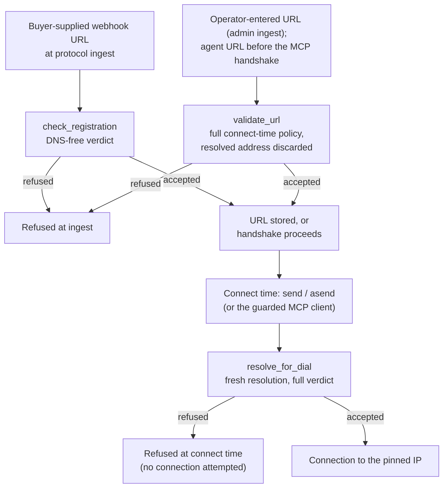
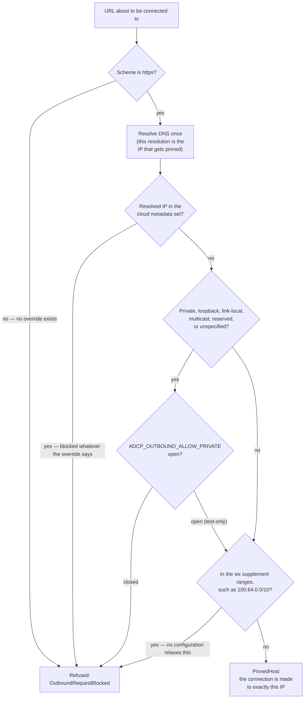

# Outbound egress: one gateway, and why nothing else validates a URL

Outbound HTTP goes through one module, `src/core/security/outbound_http.py`, via
`send` (sync) or `asend` (async). Anything you write goes through the gateway.

Exactly *three classes of authorized callers do not*, and the gateway's own module
docstring lists them, not only this document. Read that list before you "fix" an
apparent bypass — one of the three is deliberately *stronger* than the gateway, and
routing it through the gateway weakens it. See
[Authorized direct callers](#authorized-direct-callers-and-why-they-are-not-bypasses).

This document is the rule for anyone making a request: which entry point to call,
what the gateway decides on your behalf, why adding your own check is a defect
rather than an improvement, and how the codebase makes the alternatives hard to
write. The gateway's internals — the module map, what the `adcp` SDK owns, the two
verdicts' shared predicate, and which local workarounds are temporary — are in
[The egress gateway and the SDK boundary](../design/egress-sdk-boundary.md).

## The rule

```python
from src.core.security.outbound_http import asend

result = await asend(url, json=payload)
```

Do not add URL validation, private-IP checks, metadata blocklists,
resolve-then-check, or redirect re-validation at the call site. If you find
yourself importing `ipaddress`, reaching for `socket.gethostbyname`, or writing a
hostname blocklist anywhere under `src/`, stop — that logic already exists, and
yours disagrees with it.

`send` and `asend` take the same keyword-only arguments: `method` (default
`"POST"`), `json` or `content`, `params`, `headers`, `timeout` (default 10s),
`max_attempts` (default 3, counting *total* attempts, so `max_attempts=1` opts a
non-idempotent call out of retry), `provenance`, and `sign`.

They return an `OutboundResult` (`src/core/security/egress/response.py`) carrying
`http_status`, `headers`, `content`, `text`, `json()`, `attempts`, and
`duration_seconds`. It holds no `httpx` object, so there is nothing to program
against httpx through. They raise `OutboundRequestBlocked` when the gateway
refuses the scheme or the address — before it attempts any connection — and
`OutboundDeliveryFailed` when the gateway reaches the destination but does not
deliver the request. Both subclass `OutboundError`, so a call site that only logs
writes one `except`.

## Why a gateway rather than a helper everyone calls

An outbound request carries five policy decisions, each with one owner:

- **Address policy** — `adcp.signing` validates and *pins* the resolved IP, and
  the gateway's own supplement set extends the refused ranges.
- **TLS policy** — the gateway, one configuration.
- **Redirect policy** — the gateway follows no redirect. The send path never passes
  `follow_redirects`, so httpx's `False` default stands; the pinned-client
  builder for the MCP seam sets it explicitly and discards what a caller passes.
- **Retry policy** — the gateway: BR-RULE-029 backoff, bounded `Retry-After`.
- **Response cap** — bodies accumulate under a 10 MiB ceiling, because httpx
  applies no default limit.

Spread those decisions across call sites and each site gets four of five right:
this one forgets redirects, that one forgets the retry bound. Server-side
request forgery (SSRF) recurs that way, rather than through anyone overlooking
it. The gateway holds all five decisions in one place.

The address decision is the sharpest example. Checking an address and then
connecting is a time-of-check to time-of-use (TOCTOU) vulnerability: DNS can
answer differently the second time, which is DNS rebinding.
`adcp.signing.resolve_and_validate_host` resolves *once* and pins that IP into
the transport, so the address it validated is the address the client connects
to. A call site that validates and then hands the hostname to its own
client has reintroduced the vulnerability, no matter how good its blocklist is.

The following diagram shows the path of one `send` or `asend` call through the
egress gateway. The verdict runs before any connection exists, so a refusal
means the gateway attempted nothing:



## Which entry point to call

| You are… | Call | What it does |
|---|---|---|
| about to make a request | `send` / `asend` | resolves once, pins, retries, caps the body |
| storing a URL an operator entered, to fetch later | `validate_url` | the full connect-time verdict, sending nothing |
| accepting a buyer's webhook URL at protocol ingest | the registration gate (`accept_push_notification_config` → `EgressPolicy.check_registration`) | the DNS-free verdict |

The two verdicts behind those three entry points read the same address
predicate, so they cannot disagree about what counts as a bad address. A
connection attempt can still refuse what registration accepted — that is DNS
answering, not drift. The
[two-verdict split](../design/egress-sdk-boundary.md#the-validation-split-two-verdicts-one-predicate)
covers why there are two.

### Validate a stored URL at ingest: `validate_url`

`validate_url(url, *, provenance=None)` applies the gateway's full connect-time
policy to a URL *without sending anything*
(`src/core/security/outbound_http.py`). Use it when one path stores a URL at
ingest and a background worker fetches it later. At fetch time, no request exists
to carry a refusal, so without ingest validation the caller gets a success
followed by a silent delivery failure. The alternative — a hand-written
preflight check at the call site that later connects — is a second copy of
address policy, which is exactly the duplication this module exists to prevent.

It refuses exactly what `send` and `asend` refuse: all three reach
`EgressPolicy.resolve_for_dial` and differ only in what they do with the
resolved address. `validate_url` *discards* it. It builds no transport and opens
no socket, and a later fetch resolves again through its own `send` call. A
resolution cached across the ingest-to-fetch gap is precisely the DNS-rebinding
window that resolve-once-then-pin closes within a single request.

Two consumers use it: the admin ingest path (`src/admin/utils/url_policy.py`,
two helpers over one refusal decision, reached from ten call sites in five admin
modules)
and the Model Context Protocol (MCP) client wrapper, which validates the agent
URL before the handshake. Admin handlers omit `provenance` — they build no Ad
Context Protocol (AdCP) envelope, so there is no request path to name.

One deliberate non-consumer: buyer-supplied webhook URLs at protocol ingest go
through the non-resolving `check_registration` path, *not* `validate_url`.
`validate_url` always resolves, so at registration it refuses a buyer whose
hostname has not propagated, and it answers the same input differently across
surfaces. Operator-entered URLs on the admin JSON and form handlers get
`validate_url`, because the operator is present and a wrong hostname should fail
loudly at once. Buyer-supplied URLs get the non-resolving verdict at
registration and the full verdict before connecting. The admin route that
registers a *principal's* push-notification URL is itself on the buyer-shaped
path: it runs the registration gate alone, so the admin form and the protocol
surfaces reach the same verdict for the same URL
(`tests/integration/test_admin_ingest_url_policy.py` asserts that nothing calls
the resolver there).

The following diagram shows where the gateway validates each kind of URL — at
ingest, at connect time, or both:



### Sign a request

Sign through the gateway; do not bring your own client to sign.

- A legacy shared-secret HMAC covers the body and a timestamp and verifies on
  replay inside its window, so computing it once and passing `headers=` is
  correct. `src/core/security/webhook_egress.py` does exactly that:
  `prepare_signed_request` serializes the payload once, and the delivery
  functions transmit those bytes through `content=`. The signed bytes and the
  wire bytes are therefore one object.
- A signature that must not be replayed — RFC 9421 covers a `nonce` a
  conformant receiver rejects twice — needs a fresh signature per attempt, and
  the gateway owns retry. Pass `sign=`, a callback the gateway invokes once per
  attempt with that attempt's method, target URI, and body bytes; it returns the
  headers to merge. Two obligations follow. First, pass an explicit
  `Content-Type` if you use `content=`, because httpx sets none there and the
  SDK's signer covers that header. Second, do not return `Content-Length`,
  `Transfer-Encoding`, or `Host`: the gateway drops them with a warning, because
  a signer that re-frames the body can desync the bytes it signed from the bytes
  the receiver reads. No call site under `src/` or `tests/` passes `sign=`; the
  gateway's module docstring carries the parameter and its rationale.

### The supplement ranges, and the check no configuration relaxes

`adcp.signing` classifies the usual reserved space (private, loopback,
link-local, multicast, reserved, unspecified). Six ranges it does *not*
classify live here, in `_SUPPLEMENT_NETWORKS`:

- `100.64.0.0/10` — CGNAT (RFC 6598)
- `192.88.99.0/24` — 6to4 relay anycast (RFC 7526)
- `192.31.196.0/24` — AS112-v4 (RFC 7535)
- `192.52.193.0/24` — AMT (RFC 7450)
- `192.175.48.0/24` — AS112 direct (RFC 7534)
- `2001:20::/28` — ORCHIDv2 (RFC 7343)

`ADCP_OUTBOUND_ALLOW_PRIVATE=true` is a *test-only* override that relaxes the
SDK's flag classes, so an in-process suite can connect to its own loopback
origin and the end-to-end (e2e) stack can connect to its compose bridge. It
does *not* open the supplement set: that check runs unconditionally, ahead of
the override. The reason is that those six ranges have no second line of
defense. This repo carries them precisely because the SDK does not know them,
so a configuration that skips them leaves them undefended rather than merely
relaxed.

The following diagram shows the connect-time checks in the order
`resolve_for_dial` applies them, and which of them the override can and cannot
relax:



## Test egress in-network: the TLS terminator

The gateway requires `https` unconditionally — no override exists for the scheme
check, so no flag lets a test connect over `http://`. The in-network stack
therefore serves its origins over real TLS through a shared terminator, rather
than relaxing the gateway.

`docker-compose.e2e.yml` runs one shared TLS terminator, the `tls-proxy`
service, fronting every `*.adcp.test` origin the stack connects to —
`proxy.adcp.test`, `creative-agent.adcp.test`, `webhooks.adcp.test`, and
`storyboard.adcp.test`, as network aliases on that one service
(`docker-compose.e2e.yml:351-363`), routed by server name indication (SNI)
through the map in `config/nginx/nginx-tls-test.conf.template:39-44`.
`scripts/dev/gen_test_tls.py` generates the private certificate authority (CA)
and the one leaf covering every name the stack answers to.
[Webhook testing architecture](../design/webhook-testing-architecture.md)
describes the material itself, its subject alternative name (SAN) set, and when
it regenerates.

The combined bundle is essential. `SSL_CERT_FILE`
replaces the process's entire default cafile, so a private-CA-only bundle
breaks every real HTTPS connection the same process makes, `uv sync` against
pypi.org included. `gen_test_tls.py` produces `COMBINED_CERT`: the system
bundle (or `certifi`'s, on a developer laptop) plus the private CA, one file
serving both trust anchors. The `--cacert`-style flags and
`E2E_CA_BUNDLE` use the private CA alone on purpose — a caller that checks one
of the stack's own TLS endpoints should trust only this stack's leaf
certificate, not the whole public web.

### Scope of the override

The override's narrow scope is itself the enforcement mechanism. Every compose
origin resolves to a bridge address, so the stack opens
`ADCP_OUTBOUND_ALLOW_PRIVATE` only where a run genuinely dials one:
`docker-compose.e2e.yml` (twice, for the containerized runner),
`run_all_tests_host.sh` (a host run standing up the same stack), and the
`creative` matrix group in `.github/workflows/ci.yml`. The developer stack,
`docker-compose.yml`, names it zero times: opening the override there turns off
egress policy for every developer, and nothing in the test path reads that file.
`tox.ini` lists the variable under `pass_env`, not `setenv` — `setenv` forces
the override open for every tox env, including the in-process suites that must
see it closed.

One guard (`tests/unit/test_architecture_no_outbound_insecure_hatch.py`)
covers both override variables, asymmetrically and deliberately.
`ADCP_OUTBOUND_ALLOW_INSECURE` has no legitimate use — the scheme check has no
hatch at all — so the guard keeps that name out of the tree entirely.
`ADCP_OUTBOUND_ALLOW_PRIVATE` has legitimate uses, so the guard instead pins
*which files may name it* — the four above plus the one seam read site,
`src/core/security/outbound_http.py` — by set identity, so adding one surface
while dropping another fails. Anyone who adds an env surface that names the
variable — a compose file, a Dockerfile `ENV`, a CI matrix group — adds a pin
entry with a reason, or the build fails.

### What is testable where

Two checks remain active even with the override open, so most refusals stay
testable in-network:

| Refusal | Testable in-network | Reason |
|---|---|---|
| Cloud metadata (`169.254.169.254`) | Yes | The SDK blocks its metadata set whatever `allow_private` says |
| The six supplement ranges | Yes | This repo's predicate runs unconditionally, ahead of the override |
| Non-`https` scheme | Yes | No override exists for the scheme check; the TLS terminator provides a real `https` origin to refuse against |
| General private-range | No — in-process only | Every compose origin is a bridge address, so the override stays open there; `set_flags()` in `tests/integration/test_outbound_http.py` closes it per case |

When you add an egress case that "cannot be tested in-network", choose one of
two options: give the origin a real `https` endpoint behind `tls-proxy` (a
network alias and a leaf certificate), or accept that the case tests a refusal
the open override masks, and write it in-process.

[End-to-end testing](../development/e2e-testing.md) documents the stack's
service inventory, tox envs, port publishing, and how to run the suites.

## Authorized direct callers, and why they are not bypasses

Three classes of outbound call deliberately sit outside `send`/`asend`. The
gateway's module docstring lists the taxonomy, with a one-line pointer at each
call site, so a reader can tell an authorized caller from an unnoticed bypass.

**1. `adcp.adagents.fetch_adagents`** — connects to a tenant-admin-configured
`publisher_domain`. It pins its own addresses: it builds an
`AsyncIpPinnedTransport` on the validated IP with `trust_env=False`, and
creates a *fresh pinned client per redirect hop*. That is *stronger* than this
gateway for a multi-host redirect chain — this gateway's client resolves once and
pins once, which across `fetch_adagents`' own hops collapses into a TOCTOU
pre-check. **Do not "fix" this one.**

**2. authlib** — OpenID Connect (OIDC) discovery and token exchange, backed by
`requests`. A TID251 ban cannot express it, and it dereferences
`server_metadata_url=` itself, outside any gateway. This repo handles it where
it can: the admin blueprint validates the `discovery_url` and `logout_url` at
*ingest* (`src/admin/blueprints/oidc.py`), so the URL that authlib later
dereferences has already passed the registration gate. The second-order
`token_endpoint`/`jwks_uri` read out of the discovery document is a known open
item, tracked by GH #1872.

**3. Fixed-destination vendor SDKs** — `googleads`, `google.auth`,
`google.cloud.iam`, and `pydantic_ai` providers. No attacker- or tenant-controlled
URL ever reaches them, so there is no SSRF vector to guard.

If you add a fourth, it belongs in that docstring with its reason before it
belongs in the code. An unlisted caller is indistinguishable from a mistake.

## How the codebase prevents the wrong call

The codebase stops the wrong call at three layers, in descending order of
strength. Prefer the strongest available layer.

### Unrepresentable — the name does not exist

The gateway imports what it wraps, and binds it *privately*:

```python
import httpx as _httpx          # not `import httpx`
```

A plain import publishes `outbound_http.httpx`, and
`from src.core.security.outbound_http import httpx` then resolves to the
real module, past every check. The underscore makes that an
`ImportError`. This pattern closes four paths:

```text
src.core.security.outbound_http.httpx
src.core.security.egress.policy.ipaddress
src.core.utils.mcp_client.Client
src.core.utils.mcp_client.StreamableHttpTransport
```

Nothing bans these names, because there is nothing to ban. No config row, no
test, no table to keep in sync — and the failure arrives at import rather than
at lint.

**If you add a gateway that wraps a dangerous dependency, bind the import
privately.** That is the pattern.

### Banned — a lint rule, because the name is third-party

You cannot make `import httpx` impossible in an arbitrary file from inside this
repo, so `ruff-egress.toml` bans the modules outright: `httpx`, `requests`,
`aiohttp`, `urllib.request`, `httpcore`, `urllib3`, `http.client`, plus `httpx2`
and `httpcore2` (installed transitively, and one character from the real thing).

The same table bans `fastmcp.Client` and the MCP transports, under every import
path that resolves. `Client(url)` infers an unpinned transport from a bare URL,
and fastmcp is a third-party API this repo cannot rebind — so a ban list is the
only mechanism available for that half. The same table also bans the unpinnable
`adcp` clients, the SDK's error-prone signed-headers helper, `ipaddress`, and
`socket.gethostbyname`, each row carrying its reason.

The same config also selects ANN401 over `src/core/security` and `src/adapters`:
`Any` is the one thing the gateway's signatures cannot make unrepresentable, so
lint refuses a forwarder declaring `json: Any` instead of letting it type-check
clean.

### Exempted — one file, reviewed

The check runs with `--ignore-noqa`:

```bash
uv run ruff check --config ruff-egress.toml --ignore-noqa --no-respect-gitignore src/ scripts/
```

That makes `# noqa` *inert* for this config, in every form — `# noqa: TID251`,
file-scope `# ruff: noqa`, bare `# noqa`, `# flake8: noqa`. A file cannot exempt
itself. The only way to be exempt is a row in `[lint.per-file-ignores]`, which
lands in a diff that someone reviews.

Rows come in four kinds, and the difference matters:

- **The gateway importers** (`outbound_http.py`, `egress/policy.py`,
  `mcp_client.py`) — a *floor*. A gateway architecture must have authorized
  importers of what it wraps; this set never empties.
- **The vendored subtree** (`src/vendor/`) — copied upstream source this repo is
  forbidden to edit, so nobody can act on a finding there. The row leaves with
  the vendored copy.
- **`scripts/` rows** — *debt*. Retire them; do not add to them.
- **Pre-ban `Any` rows** (ANN401) — *debt*. The set shrinks as those
  signatures get typed.

These rows are *file*-granular. Because self-exemption is impossible rather
than merely detectable, the repo needs no machinery to audit whether scattered
markers are recorded and still active.

`--no-respect-gitignore` is also functional rather than decorative: ruff's
directory walk honors `.gitignore`, which can hide a git-tracked file from
the scan entirely.

## What the ban test keeps true

`tests/unit/test_ruff_egress_bans.py` is deliberately small. It keeps two claims
true:

- **Every ban fires**, on every import form that resolves, and under
  `scripts/` as well as `src/`. Ruff does not validate `banned-api` keys, so a
  mistyped row like `"httpx3"` is silently inert forever. Only a test catches
  that.
- **A clean snippet passes**, and the config parses — so a broken
  `ruff-egress.toml` fails loudly instead of passing vacuously on empty output.

## Add an outbound call

1. Call `send` or `asend`. You are done.
2. If the request needs a per-attempt signature, pass `sign=` rather than
   opening your own client.
3. If you think you need a raw client, you are adding a second policy owner —
   say why in review before you write it.
4. If you wrap a dangerous dependency in a gateway of your own, bind its
   import privately so your gateway cannot re-export it.
5. Never add a `# noqa` comment for the egress rules. It does nothing.

## Related

- [The egress gateway and the SDK boundary](../design/egress-sdk-boundary.md) — the module map,
  what the `adcp` SDK owns, the two-verdict split, and what this repo carries
  only until an upstream release
- [Security overview](../security.md) — authentication, tenancy, audit
- `CLAUDE.md` Pattern #9 — the same rule, stated for agents
